# Example comparing AMR genotypers

## Introduction

This vignette demonstrates an example of how to investigate associations
between *Klebsiella pneumoniae* meropenem antibiotic susceptibility
testing (AST) data and AMR genotype data (Kleborate, AMRFinderPlus and
RGI). We will be using the AST data and AMR genotyping outputs for
n=1490 isolates from the European Survey of Carbapenemase-Producing
Enterobacteriaceae (EuSCAPE) published as [‘Epidemic of
carbapenem-resistant *Klebsiella pneumoniae* in Europe is driven by
nosocomial spread’ by David, S., et al. Nature Microbiology,
2016](https://amrgen.org/articles/doi.org/10.1038/s41564-019-0492-8).

Whole genome sequence reads were downloaded from [NCBI Bioproject
PRJEB10018](https://www.ebi.ac.uk/ena/browser/view/PRJEB10018) /
[European Nucleotide Archive
ERP011196](https://www.ebi.ac.uk/ena/browser/view/ERP011196), trimmed
using Trim Galore v0.5.0, and assembled using Unicycler v0.5.0. The
assembled genomes were then run through each AMR genotyper:

- [Kleborate
  v3.1.3](https://github.com/klebgenomics/Kleborate/releases/tag/v3.1.3)
- [Kleborate version development branch - commit
  \#4ec1dcb](https://github.com/klebgenomics/Kleborate/tree/development)
  on March 17, 2026
- [Resistance Gene Idenfier (RGI
  v6.0.6)](https://github.com/arpcard/rgi/releases/tag/6.0.6) - using
  the Comprehensive Antibiotic Resistance Database (CARD, v4.0.1)

AMRFinderPlus results were generated by [EMBL-EBI Antimicrobial
Resistance Portal](https://www.ebi.ac.uk/amr/methods/) using -
[AMRFinderPlus v4.0](https://github.com/ncbi/amr/) with [NCBI Reference
Gene Catalog](https://www.ncbi.nlm.nih.gov/pathogens/refgene/) database
version 2025-07-16.1.

### Load the required packages

``` r
library(AMRgen)
library(dplyr)
library(ggplot2)
library(tidyr)
library(stringr)
```

## Phenotype Data

The [`download_ebi()`](https://amrgen.org/reference/download_ebi.md)
function lets you load phenotype data and interpret susceptible,
intermediate, and resistant phenotypes using EUCAST breakpoints and
ECOFF. A copy of the data objected produced below is available in the
AMRgen package as `kp_mero_euscape`.

``` r
# Download Klebsiella pneumoniae AST data from EBI, filtering for meropenem and re-interpret with EUCAST breakpoints and ECOFF

kp_mero <- download_ebi(
  pheno_drug = "meropenem",
  species = "Klebsiella pneumoniae",
  reformat = TRUE,
  interpret_eucast = TRUE,
  interpret_ecoff = TRUE
)

# Filter for isolates in EuSCAPE paper (PMID: 31358985)
kp_mero_euscape <- kp_mero %>% filter(grepl("31358985", source))

# There are assemblies from NCBI that are flagged for contamination and supposed to be excluded. For example, see SAMEA3729690 (https://www.ncbi.nlm.nih.gov/datasets/genome/?biosample=SAMEA3729690)

contaminated_assemblies <- c("SAMEA3729690", "SAMEA3721062", "SAMEA3721052", "SAMEA3720966", "SAMEA3673128", "SAMEA3538742", "SAMEA3721188", "SAMEA3649589", "SAMEA3538652", "SAMEA3649503", "SAMEA3538911", "SAMEA3727711", "SAMEA3649452", "SAMEA3649453", "SAMEA3649454", "SAMEA3649467", "SAMEA3721063", "SAMEA3538862", "SAMEA3538667", "SAMEA3673004", "SAMEA3729818", "SAMEA3729660", "SAMEA3673078", "SAMEA3673097")

# Remove contaminated assemblies from phenotype list
kp_mero_euscape <- kp_mero_euscape %>%
  filter(!id %in% contaminated_assemblies)
```

Check the data frame

``` r
head(kp_mero_euscape)
#> # A tibble: 6 × 43
#>   id        drug   mic  disk pheno_provided pheno_eucast ecoff guideline method 
#>   <chr>     <ab> <mic> <dsk> <sir>          <sir>        <sir> <chr>     <chr>  
#> 1 SAMEA372… MEM   2.00    NA   NA             S           NWT  NA        broth …
#> 2 SAMEA372… MEM   4.00    NA   NA             I           NWT  NA        broth …
#> 3 SAMEA372… MEM   0.12    NA   NA             S            WT  NA        broth …
#> 4 SAMEA372… MEM   1.00    NA   NA             S           NWT  NA        broth …
#> 5 SAMEA372… MEM   4.00    NA   NA             I           NWT  NA        broth …
#> 6 SAMEA372… MEM   8.00    NA   NA             I           NWT  NA        broth …
#> # ℹ 34 more variables: platform <chr>, source <chr>, spp_pheno <mo>,
#> #   SRA_accession <chr>, assembly_ID <chr>, collection_year <int>,
#> #   ISO_country_code <chr>, host <chr>, host_age <chr>, host_sex <chr>,
#> #   isolate <chr>, isolation_source <chr>, isolation_source_category <chr>,
#> #   isolation_latitude <chr>, isolation_longitude <chr>, genus <chr>,
#> #   organism <chr>, Updated_phenotype_CLSI <chr>,
#> #   Updated_phenotype_EUCAST <chr>, used_ECOFF <chr>, database <chr>, …
```

### Phenotype Data Summary

Summarize the downloaded phenotype data and plot the minimum inhibitory
concentration (MIC) distributions with EUCAST breakpoints and ECOFF.

``` r
# Summary of meropenem phenotype data including S/I/R count using EUCAST breakpoint and ECOFF
summarise_pheno(kp_mero_euscape, pheno_cols = c("pheno_eucast", "ecoff"))
#> $uniques
#> # A tibble: 7 × 2
#>   column    n_unique
#>   <chr>        <int>
#> 1 id            1490
#> 2 drug             1
#> 3 spp_pheno        1
#> 4 method           1
#> 5 platform         1
#> 6 guideline        1
#> 7 source           2
#> 
#> $drugs
#> # A tibble: 1 × 4
#>   drug drug_name spp_pheno               mic
#>   <ab> <chr>     <chr>                 <int>
#> 1 MEM  Meropenem Klebsiella pneumoniae  1490
#> 
#> $details
#> # A tibble: 2 × 8
#>   drug drug_name spp_pheno             method    platform guideline source   mic
#>   <ab> <chr>     <chr>                 <chr>     <chr>    <chr>     <chr>  <int>
#> 1 MEM  Meropenem Klebsiella pneumoniae broth di… NA       NA        31358…   628
#> 2 MEM  Meropenem Klebsiella pneumoniae broth di… NA       NA        31358…   862
#> 
#> $pheno_counts_list
#> $pheno_counts_list$pheno_eucast
#> # A tibble: 1 × 6
#>   drug drug_name spp_pheno                 S     I     R
#>   <ab> <chr>     <chr>                 <int> <int> <int>
#> 1 MEM  Meropenem Klebsiella pneumoniae   973   126   391
#> 
#> $pheno_counts_list$ecoff
#> # A tibble: 1 × 5
#>   drug drug_name spp_pheno                WT   NWT
#>   <ab> <chr>     <chr>                 <int> <int>
#> 1 MEM  Meropenem Klebsiella pneumoniae   710   780

# MIC distribution coloured by phenotype interpretation using EUCAST breakpoint
assay_by_var(
  pheno_table = kp_mero_euscape,
  pheno_drug = "Meropenem",
  measure = "mic",
  colour_by = "pheno_eucast",
  species = "Klebsiella pneumoniae"
)
#>   MIC breakpoints determined using AMR package: S <= 2 and R > 8
#>   NOTE: Multiple breakpoint entries, for different sites: Non-meningitis; Meningitis. Using the one with the highest S breakpoint (Non-meningitis).
```

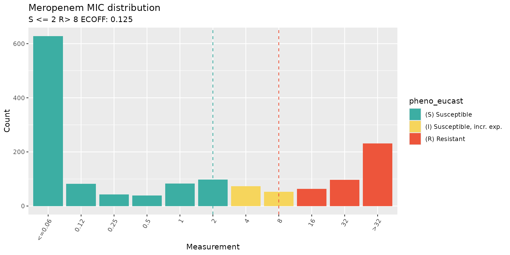

``` r

# Summary of meropenem phenotypes using ECOFF
kp_mero_euscape %>% count(ecoff)
#> # A tibble: 2 × 2
#>   ecoff     n
#>   <sir> <int>
#> 1   WT    710
#> 2  NWT    780

# MIC distribution coloured by ECOFF
assay_by_var(
  pheno_table = kp_mero_euscape,
  pheno_drug = "Meropenem",
  measure = "mic",
  colour_by = "ecoff",
  species = "Klebsiella pneumoniae"
)
#>   MIC breakpoints determined using AMR package: S <= 2 and R > 8
#>   NOTE: Multiple breakpoint entries, for different sites: Non-meningitis; Meningitis. Using the one with the highest S breakpoint (Non-meningitis).
```

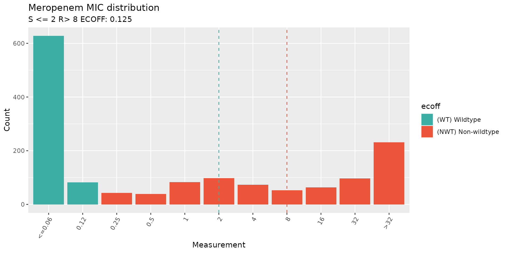

## Genotypes from Kleborate

[Kleborate](https://github.com/klebgenomics/Kleborate) screens
*Klebsiella pneumoniae* species complex (KpSC) genome assemblies to
identify sequence types (MLST), species, antimicrobial resistance (AMR)
genes, virulence loci (e.g., yersiniabactin, aerobactin), and
capsule/LPS serotypes (K and O antigens), published
[here](https://doi.org/10.1038/s41467-021-24448-3). It can be run on the
[command line](https://github.com/klebgenomics/Kleborate) or via
[Pathogenwatch](https://pathogen.watch/).

### Import Kleborate Genotype Data

The
[`import_kleborate()`](https://amrgen.org/reference/import_kleborate.md)
function imports the output table from
[Kleborate](https://github.com/klebgenomics/Kleborate), extracts the AMR
genotyping data, and formats it to be used with AMRgen functions.

Mutation notation in Kleborate changed after v3.1.3 to adhere to [HGVS
Nomenclature](https://hgvs-nomenclature.org/stable/), so:

- To import Kleborate output \<=v3.1.3 (using informal nomenclature
  (e.g. \[gene\]-\[mutation\], \[gene\]-X%, OmpK36GD)), in the
  [`import_kleborate()`](https://amrgen.org/reference/import_kleborate.md)
  function, set `hgvs = FALSE`.

- To import Kleborate output \>v3.1.3 (using HGVS Nomenclature), in the
  [`import_kleborate()`](https://amrgen.org/reference/import_kleborate.md)
  function, set to `hgvs=TRUE` (which is already the default option).

We are importing the latest version of Kleborate which is in the
[development branch - commit
\#4ec1dcb](https://github.com/klebgenomics/Kleborate/tree/development)
from March 17, 2026. This version uses HGVS Nomenclature for describing
mutations and includes an updated AMR database compared to the most
recent [Kleborate release
v3.2.4](https://github.com/klebgenomics/Kleborate/releases/tag/v3.2.4).

A table of Kleborate results generated for the EuSCAPE genomes is
available in the AMRgen package as `kleborate_raw`. Let’s import this to
AMRgen genotype table format and summarise the content:

``` r
# Updated Kleborate results from the development branch as of March 17, 2026 (commit #4ec1dcb)
head(kleborate_raw, n = 10)
#> # A tibble: 10 × 122
#>    strain    species species_match contig_count    N50 largest_contig total_size
#>    <chr>     <chr>   <chr>                <dbl>  <dbl>          <dbl>      <dbl>
#>  1 SAMEA349… Klebsi… strong                 141 230759         470757    5578320
#>  2 SAMEA349… Klebsi… strong                  88 370309         938079    5384685
#>  3 SAMEA349… Klebsi… strong                  90 238750         529125    5446454
#>  4 SAMEA349… Klebsi… strong                 144 207582         663698    5574298
#>  5 SAMEA349… Klebsi… strong                 142 263498         678692    5486238
#>  6 SAMEA349… Klebsi… strong                  79 285199         991412    5529803
#>  7 SAMEA349… Klebsi… strong                 280 178980         585359    5817055
#>  8 SAMEA349… Klebsi… strong                 108 209418         517450    5379124
#>  9 SAMEA349… Klebsi… strong                 134 371444         984005    5558705
#> 10 SAMEA349… Klebsi… strong                 142 197944         636773    5497421
#> # ℹ 115 more variables: GC_content <dbl>, ambiguous_bases <chr>,
#> #   QC_warnings <chr>, ST <chr>, gapA <dbl>, infB <dbl>, mdh <dbl>, pgi <dbl>,
#> #   phoE <dbl>, rpoB <dbl>, tonB <dbl>, YbST <chr>, Yersiniabactin <chr>,
#> #   ybtS <chr>, ybtX <chr>, ybtQ <chr>, ybtP <chr>, ybtA <chr>, irp2 <chr>,
#> #   irp1 <chr>, ybtU <chr>, ybtT <chr>, ybtE <chr>, fyuA <chr>,
#> #   spurious_ybt_hits <chr>, CbST <chr>, Colibactin <chr>, clbA <chr>,
#> #   clbB <chr>, clbC <chr>, clbD <chr>, clbE <chr>, clbF <chr>, clbG <chr>, …

# Import Kleborate
kleborate_dev <- import_kleborate(kleborate_raw)

# View summary of genotypes
summarise_geno(kleborate_dev)
#> $uniques
#> # A tibble: 6 × 2
#>   column         n_unique
#>   <chr>             <int>
#> 1 id                 1490
#> 2 marker              470
#> 3 drug                  1
#> 4 drug_class           13
#> 5 gene                293
#> 6 variation type        4
#> 
#> $per_type
#> # A tibble: 4 × 6
#>   `variation type`                  id marker  drug drug_class  gene
#>   <chr>                          <int>  <int> <int>      <int> <int>
#> 1 Gene presence detected          1490    288     1         13   288
#> 2 Inactivating mutation detected   569    167     1          2     3
#> 3 Nucleotide variant detected       15      1     1          1     1
#> 4 Protein variant detected         874     14     1          2     3
#> 
#> $drugs
#> # A tibble: 13 × 5
#>    drug  drug_class                markers samples  hits
#>    <lgl> <chr>                       <int>   <int> <int>
#>  1 NA    Aminoglycosides                68    1060  2709
#>  2 NA    Beta-lactams                   76    1457  2833
#>  3 NA    Carbapenems                   153     770  1477
#>  4 NA    Cephalosporins (3rd gen.)      18     648   668
#>  5 NA    Macrolides                     15     460   924
#>  6 NA    Phenicols                      16     479   572
#>  7 NA    Phosphonics                    17    1485  1490
#>  8 NA    Polymyxins                     33     138   138
#>  9 NA    Quinolones                     26    1021  2665
#> 10 NA    Rifamycins                      3     119   128
#> 11 NA    Sulfonamides                   13     917  1096
#> 12 NA    Tetracyclines                  12     514   554
#> 13 NA    Trimethoprims                  21     941  1110
#> 
#> $markers
#> # A tibble: 471 × 5
#>    marker   drug  drug_class                `variation type`           n
#>    <chr>    <lgl> <chr>                     <chr>                  <int>
#>  1 ACC-4.v1 NA    Beta-lactams              Gene presence detected     2
#>  2 CMY-13   NA    Beta-lactams              Gene presence detected     1
#>  3 CMY-16   NA    Beta-lactams              Gene presence detected    31
#>  4 CMY-2.v2 NA    Beta-lactams              Gene presence detected     1
#>  5 CMY-30   NA    Cephalosporins (3rd gen.) Gene presence detected     1
#>  6 CMY-4.v1 NA    Beta-lactams              Gene presence detected     5
#>  7 CMY-6    NA    Beta-lactams              Gene presence detected     2
#>  8 CTX-M-1  NA    Cephalosporins (3rd gen.) Gene presence detected     1
#>  9 CTX-M-14 NA    Cephalosporins (3rd gen.) Gene presence detected    16
#> 10 CTX-M-15 NA    Cephalosporins (3rd gen.) Gene presence detected   568
#> # ℹ 461 more rows
```

### Kleborate Genotype and Phenotype Summary

Summarize how many markers are associated with the beta-lactam and
carbapenem drug class since Kleborate only operates at a drug class
level.

``` r
summarise_geno_pheno(kleborate_dev, kp_mero_euscape,
  pheno_cols = c("pheno_eucast", "ecoff")
)
#> $overlapping_samples
#> [1] 1490
#> 
#> $drugs_with_pheno
#> # A tibble: 2 × 6
#>   drug     n drug_class   drug_name spp_pheno               mic
#>   <ab> <int> <chr>        <chr>     <chr>                 <int>
#> 1 MEM   1490 Carbapenems  Meropenem Klebsiella pneumoniae  1490
#> 2 MEM   1490 Beta-lactams Meropenem Klebsiella pneumoniae  1490
#> 
#> $geno_hits
#> # A tibble: 2 × 6
#>   drug  drug_name drug_class   markers samples  hits
#>   <lgl> <chr>     <chr>          <int>   <int> <int>
#> 1 NA    NA        Beta-lactams      76    1457  2833
#> 2 NA    NA        Carbapenems      153     770  1477
#> 
#> $geno_markers
#> # A tibble: 229 × 6
#>    marker   drug  drug_name drug_class   `variation type`           n
#>    <chr>    <lgl> <chr>     <chr>        <chr>                  <int>
#>  1 ACC-4.v1 NA    NA        Beta-lactams Gene presence detected     2
#>  2 CMY-13   NA    NA        Beta-lactams Gene presence detected     1
#>  3 CMY-16   NA    NA        Beta-lactams Gene presence detected    31
#>  4 CMY-2.v2 NA    NA        Beta-lactams Gene presence detected     1
#>  5 CMY-4.v1 NA    NA        Beta-lactams Gene presence detected     5
#>  6 CMY-6    NA    NA        Beta-lactams Gene presence detected     2
#>  7 CTX-M-33 NA    NA        Carbapenems  Gene presence detected     1
#>  8 DHA-1    NA    NA        Beta-lactams Gene presence detected    78
#>  9 IMP-1    NA    NA        Carbapenems  Gene presence detected     3
#> 10 KPC-12   NA    NA        Carbapenems  Gene presence detected     1
#> # ℹ 219 more rows
#> 
#> $pheno_counts_list
#> $pheno_counts_list$ecoff
#> # A tibble: 1 × 5
#>   drug drug_name spp_pheno                WT   NWT
#>   <ab> <chr>     <chr>                 <int> <int>
#> 1 MEM  Meropenem Klebsiella pneumoniae   710   780
#> 
#> $pheno_counts_list$pheno_eucast
#> # A tibble: 1 × 6
#>   drug drug_name spp_pheno                 S     I     R
#>   <ab> <chr>     <chr>                 <int> <int> <int>
#> 1 MEM  Meropenem Klebsiella pneumoniae   973   126   391
```

## Phenotypes vs Kleborate Genotypes

### Generate Binary Matrix for Kleborate AMR Markers

Most AMRgen analysis functions require a binary matrix with one sample
per row, and columns indicating the phenotype and genotype data in
columns, where a `1` indicates the presence and `0` indicates the
absence of the phenotype or genotypic marker in that sample. This is
produced using the `get_binary_matrix` function:

``` r
kleborate_binary_matrix <- get_binary_matrix(
  geno_table = kleborate_dev,
  pheno_table = kp_mero_euscape,
  pheno_drug = "Meropenem",
  geno_class = c("Carbapenems"),
  sir_col = "pheno_eucast",
  keep_assay_values = TRUE,
  keep_assay_values_from = "mic",
  marker_col = "marker.label"
)
#>  Defining NWT in binary matrix using ecoff column provided: ecoff

head(kleborate_binary_matrix, n = 10)
#> # A tibble: 10 × 24
#>    id    pheno ecoff    mic     R   NWT `OmpK36..-` `OmpK35..-` `NDM-1` `OXA-48`
#>    <chr> <sir> <sir>  <mic> <dbl> <dbl>       <dbl>       <dbl>   <dbl>    <dbl>
#>  1 SAME…   I    NWT    4.00     0     1           1           0       0        0
#>  2 SAME…   S     WT  <=0.06     0     0           0           0       0        0
#>  3 SAME…   S    NWT    1.00     0     1           1           1       0        0
#>  4 SAME…   I    NWT    4.00     0     1           1           0       0        0
#>  5 SAME…   I    NWT    4.00     0     1           1           1       0        0
#>  6 SAME…   S     WT  <=0.06     0     0           0           0       0        0
#>  7 SAME…   S     WT  <=0.06     0     0           0           0       0        0
#>  8 SAME…   S    NWT    2.00     0     1           1           0       0        0
#>  9 SAME…   S     WT  <=0.06     0     0           0           0       0        0
#> 10 SAME…   S    NWT    0.50     0     1           1           0       0        0
#> # ℹ 14 more variables: `OmpK36..c.25C>T` <dbl>, `KPC-3` <dbl>,
#> #   OmpK36..p.134_135insGD <dbl>, `KPC-2` <dbl>, OmpK36..p.135_136insD <dbl>,
#> #   `OXA-204` <dbl>, `VIM-1` <dbl>, OmpK36..p.136_137insTD <dbl>,
#> #   `VIM-4` <dbl>, `KPC-12` <dbl>, `OXA-232` <dbl>, `CTX-M-33` <dbl>,
#> #   `OXA-162` <dbl>, `IMP-1` <dbl>
```

### Solo PPV Analysis for Kleborate AMR Markers

To understand the individual contribution of an AMR marker found “solo”
(i.e., in the absence of another carbapenem resistance determinant), we
use the
[`solo_ppv_analysis()`](https://amrgen.org/reference/solo_ppv_analysis.md)
function.

The `combined_plot` is a visual representation of each AMR marker found
solo, the phenotypic distribution of isolates, and the positive
predictive values (PPVs). The `solo_stats` table provides the PPVs,
standard error (`se`), lower confidence interval (`ci.lower`), and upper
confidence interval (`ci.upper`).

``` r
soloPPV_kleborate_mero <- solo_ppv_analysis(binary_matrix = kleborate_binary_matrix)
```

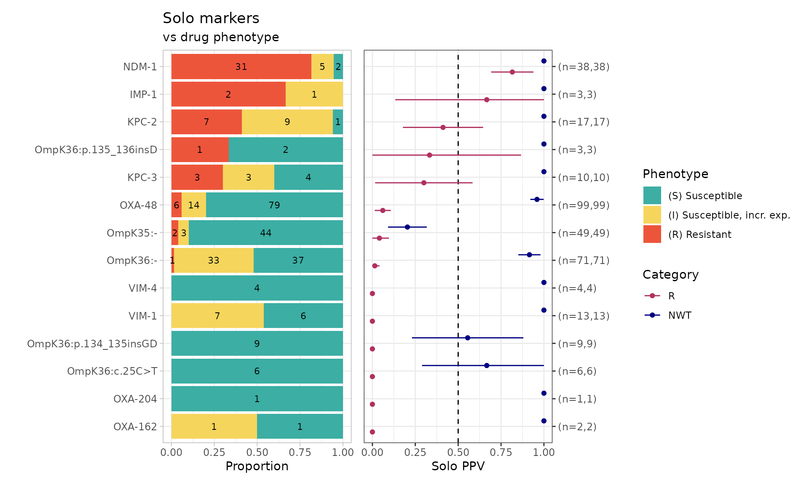

``` r

soloPPV_kleborate_mero$solo_stats
#> # A tibble: 28 × 8
#>    marker                category     x     n    ppv     se ci.lower ci.upper
#>    <chr>                 <chr>    <dbl> <int>  <dbl>  <dbl>    <dbl>    <dbl>
#>  1 OXA-162               R            0     2 0      0        0        0     
#>  2 OXA-204               R            0     1 0      0        0        0     
#>  3 OmpK36:c.25C>T        R            0     6 0      0        0        0     
#>  4 OmpK36:p.134_135insGD R            0     9 0      0        0        0     
#>  5 VIM-1                 R            0    13 0      0        0        0     
#>  6 VIM-4                 R            0     4 0      0        0        0     
#>  7 OmpK36:-              R            1    71 0.0141 0.0140   0        0.0415
#>  8 OmpK35:-              R            2    49 0.0408 0.0283   0        0.0962
#>  9 OXA-48                R            6    99 0.0606 0.0240   0.0136   0.108 
#> 10 KPC-3                 R            3    10 0.3    0.145    0.0160   0.584 
#> # ℹ 18 more rows
```

### Combinatorial PPV Analysis for Kleborate AMR Markers

To understand the contribution of AMR markers found in combination with
one another, we use the [`ppv()`](https://amrgen.org/reference/ppv.md)
function. The `plot` is a visual summary of each AMR marker combination
observed in an UpSet plot format, including phenotypic distribution and
PPVs for each combination. The `summary` table includes each AMR marker
combination observed, including number of resistant isolates, positive
predictive values, and median assay values (and interquartile range)
where relevant.

``` r
comboPPV_kleborate_mero <- ppv(
  binary_matrix = kleborate_binary_matrix,
  order = "value",
  min_set_size = 2,
  pheno_drug = "Meropenem",
  upset_grid = TRUE,
  plot_assay = TRUE,
  assay = "mic"
)
#> Scale for y is already present.
#> Adding another scale for y, which will replace the existing scale.
```

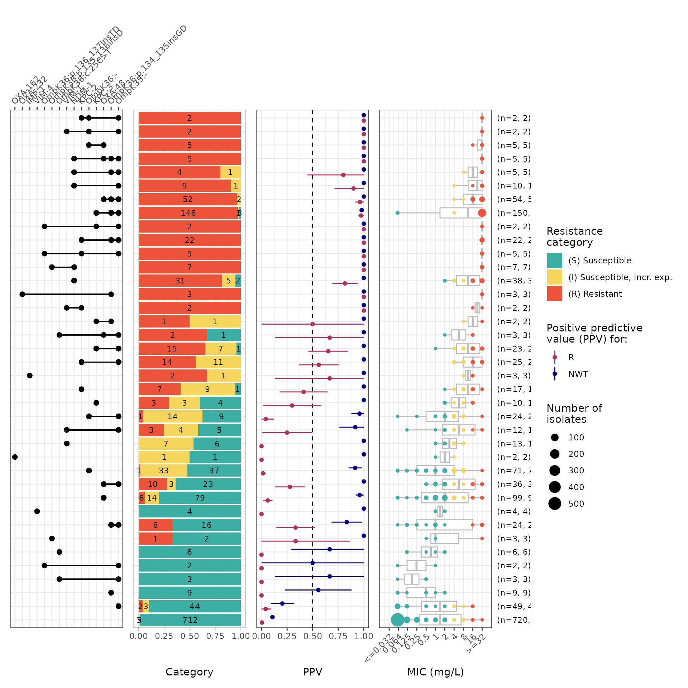

``` r

comboPPV_kleborate_mero$summary
#> # A tibble: 56 × 21
#>    marker_list        marker_count     n combination_id   R.n   R.ppv R.ci_lower
#>    <chr>                     <dbl> <int> <fct>          <dbl>   <dbl>      <dbl>
#>  1 ""                            0   720 0_0_0_0_0_0_0…     3 0.00417      0    
#>  2 "IMP-1"                       1     3 0_0_0_0_0_0_0…     2 0.667        0.133
#>  3 "OXA-162"                     1     2 0_0_0_0_0_0_0…     0 0            0    
#>  4 "VIM-4"                       1     4 0_0_0_0_0_0_0…     0 0            0    
#>  5 "VIM-1"                       1    13 0_0_0_0_0_0_0…     0 0            0    
#>  6 "OXA-204"                     1     1 0_0_0_0_0_0_0…     0 0            0    
#>  7 "OmpK36:p.135_136…            1     3 0_0_0_0_0_0_0…     1 0.333        0    
#>  8 "KPC-2"                       1    17 0_0_0_0_0_0_0…     7 0.412        0.178
#>  9 "KPC-2, VIM-1"                2     2 0_0_0_0_0_0_0…     2 1            1    
#> 10 "OmpK36:p.134_135…            1     9 0_0_0_0_0_0_1…     0 0            0    
#> # ℹ 46 more rows
#> # ℹ 14 more variables: R.ci_upper <dbl>, R.denom <int>, NWT.n <dbl>,
#> #   NWT.ppv <dbl>, NWT.ci_lower <dbl>, NWT.ci_upper <dbl>, NWT.denom <int>,
#> #   median_excludeRangeValues <dbl>, q25_excludeRangeValues <dbl>,
#> #   q75_excludeRangeValues <dbl>, n_excludeRangeValues <int>,
#> #   median_ignoreRanges <dbl>, q25_ignoreRanges <dbl>, q75_ignoreRanges <dbl>
```

### UpSet Plot for Kleborate AMR Markers

Similar to the previous [`ppv()`](https://amrgen.org/reference/ppv.md)
function, the [`amr_upset()`](https://amrgen.org/reference/amr_upset.md)
function will generate a `summary` table and `plot` that shows the
combinations of AMR markers found in the isolates and their phenotypic
distribution. The `plot` from
[`amr_upset()`](https://amrgen.org/reference/amr_upset.md) is similar to
the `plot` generated by the previous
[`ppv()`](https://amrgen.org/reference/ppv.md) function, but missing the
PPV panel.

``` r
# Changing the OmpK35:- and OmpK36:- labels to match the figures used in AMRgen paper (for figure aesthetics)
kleborate_binary_matrix_plotting <- kleborate_binary_matrix %>%
  rename(`OmpK36-Δ` = `OmpK36..-`) %>%
  rename(`OmpK35-Δ` = `OmpK35..-`)

kp_mic_upset_kleborate <- amr_upset(kleborate_binary_matrix_plotting, assay = "mic", bp_R = "8", bp_S = "2", ecoff_bp = "0.125", min_set_size = 1)
```

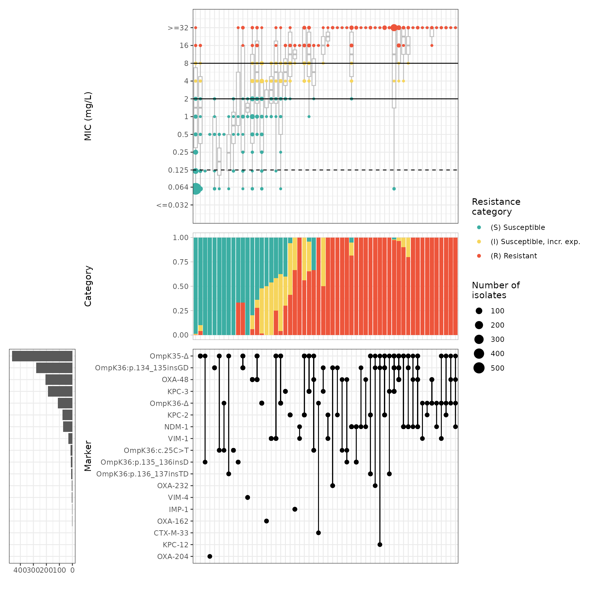

``` r
kp_mic_upset_kleborate$summary
#> # A tibble: 56 × 21
#>    marker_list        marker_count     n combination_id   R.n   R.ppv R.ci_lower
#>    <chr>                     <dbl> <int> <fct>          <dbl>   <dbl>      <dbl>
#>  1 ""                            0   720 0_0_0_0_0_0_0…     3 0.00417      0    
#>  2 "IMP-1"                       1     3 0_0_0_0_0_0_0…     2 0.667        0.133
#>  3 "OXA-162"                     1     2 0_0_0_0_0_0_0…     0 0            0    
#>  4 "VIM-4"                       1     4 0_0_0_0_0_0_0…     0 0            0    
#>  5 "VIM-1"                       1    13 0_0_0_0_0_0_0…     0 0            0    
#>  6 "OXA-204"                     1     1 0_0_0_0_0_0_0…     0 0            0    
#>  7 "OmpK36:p.135_136…            1     3 0_0_0_0_0_0_0…     1 0.333        0    
#>  8 "KPC-2"                       1    17 0_0_0_0_0_0_0…     7 0.412        0.178
#>  9 "KPC-2, VIM-1"                2     2 0_0_0_0_0_0_0…     2 1            1    
#> 10 "OmpK36:p.134_135…            1     9 0_0_0_0_0_0_1…     0 0            0    
#> # ℹ 46 more rows
#> # ℹ 14 more variables: R.ci_upper <dbl>, R.denom <int>, NWT.n <dbl>,
#> #   NWT.ppv <dbl>, NWT.ci_lower <dbl>, NWT.ci_upper <dbl>, NWT.denom <int>,
#> #   median_excludeRangeValues <dbl>, q25_excludeRangeValues <dbl>,
#> #   q75_excludeRangeValues <dbl>, n_excludeRangeValues <int>,
#> #   median_ignoreRanges <dbl>, q25_ignoreRanges <dbl>, q75_ignoreRanges <dbl>
```

### Group Kleborate AMR Markers

Since there are a number of carbapenem resistance gene alleles, we want
to group them by their respective gene families (e.g., KPC, VIM, OXA,
etc.) to simplify. In addition, we want to generalize porin defects, so
any OmpK35 or OmpK36 mutation detected with a `Ter` or `del` in the HGVS
nomenclature, we will group together as `OmpK35-\u0394` or
`OmpK35-\u0394` representing a loss/truncation of the protein.

``` r
# Selecting the relevant columns for relabeling and plotting later
kp_mero_euscape_mic <- kp_mero_euscape %>% select(id, measurement)
kp_Carb_kleborate_euscape <- kleborate_raw %>% select(strain, Omp_mutations, Bla_Carb_acquired)
kp_kleborate_mic_euscape <- left_join(kp_mero_euscape_mic, kp_Carb_kleborate_euscape, by = c("id" = "strain"))

# Grouping by carbapenem resistance genes into their gene family
kp_kleborate_mic_euscape <- kp_kleborate_mic_euscape %>%
  mutate(Carb = case_when(
    grepl(";", Bla_Carb_acquired) ~ "multiple",
    grepl("KPC", Bla_Carb_acquired) ~ "KPC",
    grepl("NDM", Bla_Carb_acquired) ~ "NDM",
    grepl("OXA", Bla_Carb_acquired) ~ "OXA",
    grepl("VIM", Bla_Carb_acquired) ~ "VIM",
    grepl("IMP", Bla_Carb_acquired) ~ "IMP",
    grepl("CTX-M", Bla_Carb_acquired) ~ "CTX-M",
    TRUE ~ "none"
  )) %>%
  # Assigning wildtype (wt) or mutation (mut) porin status (i.e., any change from wt is considered mut)
  mutate(Porin = if_else(Omp_mutations == "-", "wt", "mut"))

# Grouping porin mutations
kp_kleborate_mic_euscape <- kp_kleborate_mic_euscape %>%
  mutate(ompK35_label = case_when(
    grepl("OmpK35[^;]*(Ter|del)", Omp_mutations) ~ "OmpK35-\u0394",
    TRUE ~ "OmpK35-wt"
  )) %>%
  mutate(ompK36_label = case_when(
    grepl("OmpK36[^;]*(Ter|del)", Omp_mutations) ~ "OmpK36-\u0394",
    grepl("OmpK36:p.134_135insGD", Omp_mutations) ~ "OmpK36:p.134_135insGD",
    grepl("OmpK36:p.136_137insTD", Omp_mutations) ~ "OmpK36:p.136_137insTD",
    grepl("OmpK36:c.25C>T", Omp_mutations) ~ "OmpK36:c.25C>T",
    grepl("OmpK36:p.135_136insD", Omp_mutations) ~ "OmpK36:p.135_136insD",
    TRUE ~ "OmpK36-wt"
  )) %>%
  mutate(porin_label = paste0(ompK35_label, "; ", ompK36_label)) %>%
  mutate(porin_label = str_replace_all(porin_label, "OmpK35-wt; OmpK36-wt", "wt OmpK35 OmpK36")) %>%
  mutate(porin_label = str_replace_all(porin_label, "OmpK35-wt; OmpK36-\u0394", "OmpK36-\u0394")) %>%
  mutate(porin_label = str_replace_all(porin_label, "OmpK35-wt; OmpK36:c.25C>T", "OmpK36:c.25C>T")) %>%
  mutate(porin_label = str_replace_all(porin_label, "OmpK35-wt; OmpK36:p.134_135insGD", "OmpK36:p.134_135insGD")) %>%
  mutate(porin_label = str_replace_all(porin_label, "OmpK35-wt; OmpK36:p.135_136insD ", "OmpK36:p.135_136insD")) %>%
  mutate(porin_label = str_replace_all(porin_label, "OmpK35-\u0394; OmpK36-wt", "OmpK35-\u0394")) %>%
  mutate(porin_label = str_replace_all(porin_label, "OmpK35-wt; OmpK36:p.135_136insD", "OmpK36:p.135_136insD"))

# Setting the orders for plotting
kp_kleborate_mic_euscape$Porin <- factor(kp_kleborate_mic_euscape$Porin, levels = c("wt", "mut"))
kp_kleborate_mic_euscape$Carb <- factor(kp_kleborate_mic_euscape$Carb, levels = c("none", "KPC", "NDM", "OXA", "VIM", "IMP", "CTX-M", "multiple"))
kp_kleborate_mic_euscape$porin_label <- factor(kp_kleborate_mic_euscape$porin_label,
  levels = c(
    "wt OmpK35 OmpK36",
    "OmpK35-\u0394",
    "OmpK35-\u0394; OmpK36:p.134_135insGD",
    "OmpK35-\u0394; OmpK36-\u0394",
    "OmpK35-\u0394; OmpK36:p.136_137insTD",
    "OmpK35-\u0394; OmpK36:c.25C>T",
    "OmpK35-\u0394; OmpK36:p.135_136insD",
    "OmpK36-\u0394",
    "OmpK36:p.134_135insGD",
    "OmpK36:p.135_136insD",
    "OmpK36:c.25C>T"
  )
)
```

### Plot the Grouped Kleborate AMR Markers

We will now generate a combined box plot + scatter plot that shows each
isolate with its meropenem MIC value, generalized grouping of carbapenem
resistance gene families and porin status, with detailed porin
information.

``` r
# Counting the porin types to be used in the plot
counts <- kp_kleborate_mic_euscape %>%
  count(porin_label)

labels_with_n <- setNames(
  paste0(counts$porin_label, " (n=", counts$n, ")"),
  counts$porin_label
)

# Generate the plot
kp_kleborate_grouped_plot <- ggplot(
  kp_kleborate_mic_euscape,
  aes("", as.numeric(measurement))
) +
  geom_boxplot(width = 0.7, outlier.shape = NA) +
  geom_jitter(aes(color = porin_label), size = 1.5, alpha = 0.7) +
  scale_color_manual(
    name = "Porin Status",
    values = c(
      "wt OmpK35 OmpK36" = "grey",
      "OmpK35-\u0394" = "#DE4BAD",
      "OmpK35-\u0394; OmpK36:p.134_135insGD" = "#3B81E3",
      "OmpK35-\u0394; OmpK36-\u0394" = "#7FB550",
      "OmpK35-\u0394; OmpK36:p.136_137insTD" = "#ff8a5e",
      "OmpK35-\u0394; OmpK36:c.25C>T" = "#733808",
      "OmpK35-\u0394; OmpK36:p.135_136insD" = "pink",
      "OmpK36-\u0394" = "#fff2a6",
      "OmpK36:p.134_135insGD" = "#935BBD",
      "OmpK36:p.135_136insD" = "red",
      "OmpK36:c.25C>T" = "black"
    ),
    labels = labels_with_n
  ) +

  # log2 scale for MIC distribution
  scale_y_continuous(
    trans = "log2", breaks = c(0.25, 0.5, 1, 2, 4, 8, 16, 32),
    name = "Meropenem MIC (mg/L)"
  ) +

  # horizontal reference lines for EUCAST and ECOFF
  geom_hline(yintercept = 2, linetype = "solid", color = "black", linewidth = 0.4) +
  geom_hline(yintercept = 8, linetype = "solid", color = "black", linewidth = 0.4) +
  geom_hline(yintercept = 0.125, linetype = "dashed", color = "black", linewidth = 0.4) +
  facet_grid(
    . ~ Carb + Porin,
    switch = "x"
  ) +
  theme_bw() +
  theme(
    strip.placement = "outside",
    strip.background = element_blank(),
    panel.border = element_blank(),
    panel.grid = element_blank(),
    panel.spacing = unit(0, "lines"),
    axis.line = element_line(color = "black", linewidth = 0.4),
    plot.margin = margin(5.5, 5.5, 5.5, 60)
  ) +
  labs(x = "")

kp_kleborate_grouped_plot
```

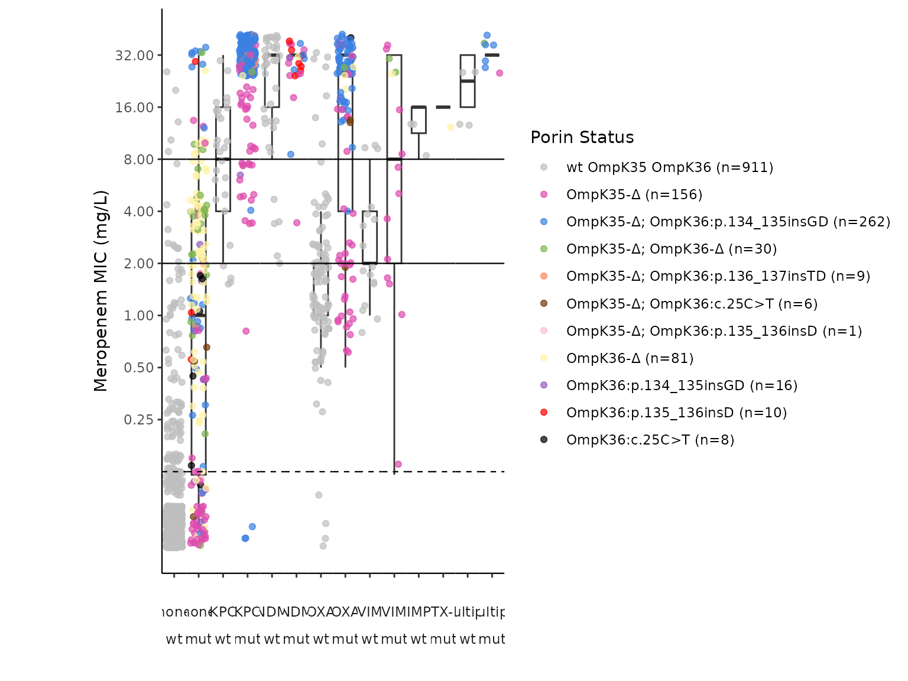

``` r
# if you have the 'cowplot' library you can use it to add labels "Carb" and "Porin" to the rows at the bottom of the plot
library(cowplot)
ggdraw(kp_kleborate_grouped_plot) +
  draw_label("Carb", x = 0.08, y = 0.11, hjust = 0, fontface = "bold", size = 10) +
  draw_label("Porin", x = 0.08, y = 0.065, hjust = 0, fontface = "bold", size = 10)
```

From the above `kp_kleborate_grouped_plot` plot (with ECOFF = 0.125mg/L,
EUCAST Susceptible breakpoint at \<=2mg/L, EUCAST Resistant breakpoint
\>8mg/L), we can see that in isolates:

- with no carbapenemase and wildtype (wt) porin, the median meropenem
  MIC is \<0.25mg/L.
- with any porin defect (no carbapenemase), the median meropenem MIC is
  elevated to 1mg/L.

Across isolates with only a single carbapenemase (and wildtype porin),
median MICs generally remained below the EUCAST resistant breakpoint
(\>8 mg/L), except for those carrying NDM, IMP, or multiple
carbapenemases, which exceeded the resistant breakpoint.

Notably, isolates with KPC or OXA carbapenemases had median MICs ≤2 mg/L
and the presence of a porin defect increased the median MICs to above
the EUCAST resistant breakpoint.

### Mean (Median) Meropenem MIC Table

While the `kp_kleborate_grouped_plot` plot is useful for visually
inspecting the median MIC values, to numerically show the mean (median)
meropenem MIC (mg/L) for isolates with different carbapenem resistance
gene families and porin statuses, we will generate a table.

``` r
# Simplifying porin status
kp_kleborate_mic_euscape <- kp_kleborate_mic_euscape %>%
  mutate(ompK35 = case_when(
    grepl("OmpK35[^;]*(Ter|del)", Omp_mutations) ~ "\u0394",
    TRUE ~ "wt"
  )) %>%
  mutate(ompK36 = case_when(
    grepl("OmpK36[^;]*(Ter|del)", Omp_mutations) ~ "\u0394",
    grepl("OmpK36:p.134_135insGD", Omp_mutations) ~ "Loop mutation",
    grepl("OmpK36:p.136_137insTD", Omp_mutations) ~ "Loop mutation",
    grepl("OmpK36:p.135_136insD", Omp_mutations) ~ "Loop mutation",
    grepl("OmpK36:c.25C>T", Omp_mutations) ~ "c25t mutation",
    TRUE ~ "wt"
  ))

# Convert the table into wide format with porin status as rows and carbapenemase status as columns
mean_MIC_table <- kp_kleborate_mic_euscape %>%
  group_by(ompK35, ompK36, Carb) %>%
  summarise(
    mean_MIC = round(mean(as.numeric(measurement), na.rm = TRUE), 1),
    median_MIC = round(median(as.numeric(measurement), na.rm = TRUE), 1),
    .groups = "drop"
  ) %>%
  mutate(mean_median = paste0(mean_MIC, " (", median_MIC, ")")) %>%
  select(-mean_MIC, -median_MIC) %>%
  pivot_wider(
    names_from = Carb,
    values_from = mean_median
  ) %>%
  select(ompK35, ompK36, none, KPC, NDM, OXA, VIM, IMP, `CTX-M`, multiple) %>%
  mutate(order_group = case_when(
    ompK35 == "wt" & ompK36 == "wt" ~ 1,
    ompK35 == "\u0394" & ompK36 == "wt" ~ 2,
    ompK35 == "\u0394" & ompK36 == "Loop mutation" ~ 3,
    ompK35 == "\u0394" & ompK36 == "c25t mutation" ~ 4,
    ompK35 == "\u0394" & ompK36 == "\u0394" ~ 5,
    ompK35 == "wt" & ompK36 == "Loop mutation" ~ 6,
    ompK35 == "wt" & ompK36 == "c25t mutation" ~ 7,
    ompK35 == "wt" & ompK36 == "\u0394" ~ 8,
    TRUE ~ 9
  )) %>%
  arrange(order_group) %>%
  select(-order_group)

mean_MIC_table
#> # A tibble: 8 × 10
#>   ompK35 ompK36        none      KPC    NDM   OXA   VIM   IMP   `CTX-M` multiple
#>   <chr>  <chr>         <chr>     <chr>  <chr> <chr> <chr> <chr> <chr>   <chr>   
#> 1 wt     wt            0.3 (0.1) 10.6 … 23.6… 3.2 … 3.3 … 13.3… NA      24 (24) 
#> 2 Δ      wt            1.2 (0.1) 17.4 … 27.6… 8 (2) 9.3 … NA    NA      32 (32) 
#> 3 Δ      Loop mutation 9.4 (1)   31.3 … 27.2… 27.6… NA    NA    NA      32 (32) 
#> 4 Δ      c25t mutation 0.4 (0.5) NA     NA    11.3… NA    NA    NA      NA      
#> 5 Δ      Δ             4.7 (4)   32 (3… NA    32 (… 32 (… NA    NA      32 (32) 
#> 6 wt     Loop mutation 3.3 (0.5) 24 (3… 32 (… 32 (… NA    NA    NA      NA      
#> 7 wt     c25t mutation 1 (0.8)   NA     NA    32 (… NA    NA    NA      NA      
#> 8 wt     Δ             3.5 (2)   32 (3… 32 (… 28.8… 32 (… NA    16 (16) NA
```

``` r
# If you have the gt pacakge, you can use it to make the table aesthetically pleasing
library(gt)
mean_MIC_table_aes <- mean_MIC_table %>%
  gt() %>%
  cols_label(
    ompK35 = html("<b>OmpK35</b>"),
    ompK36 = html("<b>OmpK36</b>"),
    none = html("<b>None</b>"),
    KPC = html("<b>KPC</b>"),
    NDM = html("<b>NDM</b>"),
    OXA = html("<b>OXA</b>"),
    VIM = html("<b>VIM</b>"),
    IMP = html("<b>IMP</b>"),
    `CTX-M` = html("<b>CTX-M</b>"),
    multiple = html("<b>Multiple</b>")
  ) %>%
  tab_spanner(
    label = html("<b>Porin status</b>"),
    columns = c("ompK35", "ompK36")
  ) %>%
  tab_spanner(
    label = html("<b>Carbapenemase status</b>"),
    columns = c("none", "KPC", "NDM", "OXA", "VIM", "IMP", "CTX-M", "multiple")
  ) %>%
  fmt_missing(
    columns = everything(),
    missing_text = "-"
  ) %>%
  # Background color based on EUCAST breakpoints
  data_color(
    columns = c("none", "KPC", "NDM", "OXA", "VIM", "IMP", "CTX-M", "multiple"),
    fn = function(x) {
      numeric_vals <- as.numeric(str_extract(x, "^[0-9.]+"))

      case_when(
        is.na(numeric_vals) ~ "transparent",
        numeric_vals <= 2 ~ "#3CAEA3",
        numeric_vals <= 8 ~ "#F6D55C",
        numeric_vals > 8 ~ "#ED553B"
      )
    }
  ) %>%
  # Changing orange cells to have white font so it is easier to see the numbers
  data_color(
    columns = c("none", "KPC", "NDM", "OXA", "VIM", "IMP", "CTX-M", "multiple"),
    fn = function(x) {
      numeric_vals <- as.numeric(str_extract(x, "^[0-9.]+"))

      case_when(
        is.na(numeric_vals) ~ "black",
        numeric_vals > 8 ~ "white",
        TRUE ~ "black"
      )
    },
    apply_to = "text"
  ) %>%
  # aligning columns
  cols_align(
    align = "center",
    columns = everything()
  ) %>%
  # text options
  tab_options(
    table.font.names = "Arial",
    table.font.size = 14,
    heading.title.font.size = 16,
    table.border.top.color = "black",
    table.border.bottom.color = "black"
  ) %>%
  # column widths
  cols_width(
    ompK35 ~ px(125),
    ompK36 ~ px(125),
    everything() ~ px(100)
  )

# Adding title and legend for colour
mean_MIC_table_aes <- mean_MIC_table_aes %>%
  tab_header(
    title = html("<b>Mean (Median) Meropenem Minimum Inhibitory Concentration (mg/L)</b>"),
    subtitle = html(
      "<span style='font-size:12px;'>
      <b>EUCAST clinical breakpoint:</b>
      <span style='color:#3CAEA3;'>■</span> Susceptible (≤ 2 mg/L) &nbsp;
      <span style='color:#F6D55C;'>■</span> Intermediate (susceptible, increased exposure; 2–8 mg/L) &nbsp;
      <span style='color:#ED553B;'>■</span> Resistant (> 8 mg/L)
      </span>"
    )
  )

mean_MIC_table_aes
```

In the `mean_MIC_table` table above, you can see that isolates have: - a
mean meropenem MIC of 0.3mg/L, when they have wildtype OmpK35/36 porin
status with no carbapenemase  
- a mean meropenem MIC that exceeds the EUCAST R breakpoint (\>8mg/L)
when a KPC, NDM, or IMP or multiple carbapenemases are harboured

Specifically, for OXA-encoding isolates, the only porin defect that does
not change the median meropenem MIC is OmpK35-Δ, whereas all other porin
defects shift the median MIC to 16-32mg/L.

Isolates with VIM carbapenemases alone had a median MIC of 2 mg/L, which
increased to 8 mg/L when combined with porin defects (particularly
OmpK36-Δ or the loss of both porins).

The only porin defects that raise the mean meropenem MIC above EUCAST S
breakpoint (\<=2mg/L) are:

- OmpK35-Δ and OmpK36 β-strand Loop 3 insertion,
- OmpK35-Δ and OmpK36-Δ,
- OmpK36 β-strand Loop 3 insertion,
- OmpK36-Δ

In summary, the presence of any carbapenemase with any porin defect
elevates the mean meropenem MIC to above the EUCAST R breakpoint, with
the exception of isolates harbouring an OXA carbapenemase and OmpK35-Δ.

#### Make Figure for AMRgen manuscript

The code below was used to combine the UpSet plot (created using the
[`amr_upset()`](https://amrgen.org/reference/amr_upset.md) function),
the grouped carbapenemase/porin status plot, and the mean (median)
meropenem MIC table as shown in the AMRgen manuscript. To make these
components you need the `cowplot` and `gt` packages as noted above, as
well as the `png` packages.

``` r
library(png)

# Save the table as a temporary file to retrieve it later when combining the panels
tmp <- tempfile(fileext = ".png")

gtsave(
  mean_MIC_table_aes,
  tmp,
  vwidth = 4000,
  vheight = 300
)

table_grob <- rasterGrob(
  png::readPNG(tmp),
  interpolate = TRUE
)

# Add whitespace to the right and left of table
table_with_padding <- plot_grid(
  NULL, # left spacer
  table_grob,
  NULL, # right spacer
  ncol = 3,
  rel_widths = c(0.001, 0.85, 0.149) # 5% white on each side
)

# Save the figure with panel labels
ggsave("Figure5_Kp_EuSCAPE.png",
  plot = plot_grid(
    kp_mic_upset_kleborate$plot,
    kp_kleborate_mic_euscape_plot_label,
    table_with_padding,
    labels = c("a)", "b)", "c)"),
    ncol = 1,
    rel_heights = c(1, 0.9, 0.5)
  ),
  width = 12, height = 15,
  bg = "white"
)
```

## Genotypes from Kleborate v3.1.3

### Import Kleborate (\<= v3.1.3) Genotype Data

We will now compare the latest version of Kleborate (which we’ve been
using up until this point) [development branch; commit
\#4ec1dcb](https://github.com/klebgenomics/Kleborate/tree/development)
to an older version of Kleborate v3.1.3. The older versions (\<=v3.1.3)
of Kleborate uses informal nomenclature to describe mutations
(e.g. \[gene\]-\[mutation\], \[gene\]-X%, OmpK36GD), whereas the updated
version follows the HGVS nomenclature standard.

A table of Kleborate v3.1.3 results generated for the EuSCAPE genomes is
available in the AMRgen package as `kleborate_raw_v313`. Let’s import it
and summarise its contents:

``` r
# View Kleborate output v3.1.3 (using informal nomenclature (e.g. [gene]-[mutation], [gene]-X%, OmpK36GD))
head(kleborate_raw_v313, n = 10)
#> # A tibble: 10 × 113
#>    strain    species species_match contig_count    N50 largest_contig total_size
#>    <chr>     <chr>   <chr>                <dbl>  <dbl>          <dbl>      <dbl>
#>  1 SAMEA349… Klebsi… strong                 141 230759         470757    5578320
#>  2 SAMEA349… Klebsi… strong                  88 370309         938079    5384685
#>  3 SAMEA349… Klebsi… strong                  90 238750         529125    5446454
#>  4 SAMEA349… Klebsi… strong                 144 207582         663698    5574298
#>  5 SAMEA349… Klebsi… strong                 142 263498         678692    5486238
#>  6 SAMEA349… Klebsi… strong                  79 285199         991412    5529803
#>  7 SAMEA349… Klebsi… strong                 280 178980         585359    5817055
#>  8 SAMEA349… Klebsi… strong                 108 209418         517450    5379124
#>  9 SAMEA349… Klebsi… strong                 134 371444         984005    5558705
#> 10 SAMEA349… Klebsi… strong                 142 197944         636773    5497421
#> # ℹ 106 more variables: ambiguous_bases <chr>, QC_warnings <chr>, ST <chr>,
#> #   gapA <dbl>, infB <dbl>, mdh <dbl>, pgi <dbl>, phoE <dbl>, rpoB <dbl>,
#> #   tonB <dbl>, YbST <chr>, Yersiniabactin <chr>, ybtS <chr>, ybtX <chr>,
#> #   ybtQ <chr>, ybtP <chr>, ybtA <chr>, irp2 <chr>, irp1 <chr>, ybtU <chr>,
#> #   ybtT <chr>, ybtE <chr>, fyuA <chr>, spurious_ybt_hits <chr>, CbST <chr>,
#> #   Colibactin <chr>, clbA <chr>, clbB <chr>, clbC <chr>, clbD <chr>,
#> #   clbE <chr>, clbF <chr>, clbG <chr>, clbH <chr>, clbI <chr>, clbL <chr>, …

# Use import_kleborate() function and set `hgvs = FALSE` for Kleborate outputs generated from <=v3.1.3 (using non-HGVS nomenclature)
kleborate_v313 <- import_kleborate(
  input_table = kleborate_raw_v313,
  sample_col = "strain",
  hgvs = FALSE
)

# Summarize genotype table
summarise_geno(kleborate_v313, sample_col = "id", marker_col = "marker.label")
#> $uniques
#> # A tibble: 6 × 2
#>   column         n_unique
#>   <chr>             <int>
#> 1 id                 1489
#> 2 marker.label        263
#> 3 drug                  1
#> 4 drug_class           13
#> 5 gene                263
#> 6 variation type        4
#> 
#> $per_type
#> # A tibble: 4 × 6
#>   `variation type`                  id marker.label  drug drug_class  gene
#>   <chr>                          <int>        <int> <int>      <int> <int>
#> 1 Gene presence detected          1489          246     1         13   246
#> 2 Inactivating mutation detected   568            3     1          2     3
#> 3 Nucleotide variant detected       15            1     1          1     1
#> 4 Protein variant detected         874           13     1          2    13
#> 
#> $drugs
#> # A tibble: 13 × 5
#>    drug  drug_class                markers samples  hits
#>    <lgl> <chr>                       <int>   <int> <int>
#>  1 NA    Aminoglycosides                59    1057  3140
#>  2 NA    Beta-lactams                   76    1457  2833
#>  3 NA    Carbapenems                    17     766  1459
#>  4 NA    Cephalosporins (3rd gen.)      18     648   668
#>  5 NA    Macrolides                     14     460   923
#>  6 NA    Phenicols                      12     469   558
#>  7 NA    Phosphonics                     1       3     3
#>  8 NA    Polymyxins                      3     138   138
#>  9 NA    Quinolones                     25    1020  2422
#> 10 NA    Rifamycins                      2     114   114
#> 11 NA    Sulfonamides                    9     913  1090
#> 12 NA    Tetracyclines                   9     503   541
#> 13 NA    Trimethoprims                  18     886  1017
#> 
#> $markers
#> # A tibble: 263 × 5
#>    marker.label drug  drug_class                `variation type`           n
#>    <chr>        <lgl> <chr>                     <chr>                  <int>
#>  1 ACC-4        NA    Beta-lactams              Gene presence detected     2
#>  2 CMY-13       NA    Beta-lactams              Gene presence detected     1
#>  3 CMY-16       NA    Beta-lactams              Gene presence detected    31
#>  4 CMY-2.v2     NA    Beta-lactams              Gene presence detected     1
#>  5 CMY-30       NA    Cephalosporins (3rd gen.) Gene presence detected     1
#>  6 CMY-4.v1     NA    Beta-lactams              Gene presence detected     5
#>  7 CMY-6        NA    Beta-lactams              Gene presence detected     2
#>  8 CTX-M-1      NA    Cephalosporins (3rd gen.) Gene presence detected     1
#>  9 CTX-M-14     NA    Cephalosporins (3rd gen.) Gene presence detected    16
#> 10 CTX-M-15     NA    Cephalosporins (3rd gen.) Gene presence detected   568
#> # ℹ 253 more rows
```

## Compare Kleborate versions

Comparing only the carbapenem resistance determinants from an updated
version Kleborate (development branch) to a previous version (v3.1.3).

``` r
# Grouping Kleborate development branch carbapenem resistance determinants, so that there is one row per sample
kleborate_dev_markers_grouped <- kleborate_dev %>%
  filter(Kleborate_Class == "Omp_mutations" | Kleborate_Class == "Bla_Carb_acquired") %>%
  select(id, marker.label) %>%
  rename(kleborate = marker.label) %>%
  group_by(id) %>%
  summarise(
    Kleborate_dev_markers = kleborate %>%
      sort() %>%
      str_c(collapse = ";")
  )

# Since we know that Kleborate v3.1.3 does not use HGVS notation, we will change the names of the OmpK36 mutations to match HGVS notation for comparison purposes
# After, we group them so there is one row per sample
kleborate_v313_markers_grouped <- kleborate_v313 %>%
  filter(Kleborate_Class == "Omp_mutations" | Kleborate_Class == "Bla_Carb_acquired") %>%
  select(id, marker.label) %>%
  mutate(
    marker.label = str_replace_all(marker.label, "OmpK36GD", "OmpK36:p.134_135insGD"),
    marker.label = str_replace_all(marker.label, "OmpK36_c25t", "OmpK36:c.25C>T"),
    marker.label = str_replace_all(marker.label, "OmpK36TD", "OmpK36:p.136_137insTD")
  ) %>%
  rename(kleborate = marker.label) %>%
  group_by(id) %>%
  summarise(
    Kleborate_v313_markers = kleborate %>%
      sort() %>%
      str_c(collapse = ";")
  )

# Joining Kleborate version tables for comparison
compare_kleborate_versions <- full_join(
  kleborate_dev_markers_grouped,
  kleborate_v313_markers_grouped
)
#> Joining with `by = join_by(id)`

# Comparing Kleborate versions and creating two new columns to show what each version is missing
compare_kleborate_versions <- compare_kleborate_versions %>%
  rowwise() %>%
  mutate(
    dev_missing = {
      v313_vec <- str_split(Kleborate_v313_markers, ";")[[1]]
      dev_vec <- str_split(Kleborate_dev_markers, ";")[[1]]
      missing <- setdiff(v313_vec, dev_vec)
      if (length(missing) == 0) NA_character_ else str_c(missing, collapse = ";")
    },
    v313_missing = {
      v313_vec <- str_split(Kleborate_v313_markers, ";")[[1]]
      dev_vec <- str_split(Kleborate_dev_markers, ";")[[1]]
      missing <- setdiff(dev_vec, v313_vec)
      if (length(missing) == 0) NA_character_ else str_c(missing, collapse = ";")
    }
  ) %>%
  ungroup()

# Table listing the AMR markers that are missing from Kleborate v3.1.3
compare_kleborate_versions %>% count(v313_missing, sort = TRUE)
#> # A tibble: 4 × 2
#>   v313_missing             n
#>   <chr>                <int>
#> 1 NA                     752
#> 2 OmpK36:p.135_136insD    12
#> 3 OmpK35:-                 4
#> 4 OmpK36:-                 2

# Table listing the AMR markers that are missing from the updated Kleborate version
compare_kleborate_versions %>% count(dev_missing, sort = TRUE)
#> # A tibble: 1 × 2
#>   dev_missing     n
#>   <chr>       <int>
#> 1 NA            770
```

We can see that there are no carbapenem resistance determinants missed
by the updated Kleborate development version, in fact, the new version
now additionally calls OmpK36:p.135_136insD (n=12), and OmpK35:- (n=4),
and OmpK36:- (n=2) that were previously unidentified.

Noting that there are no new carbapenem resistance genes identified in
this new version of Kleborate which includes an updated AMR database.

Up until this point, we have only explored using different versions of
Kleborate as the AMR genotyper. The next few sections will explore using
different AMR genotypers and comparing their results.

First up, we have AMRFinderPlus!

## Genotypes from AMRFinderPlus

NCBI has developed [AMRFinderPlus](https://github.com/ncbi/amr/wiki), a
tool that identifies AMR genes, resistance-associated point mutations,
and select other classes of genes using protein annotations and/or
assembled nucleotide sequence, published
[here](https://doi.org/10.1038/s41598-021-91456-0). It can only be used
via command line and also has [organism-specific
options](https://github.com/ncbi/amr/wiki/Running-AMRFinderPlus#--organism-option).

### Import AMRFinderPlus Genotype Data

The download_ebi() can download AMRFinderPlus genotype data from the
[EBI AMR
portal](https://ftp.ebi.ac.uk/pub/databases/amr_portal/releases/),
filter your species of interest, and reformat into AMRgen genotype
table. The AMRFinderPlus data being used here is from the [2025-12
release using AMRFinderPlus version
v4.0](https://www.ebi.ac.uk/amr/methods/). Noting that as of
AMRFinderPlus (v4.2.5), there is additional functionality to identify
putatively function disrupting mutations in genes (i.e., ompk35 and
ompk36 loss and truncations) that lead to resistance, which Kleborate
already identifies.

``` r
# Download Klebsiella pneumoniae genotype AMRFinderPlus data and re-format the data into an AMRgen genotype table
amrfp <- download_ebi(
  data = "genotype", species = "Klebsiella pneumoniae",
  reformat = T
)

# Filter for isolates in EuSCAPE paper with meropenem phenotypes and remove contaminated samples
kp_mero_amrfp <- kp_mero_amrfp %>%
  filter(id %in% kp_mero_euscape$id) %>%
  filter(!id %in% contaminated_assemblies)
```

A copy of this data frame is avaiable in the AMRgen pacakge as
`kp_mero_amrfp`:

``` r
head(kp_mero_amrfp)
#> # A tibble: 6 × 34
#>   id        marker gene  mutation drug_agent drug_class marker.label assembly_ID
#>   <chr>     <chr>  <chr> <chr>    <ab>       <chr>      <chr>        <chr>      
#> 1 SAMEA364… ompK3… ompK… Asp135A… NA         Carbapene… ompK36:Asp1… GCA_900500…
#> 2 SAMEA364… gyrA_… gyrA  Ser83Ile NA         Quinolones gyrA:Ser83I… GCA_900500…
#> 3 SAMEA364… fosA   fosA  -        FOS        Phosphoni… fosA         GCA_900500…
#> 4 SAMEA364… parC_… parC  Ser80Ile NA         Quinolones parC:Ser80I… GCA_900500…
#> 5 SAMEA364… oqxB   oqxB  -        NA         Phenicols  oqxB         GCA_900500…
#> 6 SAMEA364… oqxB   oqxB  -        NA         Quinolones oqxB         GCA_900500…
#> # ℹ 26 more variables: genus <chr>, species <chr>, organism <chr>,
#> #   isolate <chr>, taxon_id <int>, region <chr>, region_start <int>,
#> #   region_end <int>, strand <chr>, `_bin` <int>, id2 <chr>, gene_symbol <chr>,
#> #   amr_element_symbol <chr>, element_type <chr>, element_subtype <chr>,
#> #   class <chr>, subclass <chr>, split_subclass <chr>, antibiotic_name <chr>,
#> #   antibiotic_ontology <chr>, antibiotic_ontology_link <chr>,
#> #   evidence_accession <chr>, evidence_type <chr>, evidence_link <chr>, …

# Summary of carbapenem resistance determinants
summarise_geno(kp_mero_amrfp)
#> $uniques
#> # A tibble: 4 × 2
#>   column     n_unique
#>   <chr>         <int>
#> 1 id             1490
#> 2 marker          237
#> 3 drug_class       20
#> 4 gene            218
#> 
#> $per_type
#> NULL
#> 
#> $drugs
#> # A tibble: 20 × 4
#>    drug_class                markers samples     n
#>    <chr>                       <int>   <int> <int>
#>  1 Aminoglycosides                35    1020  6046
#>  2 Beta-lactams                   45    1424  2353
#>  3 Carbapenems                    16     669   956
#>  4 Cephalosporins                  1      23    48
#>  5 Cephalosporins (3rd gen.)      36     788  1479
#>  6 Efflux                          1    1483  1483
#>  7 Glycopeptides                   1      49    49
#>  8 Lincosamides                    3       3     5
#>  9 Macrolides                      7     479  6818
#> 10 Other                           1       2     4
#> 11 Penicillins                     1       4    16
#> 12 Phenicols                      25    1458  3802
#> 13 Phosphonics                     5    1488  1491
#> 14 Polymyxins                     12      40    40
#> 15 Quinolones                     40    1468  4959
#> 16 Rifamycins                      3     110   119
#> 17 Streptogramins                  2      83   249
#> 18 Sulfonamides                    3     931  1206
#> 19 Tetracyclines                  12     605   699
#> 20 Trimethoprims                  12     539   563
#> 
#> $markers
#> # A tibble: 261 × 3
#>    marker        drug_class          n
#>    <chr>         <chr>           <int>
#>  1 aac(3)-IId    Aminoglycosides   122
#>  2 aac(3)-IIe    Aminoglycosides   379
#>  3 aac(3)-IIg    Aminoglycosides    14
#>  4 aac(3)-IVa    Aminoglycosides    45
#>  5 aac(3)-Ia     Aminoglycosides     5
#>  6 aac(3)-VIa    Aminoglycosides     1
#>  7 aac(6')-IIc   Aminoglycosides   189
#>  8 aac(6')-Ib    Aminoglycosides  3100
#>  9 aac(6')-Ib'   Aminoglycosides    11
#> 10 aac(6')-Ib-cr Aminoglycosides    24
#> # ℹ 251 more rows
```

### Compare AMRFinderPlus to Kleborate genotype results

We are going to compare the AMRFinderPlus results that we just
downloaded and the Kleborate development branch results. We know that
there are differences between AMRFinderPlus and Kleborate development
branch in detecting porin defects:

- Kleborate development branch does not identify OmpK35_E132K. As per
  NCBI Reference Gene Catalog, the citation related to this mutation is
  PMID: 20660684. In the paper, the mutation (ompK35_E132K) is detected
  in a strain (AIS080884) with an ompk36 mutation (Ser255Thr) that is
  categorized as low carbapenem resistance. There is no other other
  literature that experimentally tests this mutation alone, other papers
  only report the presence of the mutation (often in combination with
  other mutations/carbapenemases).

- AMRFinderPlus (\<v4.2.5) only does not detect nucleotide mutations
  (e.g., OmpK36_c25t), nor does it detect loss of OmpK35/36 (e.g.,
  OmpK35:- or OmpK36:-).

As such, these differences make it difficult to compare, so we will
simplify and remove `OmpK35:-` and `OmpK36:-` from the Kleborate
development branch results.

``` r
# To count and see the names of the carbapenem resistance determinants
kp_mero_amrfp %>%
  filter(drug_class == "Carbapenems") %>%
  count(marker, sort = TRUE)
#> # A tibble: 16 × 2
#>    marker             n
#>    <chr>          <int>
#>  1 ompK36_D135DGD   281
#>  2 blaOXA-48        219
#>  3 blaKPC-3         194
#>  4 blaKPC-2          77
#>  5 blaNDM-1          73
#>  6 blaVIM-1          32
#>  7 blaVIM-4          25
#>  8 ompK35_E132K      22
#>  9 ompK36_D135DD     12
#> 10 ompK36_T136TDT     9
#> 11 blaOXA-232         4
#> 12 blaIMP-1           3
#> 13 blaOXA-162         2
#> 14 blaNDM             1
#> 15 blaOXA-204         1
#> 16 blaOXA-427         1

# Massaging AMRfp marker names to match Kleborate names
amrfp_simplified <- kp_mero_amrfp %>%
  filter(drug_class == "Carbapenems") %>%
  mutate(
    marker_amrfp = str_replace_all(marker, "bla", ""),
    marker_amrfp = str_replace_all(marker_amrfp, "ompK36_D135DGD", "OmpK36:p.134_135insGD"),
    marker_amrfp = str_replace_all(marker_amrfp, "ompK36_D135DD", "OmpK36:p.135_136insD"),
    marker_amrfp = str_replace_all(marker_amrfp, "ompK36_T136TDT", "OmpK36:p.136_137insTD")
  ) %>%
  select(id, marker_amrfp) %>%
  rename(AMRfp = marker_amrfp) %>%
  group_by(id) %>%
  summarise(
    AMRfp_markers = AMRfp %>%
      sort() %>%
      str_c(collapse = ";")
  )

# Filtering Kleborate AMR markers
# Excluding `OmpK35:-` and `OmpK36:-` since we know that AMRfinderplus (<v4.2.5) does not detect loss/truncations of OmpK35 and OmpK36
kleborate_dev_simplified <- kleborate_dev %>%
  filter(Kleborate_Class == "Omp_mutations" | Kleborate_Class == "Bla_Carb_acquired") %>%
  select(id, marker.label) %>%
  rename(kleborate = marker.label) %>%
  filter(!kleborate %in% c("OmpK35:-", "OmpK36:-")) %>%
  group_by(id) %>%
  summarise(
    Kleborate_markers = kleborate %>%
      sort() %>%
      str_c(collapse = ";")
  )

# Joining AMRFinderPlus and Kleborate tables
compare_amrfp_kleborate <- full_join(
  amrfp_simplified,
  kleborate_dev_simplified
)
#> Joining with `by = join_by(id)`

# Comparing AMRFinderPlus and Kleborate tables and creating two new columns to show what AMRFinderPlus is missing and what Kleborate is missing
compare_amrfp_kleborate <- compare_amrfp_kleborate %>%
  rowwise() %>%
  mutate(
    Kleborate_dev_missing = {
      amr_vec <- str_split(AMRfp_markers, ";")[[1]]
      kleb_vec <- str_split(Kleborate_markers, ";")[[1]]
      missing <- setdiff(amr_vec, kleb_vec)
      if (length(missing) == 0) NA_character_ else str_c(missing, collapse = ";")
    },
    AMRfp_missing = {
      amr_vec <- str_split(AMRfp_markers, ";")[[1]]
      kleb_vec <- str_split(Kleborate_markers, ";")[[1]]
      missing <- setdiff(kleb_vec, amr_vec)
      if (length(missing) == 0) NA_character_ else str_c(missing, collapse = ";")
    }
  ) %>%
  ungroup()

# Table listing the AMR markers that are missing from Kleborate (but detected in AMRFinderPlus)
compare_amrfp_kleborate %>% count(Kleborate_dev_missing, sort = TRUE)
#> # A tibble: 11 × 2
#>    Kleborate_dev_missing     n
#>    <chr>                 <int>
#>  1 NA                      610
#>  2 ompK35_E132K             22
#>  3 VIM-4                    21
#>  4 OXA-48                   10
#>  5 KPC-3                     7
#>  6 OmpK36:p.134_135insGD     3
#>  7 KPC-2                     2
#>  8 NDM-1                     2
#>  9 NDM                       1
#> 10 OXA-427                   1
#> 11 VIM-1                     1

# Table listing the AMR markers that are missing from AMRFinderPlus (but detected in Kleborate)
compare_amrfp_kleborate %>% count(AMRfp_missing, sort = TRUE)
#> # A tibble: 4 × 2
#>   AMRfp_missing      n
#>   <chr>          <int>
#> 1 NA               663
#> 2 OmpK36:c.25C>T    15
#> 3 CTX-M-33           1
#> 4 KPC-12             1
```

Since we know there are differences in porin defect detection between
Kleborate and AMRFinderPlus, we can focus on the carbapenemase
detection. AMRFinderPlus is missing the detection of `CTX-M-33` in one
genome and `KPC-12` in another genome.

#### CTX-M-33

However, AMRFinderPlus is not “missing” `CTX-M-33` and `KPC-12` in their
database. In the case of `CTX-M-33`, it is detected in n=1 genome and is
annotated as conferring resistance to `Cephalosporins (3rd gen.)`
instead of `Carbapenems`, which is why it has been excluded from the AMR
genotype table since we filtered for `drug_class=="Carbapenems"`.

``` r
# CTX-M-33 is annotated as conferring resistance to Cephalosporins (3rd gen.) and is identified by AMRFinderPlus in Sample SAMEA3721133
kp_mero_amrfp %>%
  filter(gene == "blaCTX-M-33") %>%
  select(id, gene, drug_class)
#> # A tibble: 1 × 3
#>   id           gene        drug_class               
#>   <chr>        <chr>       <chr>                    
#> 1 SAMEA3721133 blaCTX-M-33 Cephalosporins (3rd gen.)

# Confirming that CTX-M-33 is identified in SAMEA3721133 using Kleborate development branch
compare_amrfp_kleborate %>%
  filter(AMRfp_missing == "CTX-M-33") %>%
  select(id, AMRfp_markers, Kleborate_markers)
#> # A tibble: 1 × 3
#>   id           AMRfp_markers Kleborate_markers
#>   <chr>        <chr>         <chr>            
#> 1 SAMEA3721133 NA            CTX-M-33

# Checking phenotype of SAMEA3721133
kp_mero_euscape %>%
  filter(id == "SAMEA3721133") %>%
  select(id, mic, pheno_eucast, ecoff)
#> # A tibble: 1 × 4
#>   id             mic pheno_eucast ecoff
#>   <chr>        <mic> <sir>        <sir>
#> 1 SAMEA3721133    16   R           NWT 
```

The primary literature that describes CTX-M-33 by [Galani, et
al.](https://doi.org/10.1016/j.ijantimicag.2006.11.010) describes the
clinical strain of *E. coli* 2439 harbouring CTX-M-33, *E. coli* RC85
recipient, and *E. coli* 2439 transconjugant (aka E. coli RC85
recipient + CTX-M-33). The authors performed antibiotic susceptibility
tests on *E. coli* RC85 recipient and *E. coli* 2439 transconjugant
which showed that MIC for third gen cephalosporins increased, but the
MIC for imipenem remained the when harbouring CTX-M-33. In the
Comprehensive Antibiotic Resistance Database (CARD, v4.0.1)
[CTX-M-33](https://card.mcmaster.ca/ontology/38295) is annotated as
conferring resistance to cephalosporins (not carbapenems). The EuSCAPE
isolate (SAMEA3721133 from above) only harbours CTM-M-33 and is
meropenem resistant. Based on this conflicting evidence, it is unclear
if `CTX-M-33` in *K. pneumoniae* confers resistance to carbapenems. The
experimental work was performed in an *E. coli* strain and not *K.
pneumoniae* and only imipenem was the only carbapenem tested. Additional
experimental work and epidemiological support from *K. pneumoniae*
strains harbouring CTX-M-33 with carbapenem susceptibility test results
is needed to understand the substrate activity of CTX-M-33.

#### KPC-12

Similarly, in the case of `KPC-12`, it is detected in n=1 genome using
AMRFinderPlus and is annotated as conferring resistance to
`Cephalosporins (3rd gen.)` instead of `Carbapenems`, which is why it
has been excluded from the genotype table since we filtered for
`drug_class=="Carbapenems"`.

``` r
# KPC-12 is annotated as conferring resistance to Cephalosporins (3rd gen.)  and is identified by AMRFinderPlus in Sample SAMEA3649729
kp_mero_amrfp %>%
  filter(gene == "blaKPC-12") %>%
  select(id, gene, drug_class)
#> # A tibble: 1 × 3
#>   id           gene      drug_class               
#>   <chr>        <chr>     <chr>                    
#> 1 SAMEA3649729 blaKPC-12 Cephalosporins (3rd gen.)

# Confirming that KPC-12 is identified in SAMEA3649729 using Kleborate. It also harbours OmpK36:p.134_135insGD
compare_amrfp_kleborate %>%
  filter(AMRfp_missing == "KPC-12") %>%
  select(id, AMRfp_markers, Kleborate_markers)
#> # A tibble: 1 × 3
#>   id           AMRfp_markers         Kleborate_markers           
#>   <chr>        <chr>                 <chr>                       
#> 1 SAMEA3649729 OmpK36:p.134_135insGD KPC-12;OmpK36:p.134_135insGD

# Checking phenotype of SAMEA3649729
kp_mero_euscape %>%
  filter(id == "SAMEA3649729") %>%
  select(id, mic, pheno_eucast, ecoff)
#> # A tibble: 1 × 4
#>   id             mic pheno_eucast ecoff
#>   <chr>        <mic> <sir>        <sir>
#> 1 SAMEA3649729    32   R           NWT 
```

The only primary literature discussing KPC-12 is by [Han, et
al.](https://doi.org/10.2147/IDR.S465699) where they show that a strain
of *E. coli* DH5alpha + empty plasmid vs. *E. coli* DH5alpha + plasmid
with `KPC-12` does not change meropenem MIC (0.06mg/L) with small
elevation in imipenem (0.25 vs. 1 mg/L) and ertapenem (\<=0.12mg/L
vs. 0.25 mg/L) MICs. Whereas, *E. coli* DH5alpha + empty plasmid vs. *E.
coli* DH5alpha + plasmid with `KPC-12` elevates the MICs for ceftriaxone
(\<=0.25 vs. \>=64 mg/L, 3rd gen cephalosporin) and cefuroxime (8
vs. 256 mg/L, 2nd gen cephalosporin). This experiment was performed in
an *E. coli* strain, not *K. pneumoniae*. In the EuSCAPE dataset (from
above), there is only one isolate (SAMEA3649729) with KPC-12, which
harbours both KPC-12 and OmpK36:p.134_135insGD and is meropenem
resistant. Based on this conflicting evidence, it is not clear whether
`KPC-12` should be changed to conferring resistance to 3rd generation
cephalosporins or carbapenems. Similar to Kleborate, CARD v4.0.1 also
has [KPC-12](https://card.mcmaster.ca/ontology/38722) annotated as a
carbapenemase. Further experimental work performed in a *K. pneumoniae*
strain and having additional evidence from *K. pneumoniae* strains with
genotype-phenotype data can help strengthen our understanding of its
substrate specificity.

We will not continue to investigate what is missing in the Kleborate
development branch, compared to AMRFinderPlus, for the purpose and
lengthiness of this vignette. These two examples act as ways to
investigate differences in AMR genotypers and how ultimately, choosing a
specific genotyper will impact the foundation upon which we understand
AMR genotype-phenotype relationships.

Next up, we have the Resistance Gene Identifier (RGI)!

## Genotypes from Resistance Gene Identifier (RGI)

[RGI](https://github.com/arpcard/rgi) identifies resistance determinants
from protein or nucleotide data using homology and mutation models,
published [here](https://doi.org/10.1093/nar/gkac920). The software uses
reference data from the [Comprehensive Antibiotic Resistance
Database](https://card.mcmaster.ca/). It can be run via the
[website](https://card.mcmaster.ca/analyze/rgi) or on the [command
line](https://github.com/arpcard/rgi).

CARD is an ontology-drive database including resistance genes, their
products, and the antibiotics they confer resistance towards. CARD
operates at both a drug class and drug-specific level, where curators
can establish `gene confers_resistance_to_drug antibiotic`
relationships. Lastly, CARD includes both intrinsic/core and acquired
resistance determinants.

### Import Resistance Gene Identifier (RGI) results

Import RGI results using the
[`import_rgi()`](https://amrgen.org/reference/import_rgi.md) function.
This function imports and processes genotyping results from RGI
extracting antimicrobial resistance determinants and mapping them to
standardised drug classes/antibiotics. It also shortens determinant
names using `CARD Short Names` as provided by CARD
(<https://card.mcmaster.ca/download> in `aro_index.tsv`).

**Note**: Check the number of genomes that you expect using
[`summarise_geno()`](https://amrgen.org/reference/summarise_geno.md).
RGI text output will be empty if there are no AMR determinants
identified in the submitted genome, so you have to either:

1.  Add sample IDs with no AMR determinants into the `ORF_ID` column of
    the RGI text output that you are importing, or

2.  List your sample IDs in a vector using the `samples_no_amr=`
    parameter in the
    [`import_rgi()`](https://amrgen.org/reference/import_rgi.md)
    function. For example,
    `import_rgi(rgi_EuSCAPE_raw, samples_no_amr = c("SampleA_noAMR", "SampleB_noAMR", "SampleC_noAMR"))`

The data frame `rgi_EuSCAPE_raw` included in the AMRgen package provides
CARD RGI calls for the EuSCAPE genomes:

``` r
# Sample IDs with no AMR determinants have been added to rgi_EuSCAPE_raw under the `ORF_ID` column with the rest of the rows left blank
tail(rgi_EuSCAPE_raw, n = 10)
#> # A tibble: 10 × 26
#>    ORF_ID Contig Start  Stop Orientation Cut_Off Pass_Bitscore Best_Hit_Bitscore
#>    <chr>   <dbl> <dbl> <dbl> <chr>       <chr>           <dbl>             <dbl>
#>  1 SAMEA…     NA    NA    NA NA          NA                 NA                NA
#>  2 SAMEA…     NA    NA    NA NA          NA                 NA                NA
#>  3 SAMEA…     NA    NA    NA NA          NA                 NA                NA
#>  4 SAMEA…     NA    NA    NA NA          NA                 NA                NA
#>  5 SAMEA…     NA    NA    NA NA          NA                 NA                NA
#>  6 SAMEA…     NA    NA    NA NA          NA                 NA                NA
#>  7 SAMEA…     NA    NA    NA NA          NA                 NA                NA
#>  8 SAMEA…     NA    NA    NA NA          NA                 NA                NA
#>  9 SAMEA…     NA    NA    NA NA          NA                 NA                NA
#> 10 SAMEA…     NA    NA    NA NA          NA                 NA                NA
#> # ℹ 18 more variables: Best_Hit_ARO <chr>, Best_Identities <dbl>, ARO <dbl>,
#> #   Model_type <chr>, SNPs_in_Best_Hit_ARO <chr>, Other_SNPs <chr>,
#> #   `Drug Class` <chr>, `Resistance Mechanism` <chr>, `AMR Gene Family` <chr>,
#> #   `Percentage Length of Reference Sequence` <dbl>, ID <chr>, Model_ID <dbl>,
#> #   Nudged <lgl>, Note <lgl>, Hit_Start <dbl>, Hit_End <dbl>, Antibiotic <chr>,
#> #   AST_Source <chr>

# Import RGI output with n=1490 isolates
rgi <- import_rgi(rgi_EuSCAPE_raw)

# Summarize genotype data
summarise_geno(rgi)
#> $uniques
#> # A tibble: 5 × 2
#>   column         n_unique
#>   <chr>             <int>
#> 1 id                 1490
#> 2 marker              252
#> 3 drug                109
#> 4 drug_class           30
#> 5 variation type        3
#> 
#> $per_type
#> # A tibble: 3 × 5
#>   `variation type`            id marker  drug drug_class
#>   <chr>                    <int>  <int> <int>      <int>
#> 1 Gene presence detected    1430    233    98         29
#> 2 Protein variant detected  1445     18    37         13
#> 3 NA                          45      1     1          1
#> 
#> $drugs
#> # A tibble: 114 × 5
#>    drug                 drug_class       markers samples  hits
#>    <chr>                <chr>              <int>   <int> <int>
#>  1 2'-N-ethylnetilmicin Aminoglycosides        8     462   492
#>  2 5-episisomicin       Aminoglycosides        3      37    37
#>  3 6'-N-ethylnetilmicin Aminoglycosides        6     449   456
#>  4 AMK                  Aminoglycosides       18    1445  3846
#>  5 AMP                  Aminopenicillins      22    1445 10675
#>  6 AMX                  Aminopenicillins       6     747  1110
#>  7 APR                  Aminoglycosides        1       5     5
#>  8 ARB                  Aminoglycosides        4      72    73
#>  9 AST                  Aminoglycosides        2      17    17
#> 10 ATM                  Monobactams            1       1     1
#> # ℹ 104 more rows
#> 
#> $markers
#> # A tibble: 815 × 5
#>    marker     drug                 drug_class      `variation type`           n
#>    <chr>      <chr>                <chr>           <chr>                  <int>
#>  1 AAC(3)-IIc 2'-N-ethylnetilmicin Aminoglycosides Gene presence detected    16
#>  2 AAC(3)-IIc 6'-N-ethylnetilmicin Aminoglycosides Gene presence detected    16
#>  3 AAC(3)-IIc DKB                  Aminoglycosides Gene presence detected    16
#>  4 AAC(3)-IIc GEN                  Aminoglycosides Gene presence detected    16
#>  5 AAC(3)-IIc NET                  Aminoglycosides Gene presence detected    16
#>  6 AAC(3)-IIc SIS                  Aminoglycosides Gene presence detected    16
#>  7 AAC(3)-IIc TOB                  Aminoglycosides Gene presence detected    16
#>  8 AAC(3)-IId 2'-N-ethylnetilmicin Aminoglycosides Gene presence detected    88
#>  9 AAC(3)-IId 6'-N-ethylnetilmicin Aminoglycosides Gene presence detected    88
#> 10 AAC(3)-IId DKB                  Aminoglycosides Gene presence detected    88
#> # ℹ 805 more rows
```

### Generate Binary Matrix for RGI AMR Markers

``` r
rgi_binary_matrix <- get_binary_matrix(
  geno_table = rgi,
  pheno_table = kp_mero_euscape,
  pheno_drug = "Meropenem",
  geno_class = c("Carbapenems"),
  sir_col = "pheno_eucast",
  marker_col = "marker.label",
  keep_assay_values = TRUE,
  keep_assay_values_from = "mic"
)
#>  Defining NWT in binary matrix using ecoff column provided: ecoff
```

### Solo PPV Analysis for RGI AMR Markers

``` r
# No solo markers error when you run solo_ppv_analysis()! Since CARD/RGI includes intrinsic and acquired resistance determinants, there could be intrinsic / core resistance determinants that are found across most (if not all) genomes which obstructs our view of carbapenem resistance determinants found alone.

soloPPV_rgi_mero <- solo_ppv_analysis(binary_matrix = rgi_binary_matrix)
```

As such, we will exclude the core/intrinsic resistance determinants,
using their prevalence and exclude any determinants identified across
more than 80% of genomes.

``` r
rgi_binary_matrix_prev80 <- rgi_binary_matrix %>%
  select(where(~ {
    if (is.numeric(.x)) {
      prop_ones <- mean(.x == 1, na.rm = TRUE) # fraction of 1s
      prop_ones <= 0.80 # keep only if ≤ 80% prevalent across all genomes
    } else {
      TRUE
    }
  }))
```

Try running the
[`solo_ppv_analysis()`](https://amrgen.org/reference/solo_ppv_analysis.md)
function again.

``` r
soloPPV_rgi_mero <- solo_ppv_analysis(binary_matrix = rgi_binary_matrix_prev80)
```

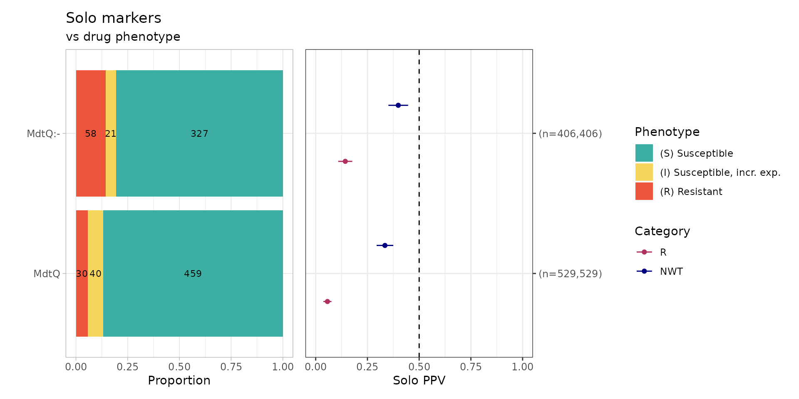

``` r
# Count number of genomes that have either `MdtQ` or `MdtQ:-`
sum(rgi_binary_matrix_prev80$MdtQ == "1" | rgi_binary_matrix_prev80$`MdtQ..-` == "1", na.rm = TRUE)
#> [1] 1429
```

Only MdtQ and MdtQ variants (MdtQ:-) were identified in the absence of
other carbapenem resistance determinants.
[MdtQ](https://card.mcmaster.ca/ontology/46464) is an outer-membrane
porin identified in *K. pneumoniae* - however the primary paper by [Fan,
et al. ](https://amrgen.org/articles/10.1016/j.micpath.2023.106325) only
reports a clinical strain with MdtQ resistant to carbapenems, but does
not show antibiotic susceptibility tests for proper controls of the same
strain with MdtQ vs. without MdtQ. In addition, 96% (n=1429/1490) of the
EuSCAPE *K. pneumoniae* genomes have MdtQ or a variant of MdtQ,
therefore it could be considered a core gene. In summary, because is no
compelling evidence that MdtQ confers resistance to carbapenems and that
it is likely a core gene, we will exclude it from further analyses.

``` r
# Exclude MdtQ and MdtQ:- from the binary matrix
rgi_binary_matrix_prev80 <- rgi_binary_matrix_prev80 %>% select(-MdtQ, -`MdtQ..-`)
```

Try running the
[`solo_ppv_analysis()`](https://amrgen.org/reference/solo_ppv_analysis.md)
function… again.

``` r
soloPPV_rgi_mero <- solo_ppv_analysis(binary_matrix = rgi_binary_matrix_prev80)
```

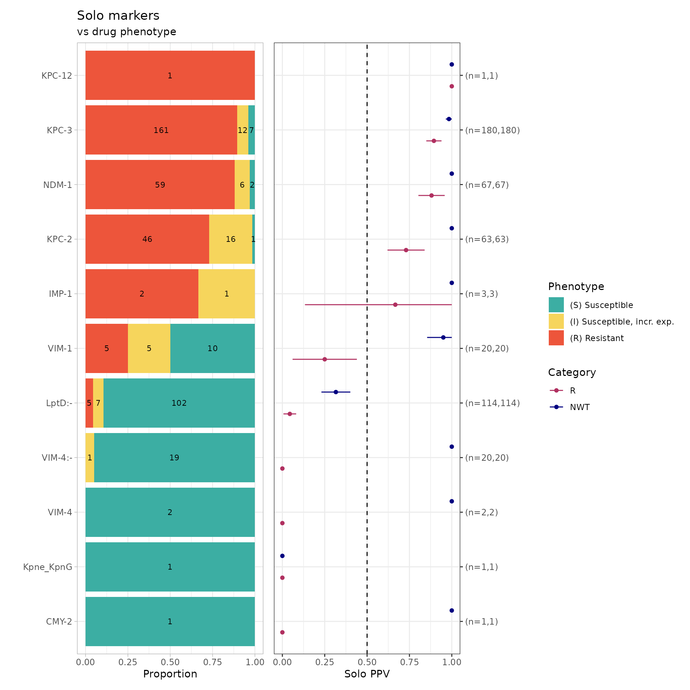

We can finally see carbapenem resistance determinants alone! Since RGI
does not detect porin defects, many AMR markers are found alone compared
to Kleborate’s and AMRFinderPlus’
[`solo_ppv_analysis()`](https://amrgen.org/reference/solo_ppv_analysis.md)
(see below). For example, NDM-1 alone was found in 59 resistant genomes
(using RGI), 31 resistant genomes (using Kleborate), and 41 resistant
genomes (using AMRFinderPlus).

``` r
soloPPV_kleborate_mero
#> $solo_stats
#> # A tibble: 28 × 8
#>    marker                category     x     n    ppv     se ci.lower ci.upper
#>    <chr>                 <chr>    <dbl> <int>  <dbl>  <dbl>    <dbl>    <dbl>
#>  1 OXA-162               R            0     2 0      0        0        0     
#>  2 OXA-204               R            0     1 0      0        0        0     
#>  3 OmpK36:c.25C>T        R            0     6 0      0        0        0     
#>  4 OmpK36:p.134_135insGD R            0     9 0      0        0        0     
#>  5 VIM-1                 R            0    13 0      0        0        0     
#>  6 VIM-4                 R            0     4 0      0        0        0     
#>  7 OmpK36:-              R            1    71 0.0141 0.0140   0        0.0415
#>  8 OmpK35:-              R            2    49 0.0408 0.0283   0        0.0962
#>  9 OXA-48                R            6    99 0.0606 0.0240   0.0136   0.108 
#> 10 KPC-3                 R            3    10 0.3    0.145    0.0160   0.584 
#> # ℹ 18 more rows
#> 
#> $combined_plot
```

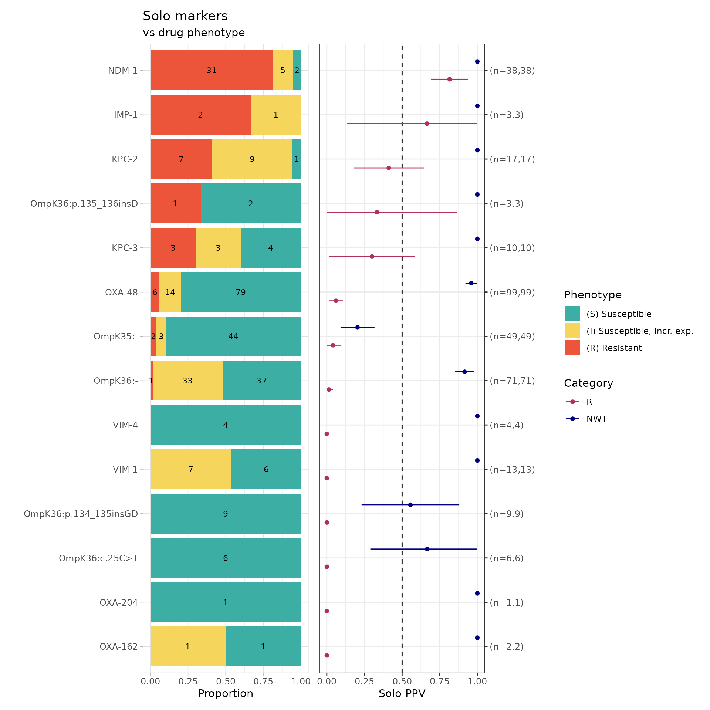

    #> 
    #> $solo_binary
    #> # A tibble: 325 × 8
    #>    id           pheno ecoff    mic     R   NWT marker   value
    #>    <chr>        <sir> <sir>  <mic> <dbl> <dbl> <chr>    <dbl>
    #>  1 SAMEA3498967   I    NWT    4.00     0     1 OmpK36:-     1
    #>  2 SAMEA3498970   I    NWT    4.00     0     1 OmpK36:-     1
    #>  3 SAMEA3498975   S    NWT    2.00     0     1 OmpK36:-     1
    #>  4 SAMEA3498992   S    NWT    0.50     0     1 OmpK36:-     1
    #>  5 SAMEA3498996   S     WT  <=0.06     0     0 OmpK35:-     1
    #>  6 SAMEA3498997   S    NWT    0.50     0     1 OmpK36:-     1
    #>  7 SAMEA3498998   S    NWT    2.00     0     1 OmpK36:-     1
    #>  8 SAMEA3499003   R    NWT  >32.00     1     1 NDM-1        1
    #>  9 SAMEA3499004   R    NWT   32.00     1     1 OmpK36:-     1
    #> 10 SAMEA3499010   S     WT  <=0.06     0     0 OmpK35:-     1
    #> # ℹ 315 more rows
    #> 
    #> $solo_binary_norange
    #> NULL
    #> 
    #> $amr_binary
    #> # A tibble: 1,490 × 24
    #>    id    pheno ecoff    mic     R   NWT `OmpK36..-` `OmpK35..-` `NDM-1` `OXA-48`
    #>    <chr> <sir> <sir>  <mic> <dbl> <dbl>       <dbl>       <dbl>   <dbl>    <dbl>
    #>  1 SAME…   I    NWT    4.00     0     1           1           0       0        0
    #>  2 SAME…   S     WT  <=0.06     0     0           0           0       0        0
    #>  3 SAME…   S    NWT    1.00     0     1           1           1       0        0
    #>  4 SAME…   I    NWT    4.00     0     1           1           0       0        0
    #>  5 SAME…   I    NWT    4.00     0     1           1           1       0        0
    #>  6 SAME…   S     WT  <=0.06     0     0           0           0       0        0
    #>  7 SAME…   S     WT  <=0.06     0     0           0           0       0        0
    #>  8 SAME…   S    NWT    2.00     0     1           1           0       0        0
    #>  9 SAME…   S     WT  <=0.06     0     0           0           0       0        0
    #> 10 SAME…   S    NWT    0.50     0     1           1           0       0        0
    #> # ℹ 1,480 more rows
    #> # ℹ 14 more variables: `OmpK36..c.25C>T` <dbl>, `KPC-3` <dbl>,
    #> #   OmpK36..p.134_135insGD <dbl>, `KPC-2` <dbl>, OmpK36..p.135_136insD <dbl>,
    #> #   `OXA-204` <dbl>, `VIM-1` <dbl>, OmpK36..p.136_137insTD <dbl>,
    #> #   `VIM-4` <dbl>, `KPC-12` <dbl>, `OXA-232` <dbl>, `CTX-M-33` <dbl>,
    #> #   `OXA-162` <dbl>, `IMP-1` <dbl>
    #> 
    #> $plot_order
    #>               OXA-162               OXA-204        OmpK36:c.25C>T 
    #>             "(n=2,2)"             "(n=1,1)"             "(n=6,6)" 
    #> OmpK36:p.134_135insGD                 VIM-1                 VIM-4 
    #>             "(n=9,9)"           "(n=13,13)"             "(n=4,4)" 
    #>              OmpK36:-              OmpK35:-                OXA-48 
    #>           "(n=71,71)"           "(n=49,49)"           "(n=99,99)" 
    #>                 KPC-3  OmpK36:p.135_136insD                 KPC-2 
    #>           "(n=10,10)"             "(n=3,3)"           "(n=17,17)" 
    #>                 IMP-1                 NDM-1 
    #>             "(n=3,3)"           "(n=38,38)"

``` r
# Generate binary matrix for AMRFinderPlus
amrfp_binary_matrix <- get_binary_matrix(
  geno_table = kp_mero_amrfp,
  pheno_table = kp_mero_euscape,
  pheno_drug = "Meropenem",
  geno_class = c("Carbapenems"),
  sir_col = "pheno_eucast",
  keep_assay_values = TRUE,
  keep_assay_values_from = "mic"
)
#>  Defining NWT in binary matrix using ecoff column provided: ecoff
# Solo PPV analysis
soloPPV_amrfp_mero <- solo_ppv_analysis(binary_matrix = amrfp_binary_matrix)
```

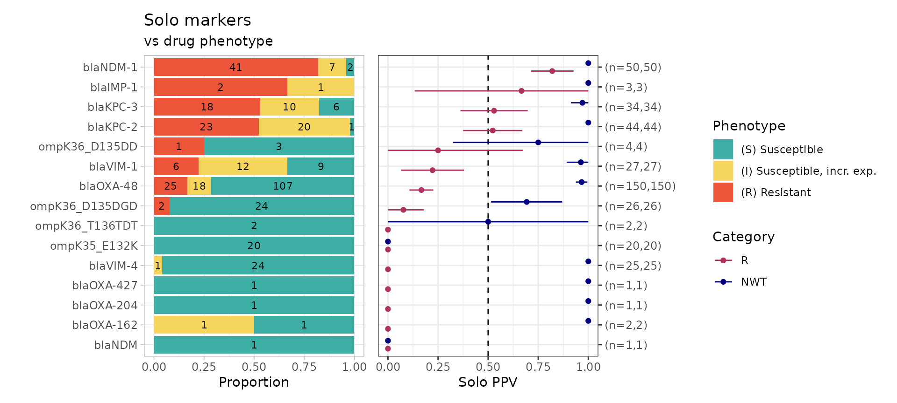

### Combinatorial PPV Analysis for RGI AMR Markers

``` r
comboPPV_rgi_mero <- ppv(
  binary_matrix = rgi_binary_matrix_prev80,
  order = "value",
  min_set_size = 2,
  pheno_drug = "Meropenem",
  upset_grid = TRUE,
  plot_assay = TRUE,
  assay = "mic"
)
#> Scale for y is already present.
#> Adding another scale for y, which will replace the existing scale.
```

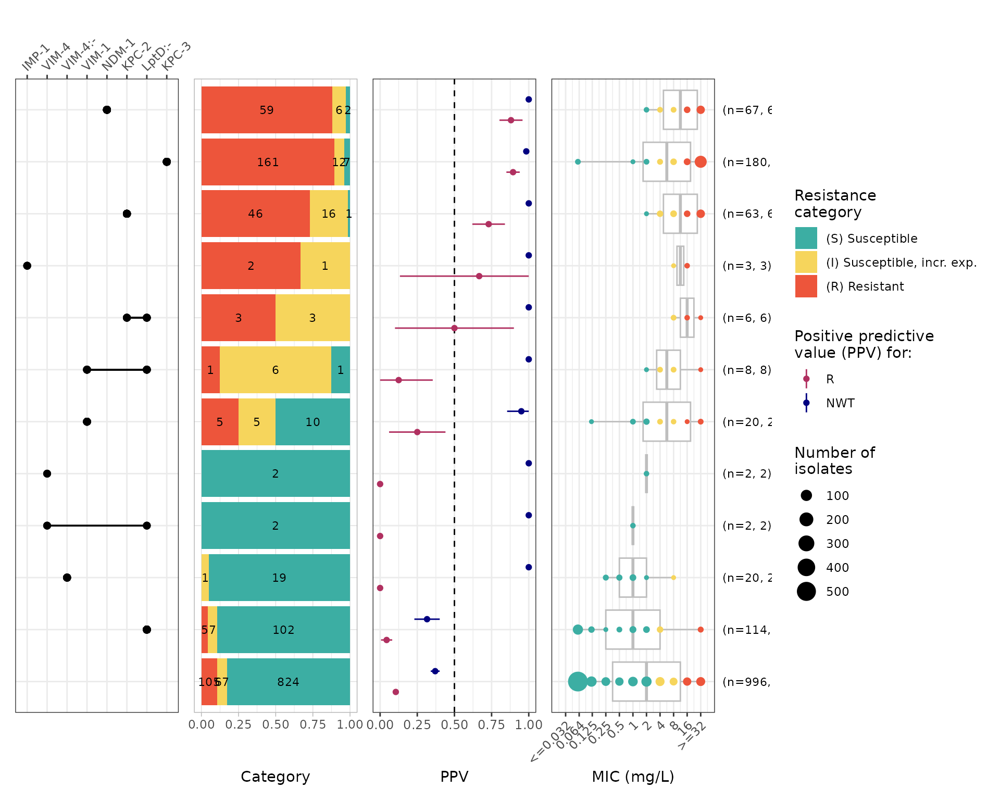

``` r
# Summary of combinatorial PPV
comboPPV_rgi_mero$summary
#> # A tibble: 21 × 21
#>    marker_list        marker_count     n combination_id    R.n  R.ppv R.ci_lower
#>    <chr>                     <dbl> <int> <fct>           <dbl>  <dbl>      <dbl>
#>  1 ""                            0   996 0_0_0_0_0_0_0_…   105 0.105     0.0863 
#>  2 "IMP-1"                       1     3 0_0_0_0_0_0_0_…     2 0.667     0.133  
#>  3 "CMY-2"                       1     1 0_0_0_0_0_0_0_…     0 0         0      
#>  4 "KPC-12"                      1     1 0_0_0_0_0_0_0_…     1 1         1      
#>  5 "Kpne_KpnG"                   1     1 0_0_0_0_0_0_0_…     0 0         0      
#>  6 "VIM-4"                       1     2 0_0_0_0_0_0_1_…     0 0         0      
#>  7 "VIM-4:-"                     1    20 0_0_0_0_0_1_0_…     0 0         0      
#>  8 "VIM-1"                       1    20 0_0_0_0_1_0_0_…     5 0.25      0.0602 
#>  9 "LptD:-"                      1   114 0_0_0_1_0_0_0_…     5 0.0439    0.00627
#> 10 "LptD:-, NDM-69:-"            2     1 0_0_0_1_0_0_0_…     0 0         0      
#> # ℹ 11 more rows
#> # ℹ 14 more variables: R.ci_upper <dbl>, R.denom <int>, NWT.n <dbl>,
#> #   NWT.ppv <dbl>, NWT.ci_lower <dbl>, NWT.ci_upper <dbl>, NWT.denom <int>,
#> #   median_excludeRangeValues <dbl>, q25_excludeRangeValues <dbl>,
#> #   q75_excludeRangeValues <dbl>, n_excludeRangeValues <int>,
#> #   median_ignoreRanges <dbl>, q25_ignoreRanges <dbl>, q75_ignoreRanges <dbl>
```

Evidently, RGI does not detect OmpK35 or OmpK36 defects so we can only
compare the carbapenemases that are detected by RGI vs. Kleborate
development branch.

### Compare RGI to Kleborate Genotype Results

``` r
rgi_simplified <- rgi %>%
  filter(drug_class == "Carbapenems") %>%
  filter(`Resistance Mechanism` == "antibiotic inactivation") %>%
  select(id, marker.label) %>%
  distinct() %>%
  rename(rgi = marker.label) %>%
  group_by(id) %>%
  summarise(
    rgi_markers = rgi %>%
      sort() %>%
      str_c(collapse = ";")
  )

kleborate_simplified <- kleborate_dev %>%
  filter(Kleborate_Class == "Omp_mutations" | Kleborate_Class == "Bla_Carb_acquired") %>%
  select(id, marker.label) %>%
  rename(kleborate = marker.label) %>%
  filter(!grepl("OmpK35|OmpK36", kleborate)) %>%
  group_by(id) %>%
  summarise(
    Kleborate_markers = kleborate %>%
      sort() %>%
      str_c(collapse = ";")
  )

compare_rgi_kleborate <- full_join(
  rgi_simplified,
  kleborate_simplified
)
#> Joining with `by = join_by(id)`

compare_rgi_kleborate <- compare_rgi_kleborate %>%
  rowwise() %>%
  mutate(
    Kleborate_missing = {
      rgi_vec <- str_split(rgi_markers, ";")[[1]]
      kleb_vec <- str_split(Kleborate_markers, ";")[[1]]
      missing <- setdiff(rgi_vec, kleb_vec)
      if (length(missing) == 0) NA_character_ else str_c(missing, collapse = ";")
    },
    rgi_missing = {
      rgi_vec <- str_split(rgi_markers, ";")[[1]]
      kleb_vec <- str_split(Kleborate_markers, ";")[[1]]
      missing <- setdiff(kleb_vec, rgi_vec)
      if (length(missing) == 0) NA_character_ else str_c(missing, collapse = ";")
    }
  ) %>%
  ungroup()

compare_rgi_kleborate %>% count(Kleborate_missing, sort = TRUE)
#> # A tibble: 4 × 2
#>   Kleborate_missing     n
#>   <chr>             <int>
#> 1 NA                  576
#> 2 VIM-4:-              20
#> 3 CMY-2                 1
#> 4 NDM-69:-              1
compare_rgi_kleborate %>% count(rgi_missing, sort = TRUE)
#> # A tibble: 10 × 2
#>    rgi_missing      n
#>    <chr>        <int>
#>  1 NA             371
#>  2 OXA-48         207
#>  3 KPC-3            6
#>  4 KPC-2            4
#>  5 OXA-232          4
#>  6 OXA-162          2
#>  7 CTX-M-33         1
#>  8 NDM-1            1
#>  9 NDM-1;OXA-48     1
#> 10 OXA-204          1
```

### Combining Kleborate, AMRFinderPlus and RGI results

To merge Kleborate (development branch), AMRFinderPlus (from EBI), and
RGI results, we will combine the binary matrices generated by
[`get_binary_matrix()`](https://amrgen.org/reference/get_binary_matrix.md).

Note that you will have to inspect how each of the AMR markers are named
and change them so that they match and can be merged, for example
AMRFinderPlus appends “bla” in front of all beta-lactamases, whereas RGI
and Kleborate do not. **This assumes that the same name is referring to
the same reference sequence that is used in each tool/database which is
not necessarily true** (even if we wish it were true). Hypothetical
example, the NDM-1 sequence in CARD/RGI is `ABCD` vs. AMRFinderPlus
NDM-1 sequence is `ACCD` vs. Kleborate NDM-1 sequence is `ACDD`. All AMR
databases strive to use the same reference accessions and sequences, but
sometimes there can be discrepancies, which need to be kept in mind.

In the following code, unique AMR markers (i.e., only identified by one
AMR genotyper) will be have a suffix to describe the AMR genotyper that
it is found by (e.g., Kpne_KpnG will be Kpne_KpnG_rgi). AMR markers
identified by more than one genotyper will be merged, where if it was
identified by any genotyper in that sample, the binary matrix will have
a `1` (present), otherwise `0` (absent).

``` r
# Phenotype columns to remove (that we can put back in later)
cols_to_remove <- c("pheno", "ecoff", "mic", "R", "NWT")

# Remove columns
# We will be using the RGI binary matrix where core/intrinsic genes are removed
df_rgi <- rgi_binary_matrix_prev80 %>% select(-cols_to_remove)
#> Warning: Using an external vector in selections was deprecated in tidyselect 1.1.0.
#> ℹ Please use `all_of()` or `any_of()` instead.
#>   # Was:
#>   data %>% select(cols_to_remove)
#> 
#>   # Now:
#>   data %>% select(all_of(cols_to_remove))
#> 
#> See <https://tidyselect.r-lib.org/reference/faq-external-vector.html>.
#> This warning is displayed once per session.
#> Call `lifecycle::last_lifecycle_warnings()` to see where this warning was
#> generated.
df_kleborate <- kleborate_binary_matrix %>% select(-cols_to_remove)

# Massage AMRFinderPlus marker names to match RGI/Kleborate
df_amrfp <- amrfp_binary_matrix %>%
  select(-cols_to_remove) %>%
  rename("OmpK36..p.134_135insGD" = "ompK36_D135DGD") %>%
  rename("OmpK36..p.135_136insD" = "ompK36_D135DD") %>%
  rename("OmpK36..p.136_137insTD" = "ompK36_T136TDT")
colnames(df_amrfp) <- gsub("bla", "", colnames(df_amrfp))

# Sort each dataframe by id to make sure the samples are all in the same order
df_rgi <- df_rgi[order(df_rgi[[1]]), ]
df_amrfp <- df_amrfp[order(df_amrfp[[1]]), ]
df_kleborate <- df_kleborate[order(df_kleborate[[1]]), ]

# All column names (excluding id)
cols_rgi <- colnames(df_rgi)[-1]
cols_amrfp <- colnames(df_amrfp)[-1]
cols_kleb <- colnames(df_kleborate)[-1]

all_cols <- unique(c(cols_rgi, cols_amrfp, cols_kleb))

# Function to safely get column or return 0s
get_col <- function(df, col) {
  if (col %in% colnames(df)) {
    df[[col]]
  } else {
    rep(0, nrow(df))
  }
}

# Initialize final df (assuming same order of ids)
combined_binary_matrix <- data.frame(id = df_rgi[[1]])

# Merge all columns using OR
for (col in all_cols) {
  combined_binary_matrix[[col]] <- as.integer(
    get_col(df_rgi, col) |
      get_col(df_amrfp, col) |
      get_col(df_kleborate, col)
  )
}

# Identify unique columns (present in ONLY one binary matrix)
unique_rgi <- setdiff(cols_rgi, union(cols_amrfp, cols_kleb))
unique_amrfp <- setdiff(cols_amrfp, union(cols_rgi, cols_kleb))
unique_kleb <- setdiff(cols_kleb, union(cols_rgi, cols_amrfp))

# Rename unique columns with suffix
colnames(combined_binary_matrix)[colnames(combined_binary_matrix) %in% unique_rgi] <- paste0(unique_rgi, "_rgi")
colnames(combined_binary_matrix)[colnames(combined_binary_matrix) %in% unique_amrfp] <- paste0(unique_amrfp, "_amrfp")
colnames(combined_binary_matrix)[colnames(combined_binary_matrix) %in% unique_kleb] <- paste0(unique_kleb, "_kleborate")

# Joining back the phenotype columns
phenotype_cols <- rgi_binary_matrix_prev80 %>%
  select(id, pheno, ecoff, mic, R, NWT)

# Merge back into your final_df
combined_binary_matrix <- combined_binary_matrix %>%
  left_join(phenotype_cols, by = "id")

# Relocate phenotype columns to the front
combined_binary_matrix <- combined_binary_matrix %>%
  relocate(pheno, ecoff, mic, R, NWT, .after = id)
```

### Solo PPV Analysis for AMRFinderPlus, RGI, Kleborate AMR Markers

``` r
combined_solo_ppv <- solo_ppv_analysis(binary_matrix = combined_binary_matrix)
```

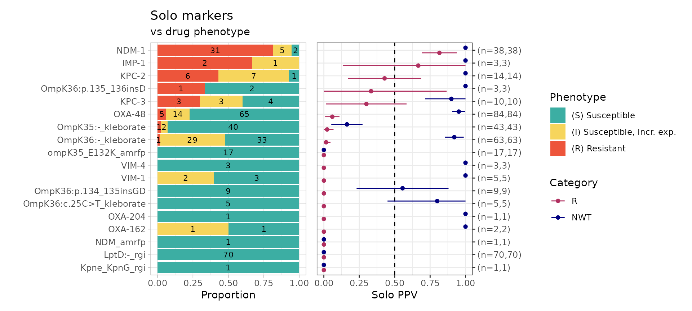 From
this solo_ppv_analysis() plot, we can see that there are markers that
are found alone which have strong support for a particular phenotype,
e.g., NDM-1 association with meropenem resistance (n=31/38 R isolates),
LptD:- identified by RGI (associated with susceptibility). Noting that
LptD:- indicates a variant of LptD, so the variants need to be further
investigated to see if there is a particular mutation/defect that is
associated with meropenem susceptibility.

Another way to investigate the association between AMR markers and
meropenem susceptibility is to use the
[`amr_logistic()`](https://amrgen.org/reference/amr_logistic.md)
function to perform logistic regression to analyse the relationship
between the markers and a specified antibiotic.

### Logistic regression for AMRFinderPlus, RGI, Kleborate AMR Markers

``` r
combined_logist <- amr_logistic(
  binary_matrix = combined_binary_matrix,
  pheno_drug = "meropenem",
  ecoff_col = "ecoff",
  maf = 10, # filter for AMR markers in at least 10 samples
  single_plot = TRUE
)
#> ...Fitting logistic regression model to R using logistf
#>    Filtered data contains 1490 samples (391 => 1, 1099 => 0) and 14 variables.
#> ...Fitting logistic regression model to NWT using logistf
#>    Filtered data contains 1490 samples (780 => 1, 710 => 0) and 14 variables.
#> Generating plots
#> Plotting 2 models
```

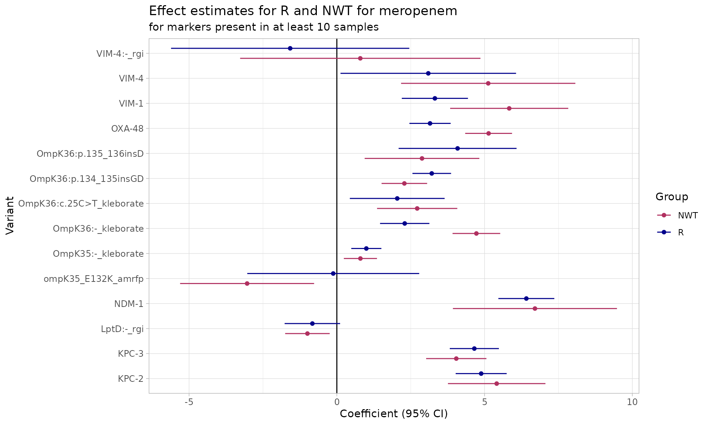

``` r
# model coefficients
combined_logist$modelR
#> # A tibble: 15 × 5
#>    marker                      est ci.lower ci.upper          pval
#>    <chr>                     <dbl>    <dbl>    <dbl>         <dbl>
#>  1 (Intercept)              -5.23    -5.91    -4.55  0            
#>  2 NDM-1                     6.41     5.47     7.36  0            
#>  3 KPC-3                     4.65     3.82     5.48  0            
#>  4 KPC-2                     4.88     4.02     5.75  0            
#>  5 LptD:-_rgi               -0.828   -1.77     0.111 0.0839       
#>  6 VIM-1                     3.32     2.20     4.44  0.00000000623
#>  7 VIM-4:-_rgi              -1.58    -5.61     2.45  0.443        
#>  8 VIM-4                     3.09     0.124    6.07  0.0411       
#>  9 OXA-48                    3.15     2.46     3.85  0            
#> 10 OmpK36:p.134_135insGD     3.21     2.56     3.87  0            
#> 11 OmpK36:p.135_136insD      4.09     2.09     6.08  0.0000597    
#> 12 ompK35_E132K_amrfp       -0.122   -3.03     2.79  0.935        
#> 13 OmpK36:-_kleborate        2.30     1.46     3.13  0.0000000689 
#> 14 OmpK35:-_kleborate        0.998    0.489    1.51  0.000123     
#> 15 OmpK36:c.25C>T_kleborate  2.04     0.440    3.65  0.0125
#> Use ggplot2::autoplot() on this output to visualise
```

A coefficient above zero indicates that the presence of the AMR marker
increases the likelihood of resistance, whereas a coefficient below zero
indicates a decrease in probability of resistance. From the plot above
showing AMR markers found in more than 10 isolates, majority have a
positive association with resistance with the exception of LptD:-
(identified by RGI), ompK35_E132K (identified by AMRFinderPlus), and
VIM-4:- (identified by RGI).

### Combinatorial PPV Analysis for AMRFinderPlus, RGI, Kleborate AMR Markers

``` r
comboPPV_combined_mero <- ppv(
  binary_matrix = combined_binary_matrix,
  order = "value",
  min_set_size = 2,
  pheno_drug = "Meropenem",
  upset_grid = TRUE,
  plot_assay = TRUE,
  assay = "mic"
)
#> Scale for y is already present.
#> Adding another scale for y, which will replace the existing scale.
```

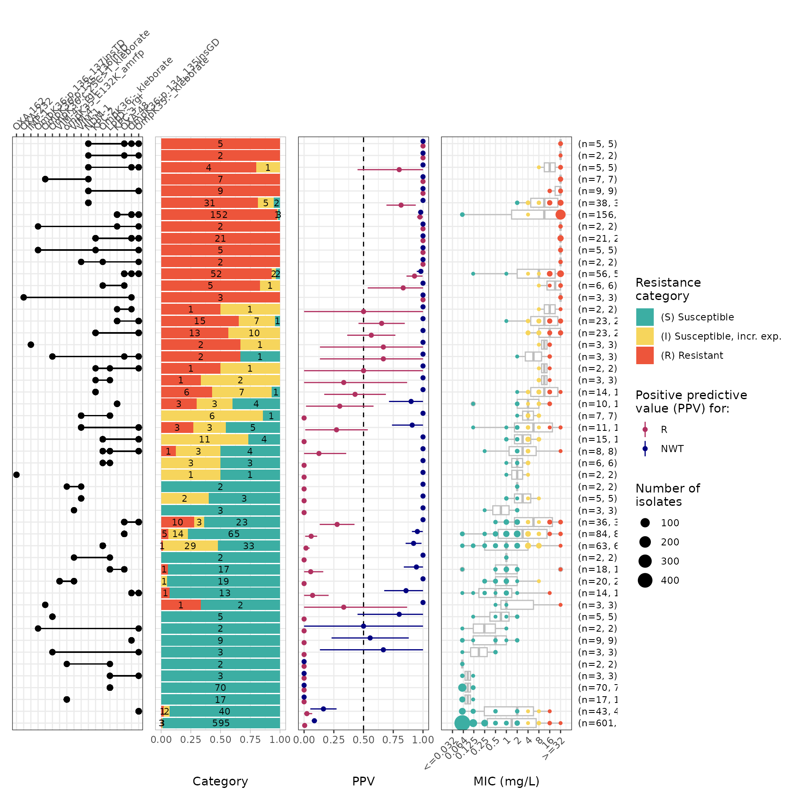

``` r

comboPPV_combined_mero$summary
#> # A tibble: 86 × 21
#>    marker_list        marker_count     n combination_id   R.n   R.ppv R.ci_lower
#>    <chr>                     <dbl> <int> <fct>          <dbl>   <dbl>      <dbl>
#>  1 ""                            0   601 0_0_0_0_0_0_0…     3 0.00499          0
#>  2 "OmpK36:c.25C>T_k…            1     5 0_0_0_0_0_0_0…     0 0                0
#>  3 "OmpK35:-_klebora…            1    43 0_0_0_0_0_0_0…     1 0.0233           0
#>  4 "OmpK35:-_klebora…            2     3 0_0_0_0_0_0_0…     0 0                0
#>  5 "OmpK36:-_klebora…            1    63 0_0_0_0_0_0_0…     1 0.0159           0
#>  6 "OmpK36:-_klebora…            2     1 0_0_0_0_0_0_0…     1 1                1
#>  7 "OmpK36:-_klebora…            2    15 0_0_0_0_0_0_0…     0 0                0
#>  8 "OXA-162"                     1     2 0_0_0_0_0_0_0…     0 0                0
#>  9 "OXA-427_amrfp, O…            2     1 0_0_0_0_0_0_0…     0 0                0
#> 10 "NDM_amrfp"                   1     1 0_0_0_0_0_0_0…     0 0                0
#> # ℹ 76 more rows
#> # ℹ 14 more variables: R.ci_upper <dbl>, R.denom <int>, NWT.n <dbl>,
#> #   NWT.ppv <dbl>, NWT.ci_lower <dbl>, NWT.ci_upper <dbl>, NWT.denom <int>,
#> #   median_excludeRangeValues <dbl>, q25_excludeRangeValues <dbl>,
#> #   q75_excludeRangeValues <dbl>, n_excludeRangeValues <int>,
#> #   median_ignoreRanges <dbl>, q25_ignoreRanges <dbl>, q75_ignoreRanges <dbl>
```
