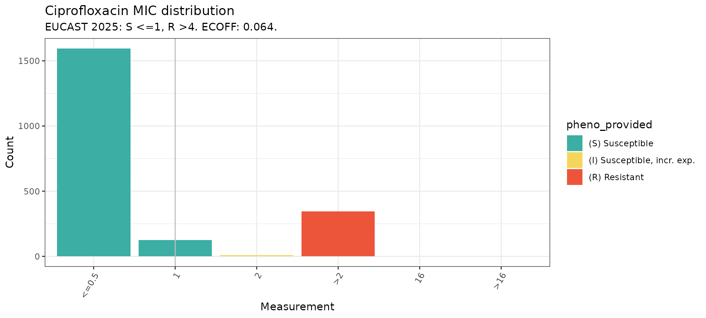
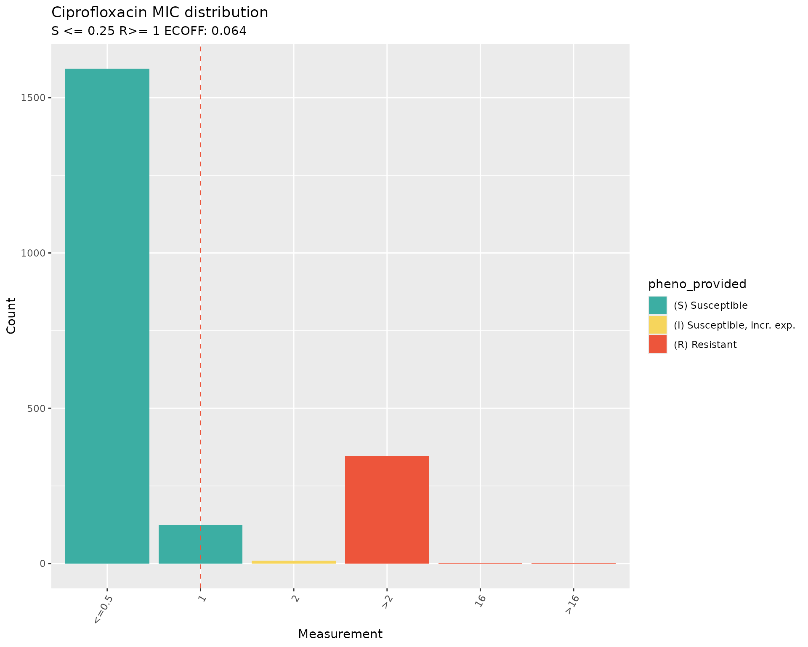
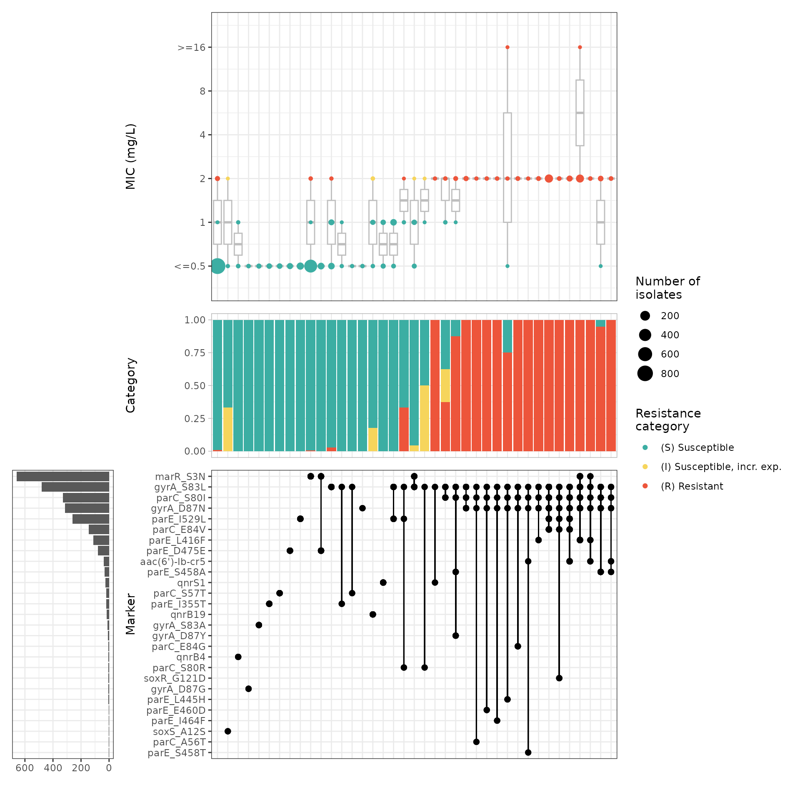
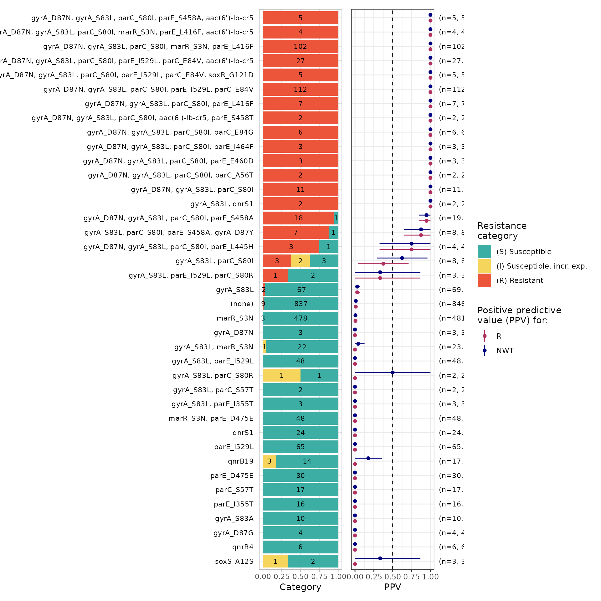
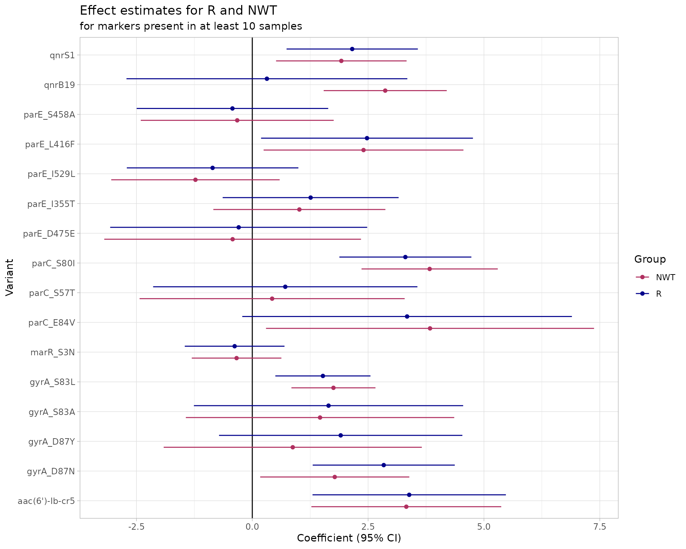
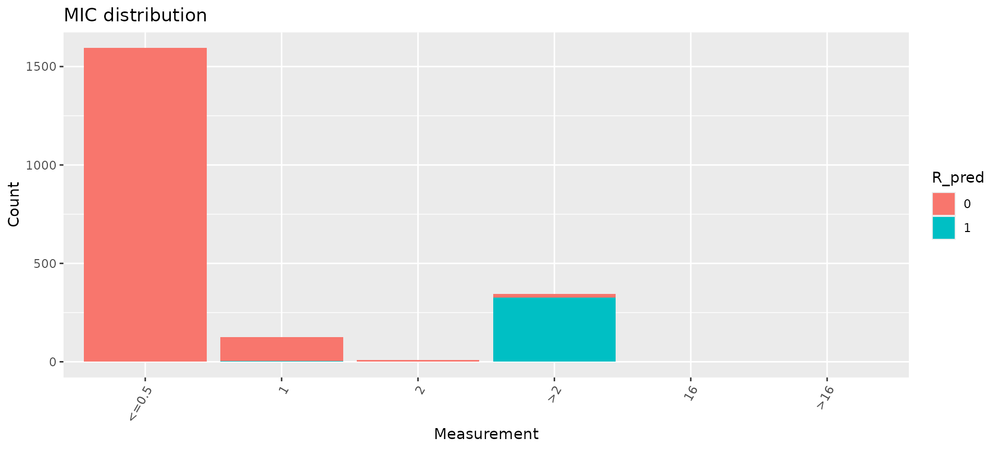
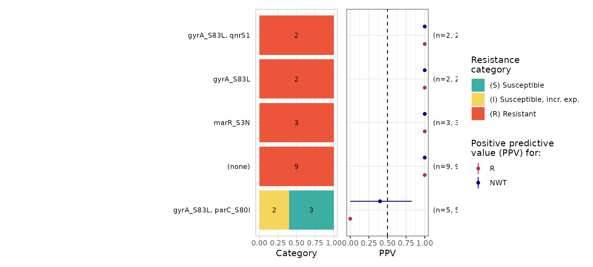

# Assessing geno-pheno concordance

## Introduction

`AMRgen` is a comprehensive R package designed to integrate
antimicrobial resistance genotype and phenotype data. It provides tools
to import AMR genotype data, AST phenotype data, and conduct
genotype-phenotype analyses to explore the impact of genotypic markers
on phenotype, including phenotype-genotype concordance.

The [`concordance()`](https://amrgen.org/reference/concordance.md)
function in AMRgen compares genotypes (presence of resistance markers)
to observed phenotypes (resistant vs susceptible) using a binary matrix
obtained with
[`get_binary_matrix()`](https://amrgen.org/reference/get_binary_matrix.md).
A genotypic prediction variable is defined on the basis of presence of
genetic resistance markers, either all markers in the input table or
those defined by an input inclusion list or exclusion list (specific
marker(s), a minimum number of markers). The user may also filter the
markers to be included in the genotypic prediction based on thresholds
for solo Positive Predictive Value (PPV, see
[`solo_ppv()`](https://amrgen.org/reference/solo_ppv.md) function) or
logistic regression p-values (see
[`amr_logistic()`](https://amrgen.org/reference/amr_logistic.md)
function.

This genotypic prediction (the “test”) is then compared to the observed
phenotypes (the “truth” or “gold standard”) using standard
classification metrics calculated with the yardstick package
(<https://yardstick.tidymodels.org/reference/index.html>). These are
Sensitivity, Specificity, PPV, Negative Predictive Value (NPV),
Accuracy, Kappa, and F-measure. Error rates (major error - ME, and very
major error - VME) are calculated as per ISO 20776-2 (see FDA
definitions). The
[`concordance()`](https://amrgen.org/reference/concordance.md) function
supports evaluating both R and NWT outcomes in a single call, with
flexible prediction rules and marker inclusion options.

This vignette walks through a workflow to analyse phenotype-genotype
concordance using example datasets taken from “A one-year genomic
investigation of *Escherichia coli* epidemiology and nosocomial spread
at a large US healthcare network” by Mills et al (2022). The
antimicrobial susceptibility test results (MIC values and SIR
interpretation) were obtained from the EBI AMR portal
(<https://www.ebi.ac.uk/amr/>), and the AMRFinderPlus results from the
All the Bacteria project (<https://allthebacteria.org/>).

Citation: Mills, E.G., Martin, M.J., Luo, T.L. *et al*. A one-year
genomic investigation of *Escherichia coli* epidemiology and nosocomial
spread at a large US healthcare network. Genome Med 14, 147 (2022).
<https://doi.org/10.1186/s13073-022-01150-7>

### Start by loading the AMRgen package:

``` r
# Load AMRgen
library(AMRgen)

# Also load the dplyr package to use the filter function in step 7
# https://dplyr.tidyverse.org/reference/filter.html
library(dplyr)
#> 
#> Attaching package: 'dplyr'
#> The following objects are masked from 'package:stats':
#> 
#>     filter, lag
#> The following objects are masked from 'package:base':
#> 
#>     intersect, setdiff, setequal, union
```

### 1. Phenotype table

The antimicrobial susceptibility test (AST) data for the 2075 isolates
in this study were retrieved from the EBI AMR Portal FTP site, following
these steps:

1.  Downloaded all E. coli phenotype data with the
    [`download_ebi()`](https://amrgen.org/reference/download_ebi.md)
    function from AMRgen, passing options `species="Escherichia coli"`,
    `release = "2025-12"`, and `reformat = TRUE`. Options to reinterpret
    data based on CLSI/EUCAST breakpoints or ECOFFs were not applied.

2.  Downloaded the table with accessions associated with this
    publication (bioproject PRJNA809394) from the SRA
    (<https://www.ncbi.nlm.nih.gov/Traces/study/?acc=SRP401320&o=acc_s%3Aa>).
    Note: some manual curation was needed as this file contains
    accessions for 2076 samples.

3.  Programmatically selected the AST data for the 2075 E. coli by the
    “id” column using the “BioSample” column in the accessions table.

The resulting phenotype table was imported to the AMRgen package and
called `pheno_eco_2075`.

``` r
# Check the format of the phenotype table pre-loaded in the AMRgen package
data(pheno_eco_2075)

head(pheno_eco_2075)
#> # A tibble: 6 × 36
#>   id    drug   mic pheno_provided guideline method  platform source spp_pheno   
#>   <chr> <ab> <mic> <sir>          <chr>     <chr>   <chr>    <lgl>  <mo>        
#> 1 SAMN… AMK    <=8   S            CLSI      broth … BD Phoe… NA     B_ESCHR_COLI
#> 2 SAMN… GEN    <=2   S            CLSI      broth … BD Phoe… NA     B_ESCHR_COLI
#> 3 SAMN… TOB    <=2   S            CLSI      broth … BD Phoe… NA     B_ESCHR_COLI
#> 4 SAMN… AMP    <=4   S            CLSI      broth … BD Phoe… NA     B_ESCHR_COLI
#> 5 SAMN… AMC      8   S            CLSI      broth … BD Phoe… NA     B_ESCHR_COLI
#> 6 SAMN… TZP    <=2   S            CLSI      broth … BD Phoe… NA     B_ESCHR_COLI
#> # ℹ 27 more variables: SRA_accession <chr>, assembly_ID <chr>,
#> #   collection_year <dbl>, ISO_country_code <chr>, host <chr>, host_age <lgl>,
#> #   host_sex <lgl>, isolate <dbl>, isolation_source <chr>,
#> #   isolation_source_category <chr>, isolation_latitude <dbl>,
#> #   isolation_longitude <dbl>, genus <chr>, organism <chr>,
#> #   Updated_phenotype_CLSI <chr>, Updated_phenotype_EUCAST <chr>,
#> #   used_ECOFF <chr>, database <chr>, measurement <chr>, …
```

The phenotype table has one row for each assay measurement, i.e. one per
strain/drug combination. The essential columns for a phenotype table to
work with `AMRgen` functions are:

- `id`: character string giving the sample name, used to link to sample
  names in the genotype file

- `spp_pheno`: species in the form of an AMR package `mo` class, in this
  vignette “B_ESCHR_COLI”

- `drug`: antibiotic name in the form of an AMR package `ab` class

- a phenotype column: S/I/R phenotype calls in the form of an AMR
  package `sir` class. In this example, SIR phenotype calls are as
  provided in the EBI AMR portal (`pheno_provided`) as we did not
  re-interpret data based on CLSI/EUCAST breakpoints during download.

This vignette also uses raw MIC data for the analyses. The corresponding
column is:

- `mic`: MIC measurements in the form of an AMR package `mic` class.

### 2. Genotype table

The AMRFinderPlus results for the 2075 isolates in this study were
retrieved from the AllTheBacteria project, following these steps:

1.  Downloaded a compressed TSV file containing the aggregated results
    of running AMRFinderPlus on all samples in the AllTheBacteria
    dataset from <https://osf.io/ck7st> (large file)

2.  Programmatically selected the results for the 2075 *E. coli* samples
    by the “Name” column using the “BioSample” column in the accessions
    table downloaded from the SRA (as for the phenotype table).

``` r
# Load AMRFinderPlus data to create an object with the key columns needed to work with the AMRgen package
data(geno_eco_2075)
geno_eco_2075 <- import_amrfp(geno_eco_2075, "Name")

# Check the format of the processed genotype table
head(geno_eco_2075)
#> # A tibble: 6 × 33
#>   id           marker     gene  mutation drug drug_class  `variation type` node 
#>   <chr>        <chr>      <chr> <chr>    <ab> <chr>       <chr>            <chr>
#> 1 SAMN26304318 pmrB_Y358N pmrB  Tyr358A… COL  Polymyxins  Protein variant… pmrB 
#> 2 SAMN26304318 blaEC      blaEC NA       NA   Beta-lacta… Gene presence d… blaEC
#> 3 SAMN26304318 mdtM       mdtM  NA       NA   Efflux      Gene presence d… mdtM 
#> 4 SAMN26304318 glpT_E448K glpT  Glu448L… FOS  Phosphonics Protein variant… glpT 
#> 5 SAMN26304318 acrF       acrF  NA       NA   Efflux      Gene presence d… acrF 
#> 6 SAMN26304319 blaEC      blaEC NA       NA   Beta-lacta… Gene presence d… blaEC
#> # ℹ 25 more variables: marker.label <chr>, `Protein identifier` <lgl>,
#> #   `Contig id` <chr>, Start <dbl>, Stop <dbl>, Strand <chr>,
#> #   `Gene symbol` <chr>, `Sequence name` <chr>, Scope <chr>,
#> #   `Element type` <chr>, `Element subtype` <chr>, Class <chr>, Subclass <chr>,
#> #   Method <chr>, `Target length` <dbl>, `Reference sequence length` <dbl>,
#> #   `% Coverage of reference sequence` <dbl>,
#> #   `% Identity to reference sequence` <dbl>, `Alignment length` <dbl>, …
```

The genotype table has one row for each genetic marker detected in an
input genome, i.e. one per strain/marker combination. The essential
columns for a genotype table to work with `AMRgen` functions are:

- `Name`: character string giving the sample name, used to link to
  sample names in the phenotype file.

- `marker`: character string giving the name of the genetic marker
  detected.

- `drug_class`: character string giving the antibiotic class associated
  with this marker.

NOTE: In this example, at least one AMR marker is present in all 2075
genomes. In contrast, no markers were reported for five genomes in the
publication (see Supplementary Table 3).

### 3. Combine genotype and phenotype data for Ciprofloxacin

The phenotype table includes data for 18 antibiotics from 11 different
classes, but we need to analyse concordance one drug at a time.

The function
[`get_binary_matrix()`](https://amrgen.org/reference/get_binary_matrix.md)
is used to extract phenotype data for a specified drug (in this example
Ciprofloxacin), and genotype data for markers associated with a
specified drug class by AMRFinderPlus (in this example Quinolones). It
returns a single dataframe with one row per strain, for the subset of
strains that appear in both the genotype and phenotype input tables.

``` r
# Get matrix combining phenotype data for Ciprofloxacin, binary calls for R/NWT pheno,
# and genotype presence/absence data for all markers associated with Quinolone
eco_cip_matrix <- get_binary_matrix(
  geno_eco_2075,
  pheno_eco_2075,
  pheno_drug = "Ciprofloxacin",
  geno_class = "Quinolones",
  sir_col = "pheno_provided",
  keep_assay_values = TRUE,
  keep_assay_values_from = "mic"
)
#>  Defining NWT in binary matrix as I/R vs S, as no ECOFF column defined

# Check the format of the binary matrix
head(eco_cip_matrix)
#> # A tibble: 6 × 36
#>   id           pheno   mic     R   NWT gyrA_D87N gyrA_S83L parC_S80I parE_S458A
#>   <chr>        <sir> <mic> <dbl> <dbl>     <dbl>     <dbl>     <dbl>      <dbl>
#> 1 SAMN26304318   S   <=0.5     0     0         0         0         0          0
#> 2 SAMN26304319   R    >2.0     1     1         1         1         1          1
#> 3 SAMN26304320   S   <=0.5     0     0         0         0         0          0
#> 4 SAMN26304321   S   <=0.5     0     0         0         0         0          0
#> 5 SAMN26304322   S   <=0.5     0     0         0         0         0          0
#> 6 SAMN26304323   S   <=0.5     0     0         0         0         0          0
#> # ℹ 27 more variables: marR_S3N <dbl>, qnrS1 <dbl>, parE_I529L <dbl>,
#> #   parC_E84V <dbl>, qnrB19 <dbl>, parE_L416F <dbl>, parC_S80R <dbl>,
#> #   `aac(6')-Ib-cr5` <dbl>, parE_S458T <dbl>, parE_D475E <dbl>,
#> #   parC_S57T <dbl>, parE_I355T <dbl>, gyrA_S83A <dbl>, parC_E84G <dbl>,
#> #   qnrB2 <dbl>, marR_R77C <dbl>, qnrB6 <dbl>, gyrA_D87Y <dbl>,
#> #   parE_L445H <dbl>, gyrA_D87G <dbl>, qnrB4 <dbl>, soxS_A12S <dbl>,
#> #   parE_I464F <dbl>, parE_E460D <dbl>, qnrB <dbl>, soxR_G121D <dbl>, …
```

Each row in the binary matrix indicates, for one strain, both the
phenotypes (with SIR column, mic values, and boolean 1/0 coding of R and
NWT status) and the genotypes (one column per marker, with boolean 1/0
coding of marker presence/absence).

The ‘NWT’ variable can be taken either from a precomputed ECOFF-based
call of WT=wildtype/NWT=nonwildtype (if passing the option `ecoff_col`),
or computed from the S/I/R phenotype as NWT=R/I and WT=S. In this
example, NWT was defined as R/I vs S. No ECOFF column was defined
because of the nature of the AST data: the minimum MIC values of \<=0.5
in the BD Phoenix AST data are above the ECOFF of 0.064 and cannot be
interpreted against ECOFF. We can inspect the distribution of the
Ciprofloxacin phenotype data to better understand this.

### 4. Plot Ciprofloxacin phenotype data distribution

The function
[`assay_by_var()`](https://amrgen.org/reference/assay_by_var.md) can be
used to plot the distribution of MIC values coloured by a variable. In
this case, the S/I/R values were coloured by the column
“pheno_provided”, which were interpreted by the authors with the
breakpoints from CLSI 2018. We can also compare them to the updated
breakpoints from CLSI 2025.

``` r
# CLSI 2018 guidelines (as in the publication from Mills et al).
# The breakpoints are provided manually.
assay_by_var(
  pheno_table = pheno_eco_2075,
  pheno_drug = "Ciprofloxacin",
  measure = "mic",
  colour_by = "pheno_provided",
  species = "Escherichia coli",
  bp_S = 1,
  bp_R = 4
)
```



``` r

# CLSI 2025 guidelines
# The breakpoints are provided by passing the option "guideline"
assay_by_var(
  pheno_table = pheno_eco_2075,
  pheno_drug = "Ciprofloxacin",
  measure = "mic",
  colour_by = "pheno_provided",
  species = "Escherichia coli",
  guideline = "CLSI 2025"
)
#>   MIC breakpoints determined using AMR package: S <= 0.25 and R > 1
```

 The plots of the
distribution of MIC values with breakpoints for Ciprofloxacin from the
2018 CLSI guidelines (S\<=1 and R\>=4) vs 2025 CLSI guidelines (S\<=0.25
and R\>=1) confirm that the SIR interpretation was as per the 2018
breakpoints, and that the interpretation would have been different if
the AST data had been re-interpreted during download by passing the
option `interpret_clsi=TRUE` to the
[`download_ebi()`](https://amrgen.org/reference/download_ebi.md)
function.

The plots also show that the ECOFF value of 0.064 is below the minimum
MIC values in the distribution.

### 5. Calculate concordance between phenotype and genotype

Start with a first concordance calculation including all the AMR markers
in the binary matrix.

``` r
concordance_cip <- concordance(eco_cip_matrix)

concordance_cip
#> AMR Genotype-Phenotype Concordance
#> Prediction rule: any
#> 
#> --- Outcome: R ---
#> Samples: 2075 | Markers: 31
#> Markers used: gyrA_D87N, gyrA_S83L, parC_S80I, parE_S458A, marR_S3N, qnrS1, parE_I529L, parC_E84V, qnrB19, parE_L416F, parC_S80R, aac(6')-Ib-cr5, parE_S458T, parE_D475E, parC_S57T, parE_I355T, gyrA_S83A, parC_E84G, qnrB2, marR_R77C, qnrB6, gyrA_D87Y, parE_L445H, gyrA_D87G, qnrB4, soxS_A12S, parE_I464F, parE_E460D, qnrB, soxR_G121D, parC_A56T
#> 
#> Confusion Matrix:
#>           Truth
#> Prediction   1   0
#>          1 338 891
#>          0   9 837
#> 
#> Metrics:
#>   Sensitivity : 0.9741
#>   Specificity : 0.4844
#>   PPV         : 0.2750
#>   NPV         : 0.9894
#>   Accuracy    : 0.5663
#>   Kappa       : 0.2274
#>   F-measure   : 0.4289
#>   VME         : 0.0259
#>   ME          : 0.5156
#> 
#> --- Outcome: NWT ---
#> Samples: 2075 | Markers: 31
#> Markers used: gyrA_D87N, gyrA_S83L, parC_S80I, parE_S458A, marR_S3N, qnrS1, parE_I529L, parC_E84V, qnrB19, parE_L416F, parC_S80R, aac(6')-Ib-cr5, parE_S458T, parE_D475E, parC_S57T, parE_I355T, gyrA_S83A, parC_E84G, qnrB2, marR_R77C, qnrB6, gyrA_D87Y, parE_L445H, gyrA_D87G, qnrB4, soxS_A12S, parE_I464F, parE_E460D, qnrB, soxR_G121D, parC_A56T
#> 
#> Confusion Matrix:
#>           Truth
#> Prediction   1   0
#>          1 347 882
#>          0   9 837
#> 
#> Metrics:
#>   Sensitivity : 0.9747
#>   Specificity : 0.4869
#>   PPV         : 0.2823
#>   NPV         : 0.9894
#>   Accuracy    : 0.5706
#>   Kappa       : 0.2341
#>   F-measure   : 0.4379
#>   VME         : 0.0253
#>   ME          : 0.5131
```

The output shows that 31 markers were identified linked to Ciprofloxacin
resistance in this dataset.

The 2x2 confusion matrix shows the following values:

- 338 - no. of true positives (TP), resistant isolates predicted to be
  resistant by the presence of AMR markers

- 891 - no. of false positives (FP), susceptible isolates predicted to
  be resistant by the presence of AMR markers

- 837 - no. of true negatives (TN), susceptible isolates predicted to be
  susceptible by the absence of resistance markers

- 9 - no. of false negatives (FN), resistant isolates predicted to be
  susceptible by the absence of resistance markers

The sensitivity value (or true positive rate, i.e. the proportion of
resistant isolates predicted to be resistant by the presence of AMR
markers) is high (\>0.95), but the specificity (or true negative rate,
i.e. the proportion of susceptible isolates predicted to be susceptible
by the absence of resistance markers) is very low (\<0.5). The high
sensitivity is especially important as predicting a resistant strain as
susceptible is more consequential to treatment than finding resistance
genes in phenotypically susceptible isolates. This is also reflected in
the low Very Major Error (VME) vs the high Major Error (ME).

The PPV, i.e. the proportion of all positive results (true plus false)
that are TP, is low. This is due to the higher number of FP (891) than
of TP (331), i.e. many Cip-susceptible isolates carry resistance
markers. Conversely, the NPV, i.e. the proportion of all negative
results (true plus false) that are TN, is high. This is because the
number of TN (837) is much higher than the number of false negatives
(9).

The concordance stats for outcome R (R vs S/I) are very similar than for
outcome NWT (R/I vs S). This can be explained by the small number of
isolates interpreted as “I” in this dataset (n=9).

The low specificity value (caused by the 891 Cip-susceptible isolates
that carry resistance markers) is not surprising as Ciprofloxacin
resistance usually results from the accumulation of mutations, with
isolates carrying only one mutation often remaining susceptible. This
can be easily visualised with the
[`amr_upset()`](https://amrgen.org/reference/amr_upset.md) function in
`AMRgen`.

### 6. Compare the presence of markers with susceptibility testing data with an upset plot

The function [`amr_upset()`](https://amrgen.org/reference/amr_upset.md)
takes the binary matrix table `eco_cip_matrix`, and explores the
distribution of MIC assay values for all observed combinations of
markers (solo or multiple markers). The resulting upset plot shows the
distribution of assay values and S/I/R calls for each observed marker
combination, and returns a summary of these distributions (including
sample size, median and interquartile range, number and proportion
classified as R).

``` r
# Generate an upset plot comparing ciprofloxacin MIC data with quinolone marker combinations,
eco_cip_upset <- amr_upset(
  eco_cip_matrix,
  assay = "mic",
  order = "value"
)
```

 The upset plot shows
that the combination of mutations in the Quinolone Resistance
Determining Region (QRDR) of the *E. coli* DNA topoisomerase GyrA
(gyrA_S83L) and DNA gyrase ParC (parC_S80I), alone or with other
mutations, raises the MIC values above the susceptible range, i.e. the
combination of this mutations is common in non-susceptpible isolates
(I/R).

To identify the combinations of AMR markers that are associated with
resistance, we can use the
[`ppv()`](https://amrgen.org/reference/ppv.md) function of the `AMRgen`
package

### 7. Identify markers or combination of markers associated with resistance

The [`ppv()`](https://amrgen.org/reference/ppv.md) function calculates
the possible combinations of markers, and returns the positive
predictive value (PPV) for each combination (with 95% CI) and the basic
plot elements (including PPV).

``` r
# Generate a summary plot of PPV for each solo and combination of markers observed in the mic assay data and order by decreasing ppv value
eco_cip_ppv <- ppv(eco_cip_matrix,
  assay = "mic",
  order = "ppv"
)
```



``` r

# View the column headers of the ppv stats
head(eco_cip_ppv$summary)
#> # A tibble: 6 × 21
#>   marker_list marker_count     n combination_id            R.n  R.ppv R.ci_lower
#>   <chr>              <dbl> <int> <fct>                   <dbl>  <dbl>      <dbl>
#> 1 ""                     0   846 0_0_0_0_0_0_0_0_0_0_0_…     9 0.0106    0.00373
#> 2 "qnrB"                 1     1 0_0_0_0_0_0_0_0_0_0_0_…     0 0         0      
#> 3 "soxS_A12S"            1     3 0_0_0_0_0_0_0_0_0_0_0_…     0 0         0      
#> 4 "qnrB4"                1     6 0_0_0_0_0_0_0_0_0_0_0_…     0 0         0      
#> 5 "gyrA_D87G"            1     4 0_0_0_0_0_0_0_0_0_0_0_…     0 0         0      
#> 6 "gyrA_D87Y"            1     1 0_0_0_0_0_0_0_0_0_0_0_…     0 0         0      
#> # ℹ 14 more variables: R.ci_upper <dbl>, R.denom <int>, NWT.n <dbl>,
#> #   NWT.ppv <dbl>, NWT.ci_lower <dbl>, NWT.ci_upper <dbl>, NWT.denom <int>,
#> #   median_excludeRangeValues <dbl>, q25_excludeRangeValues <dbl>,
#> #   q75_excludeRangeValues <dbl>, n_excludeRangeValues <int>,
#> #   median_ignoreRanges <dbl>, q25_ignoreRanges <dbl>, q75_ignoreRanges <dbl>

# Select only combinations with a R ppv value of at least 0.5
ppv_05 <- eco_cip_ppv$summary %>%
  filter(R.ppv >= 0.5)

# View the combinations of markers with a ppv value above 0.5
ppv_05
#> # A tibble: 27 × 21
#>    marker_list          marker_count     n combination_id   R.n R.ppv R.ci_lower
#>    <chr>                       <dbl> <int> <fct>          <dbl> <dbl>      <dbl>
#>  1 aac(6')-Ib-cr5, par…            3     1 0_0_0_0_0_0_0…     1 1          1    
#>  2 gyrA_S83L, qnrS1                2     2 0_1_0_0_0_1_0…     2 1          1    
#>  3 gyrA_S83L, parC_S80…            3     1 0_1_1_0_0_0_0…     1 1          1    
#>  4 gyrA_S83L, parC_S80…            3     1 0_1_1_0_0_0_0…     1 1          1    
#>  5 gyrA_S83L, parC_S80…            4     8 0_1_1_1_0_0_0…     7 0.875      0.646
#>  6 gyrA_D87N, gyrA_S83…            3    11 1_1_1_0_0_0_0…    11 1          1    
#>  7 gyrA_D87N, gyrA_S83…            4     2 1_1_1_0_0_0_0…     2 1          1    
#>  8 gyrA_D87N, gyrA_S83…            4     3 1_1_1_0_0_0_0…     3 1          1    
#>  9 gyrA_D87N, gyrA_S83…            4     3 1_1_1_0_0_0_0…     3 1          1    
#> 10 gyrA_D87N, gyrA_S83…            4     4 1_1_1_0_0_0_0…     3 0.75       0.326
#> # ℹ 17 more rows
#> # ℹ 14 more variables: R.ci_upper <dbl>, R.denom <int>, NWT.n <dbl>,
#> #   NWT.ppv <dbl>, NWT.ci_lower <dbl>, NWT.ci_upper <dbl>, NWT.denom <int>,
#> #   median_excludeRangeValues <dbl>, q25_excludeRangeValues <dbl>,
#> #   q75_excludeRangeValues <dbl>, n_excludeRangeValues <int>,
#> #   median_ignoreRanges <dbl>, q25_ignoreRanges <dbl>, q75_ignoreRanges <dbl>
```

The analysis confirms that solo AMR markers have low PPV (\<0.5) for
Ciprofloxacin. In contrast, 27 combinations of between 2 and 6 markers
have PPV \>= 0.5. The distribution of the number of markers in these
combinations is as follows: No. of markers No.of combinations 2 1 3 4 4
9 5 6 6 7

Importantly, out of the 27 combinations, 25 include mutations gyrA_S83L
and parC_S80I.

We can use all this information to refine our concordance analysis.

Note: the [`ppv()`](https://amrgen.org/reference/ppv.md) function
applies by default a `min_set_size` threshold of 2, meaning that only
solo markers or marker combinations with at least 2 occurrences in the
dataset are included in the plots. Nevertheless solo markers or marker
combinations that occur only once in the dataset are included in the
stats table. In this example, there are 10 marker combinations
represented by only 1 isolate in the dataset.

### 8. Analyse concordance refining the definition of the genotypic prediction variable

We can refine the concordance analysis by setting requirements for the
presence of gyrA_S83L and parC_S80I, or for a minimum number of markers.
We will try this only for outcome R, as we have seen before that outcome
NWT produces very similar concordance stats.

``` r
# Filter the genotypic prediction by the presence of specific mutations
concordance_cip_markers <- concordance(eco_cip_matrix,
  truth = "R",
  markers = c("gyrA_S83L", "parC_S80I")
)
concordance_cip_markers
#> AMR Genotype-Phenotype Concordance
#> Prediction rule: any
#> 
#> --- Outcome: R ---
#> Samples: 2075 | Markers: 2
#> Markers used: gyrA_S83L, parC_S80I
#> 
#> Confusion Matrix:
#>           Truth
#> Prediction    1    0
#>          1  334  160
#>          0   13 1568
#> 
#> Metrics:
#>   Sensitivity : 0.9625
#>   Specificity : 0.9074
#>   PPV         : 0.6761
#>   NPV         : 0.9918
#>   Accuracy    : 0.9166
#>   Kappa       : 0.7440
#>   F-measure   : 0.7943
#>   VME         : 0.0375
#>   ME          : 0.0926

# Filter the  genotypic prediction by the presence of a minimum number of markers
concordance_cip_min <- concordance(eco_cip_matrix,
  truth = "R",
  prediction_rule = 2
)
concordance_cip_min
#> AMR Genotype-Phenotype Concordance
#> Prediction rule: 2
#> 
#> --- Outcome: R ---
#> Samples: 2075 | Markers: 31
#> Markers used: gyrA_D87N, gyrA_S83L, parC_S80I, parE_S458A, marR_S3N, qnrS1, parE_I529L, parC_E84V, qnrB19, parE_L416F, parC_S80R, aac(6')-Ib-cr5, parE_S458T, parE_D475E, parC_S57T, parE_I355T, gyrA_S83A, parC_E84G, qnrB2, marR_R77C, qnrB6, gyrA_D87Y, parE_L445H, gyrA_D87G, qnrB4, soxS_A12S, parE_I464F, parE_E460D, qnrB, soxR_G121D, parC_A56T
#> 
#> Confusion Matrix:
#>           Truth
#> Prediction    1    0
#>          1  333  149
#>          0   14 1579
#> 
#> Metrics:
#>   Sensitivity : 0.9597
#>   Specificity : 0.9138
#>   PPV         : 0.6909
#>   NPV         : 0.9912
#>   Accuracy    : 0.9214
#>   Kappa       : 0.7559
#>   F-measure   : 0.8034
#>   VME         : 0.0403
#>   ME          : 0.0862
```

The specificity, PPV, and ME values have substantially improved for both
refinement strategies. The results are fairly similar because 25/27
combinations included the two mutations specified.

### 9. Refine the concordance analysis by applying a PPV threshold

The PPV analysis in section 7 revealed that solo markers show low PPV
for Ciprofloxacin (\<= 0.029). Therefore, it is expected that refining
the genotypic prediction by a solo PPV threshold would not substantially
improve the concordance stats for this antibiotic. Instead, we can try
predicting R for all samples with a marker or combination that had PPV
\>=0.5.

``` r
# Pass the PPV analysis output and a desired threshold to the `concordance()` function.
concordance_cip_ppv <- concordance(eco_cip_matrix,
  truth = "R",
  prediction_rule = "combo_ppv",
  ppv_results = eco_cip_ppv,
  ppv_threshold = 0.5
)
concordance_cip_ppv
#> AMR Genotype-Phenotype Concordance
#> Prediction rule: combo_ppv
#> 
#> --- Outcome: R ---
#> Samples: 2075 | Markers: 24
#> Markers used: aac(6')-Ib-cr5, parE_I355T, qnrB6, gyrA_S83L, qnrS1, parC_S80I, qnrB4, gyrA_D87G, parE_S458A, gyrA_D87Y, gyrA_D87N, parC_A56T, parE_E460D, parE_I464F, parE_L445H, parC_E84G, parE_S458T, parE_L416F, parC_S57T, qnrB19, parE_I529L, parC_E84V, soxR_G121D, marR_S3N
#> 
#> Confusion Matrix:
#>           Truth
#> Prediction    1    0
#>          1  329    3
#>          0   18 1725
#> 
#> Metrics:
#>   Sensitivity : 0.9481
#>   Specificity : 0.9983
#>   PPV         : 0.9910
#>   NPV         : 0.9897
#>   Accuracy    : 0.9899
#>   Kappa       : 0.9630
#>   F-measure   : 0.9691
#>   VME         : 0.0519
#>   ME          : 0.0017
```

Applying this logic improves the PPV (from 0.691 to 0.991), specificity
(from 0.914 to 0.998) and ME (from 0.0862 to 0.00174) without major
detriment to sensitivity, NPV or VME.

### 10. Refine the concordance analysis with the logistic regression model

The [`amr_logistic()`](https://amrgen.org/reference/amr_logistic.md)
function of the `AMRgen` package performs logistic regression to analyse
the relationship between genetic markers and phenotype (R, and NWT) for
a specified antibiotic. It uses the binary matrix `eco_cip_markers` to
fit logistic regression models for R vs S/I and/or NWT vs WT (by
comparison to ECOFF), for Ciprofloxacin and a set of associated markers.

By default, only those markers present in at least 10 genomes are
included in the logistic regression models, as regression often fails
when very rare markers are included. We will use the default threshold
but note that it can be adjusted by the user.

The results of the logistic regression analysis can also be used to
refine the definition of the genotypic prediction variable by passing
the options `prediction_rule="logistic"` and `logreg_results`. In this
example, we will apply this to the R output only.

``` r
# Model a binary Ciprofloxacin phenotype using genetic marker presence/absence data
logreg <- amr_logistic(binary_matrix = eco_cip_matrix)
#> ...Fitting logistic regression model to R using logistf
#>    Filtered data contains 2075 samples (347 => 1, 1728 => 0) and 16 variables.
#> ...Fitting logistic regression model to NWT using logistf
#>    Filtered data contains 2075 samples (356 => 1, 1719 => 0) and 16 variables.
#> Generating plots
#> Plotting 2 models
```



``` r


# Apply the logistic regression results to the concordance analysis
concordance_cip_log <- concordance(eco_cip_matrix,
  truth = "R",
  prediction_rule = "logistic",
  logreg_results = logreg
)
concordance_cip_log
#> AMR Genotype-Phenotype Concordance
#> Prediction rule: logistic
#> 
#> --- Outcome: R ---
#> Samples: 2075 | Markers: 31
#> Markers used: gyrA_D87N, gyrA_S83L, parC_S80I, parE_S458A, marR_S3N, qnrS1, parE_I529L, parC_E84V, qnrB19, parE_L416F, parC_S80R, aac(6')-Ib-cr5, parE_S458T, parE_D475E, parC_S57T, parE_I355T, gyrA_S83A, parC_E84G, qnrB2, marR_R77C, qnrB6, gyrA_D87Y, parE_L445H, gyrA_D87G, qnrB4, soxS_A12S, parE_I464F, parE_E460D, qnrB, soxR_G121D, parC_A56T
#> 
#> Confusion Matrix:
#>           Truth
#> Prediction    1    0
#>          1  329    8
#>          0   18 1720
#> 
#> Metrics:
#>   Sensitivity : 0.9481
#>   Specificity : 0.9954
#>   PPV         : 0.9763
#>   NPV         : 0.9896
#>   Accuracy    : 0.9875
#>   Kappa       : 0.9545
#>   F-measure   : 0.9620
#>   VME         : 0.0519
#>   ME          : 0.0046
```

The plot showing the logistic regression coefficient and 95% confidence
interval shows that QRDR mutations gyrA_D87N, gyrA_S83L, parC_S80I, and
parE_L416F, and genes aac(6’)-Ib-cr5 and qnrS1 have an effect on the R
phenotype (blue). The coefficients are larger than zero and the lower
confidence value doesn’t cross the zero line on the x-axis.

The [`concordance()`](https://amrgen.org/reference/concordance.md)
function returns our data object with the predictions added in a new
column, “R_pred”. We can use the
[`assay_by_var()`](https://amrgen.org/reference/assay_by_var.md)
function to colour our input MIC distribution by the genotypic
prediction.

``` r
assay_by_var(concordance_cip_log$data, colour_by = "R_pred")
```



Predictions based on the logistic regression model have similar
concordance statistics to those based on combinations with PPV\>=0.5.

``` r
concordance_cip_log$metrics %>%
  left_join(concordance_cip_ppv$metrics, by = c("outcome", "metric"), suffix = c(".logistic", ".ppv"))
#> # A tibble: 9 × 4
#>   outcome metric   estimate.logistic estimate.ppv
#>   <chr>   <chr>                <dbl>        <dbl>
#> 1 R       sens               0.948        0.948  
#> 2 R       spec               0.995        0.998  
#> 3 R       ppv                0.976        0.991  
#> 4 R       npv                0.990        0.990  
#> 5 R       accuracy           0.987        0.990  
#> 6 R       kap                0.954        0.963  
#> 7 R       f_meas             0.962        0.969  
#> 8 R       VME                0.0519       0.0519 
#> 9 R       ME                 0.00463      0.00174
```

We can check the predictions from both methods, vs the observed
phenotype, to see how many samples yield different predictions with the
two methods.

``` r
concordance_cip_log$data %>%
  select(id, R_pred) %>%
  left_join(concordance_cip_ppv$data, by = "id", suffix = c(".logistic", ".ppv")) %>%
  count(R_pred.logistic, R_pred.ppv, R)
#> # A tibble: 7 × 4
#>   R_pred.logistic R_pred.ppv     R     n
#>             <int>      <int> <dbl> <int>
#> 1               0          0     0  1720
#> 2               0          0     1    15
#> 3               0          1     1     3
#> 4               1          0     0     5
#> 5               1          0     1     3
#> 6               1          1     0     3
#> 7               1          1     1   326
```

We can also extract and inspect the samples that the logistic model
predicted wrongly, to explore their genotypes.

``` r
# samples with predictions different from the observed phenotype
concordance_cip_log$data %>%
  filter(R_pred != R)
#> # A tibble: 26 × 37
#>    id    R_pred     R   NWT pheno   mic gyrA_D87N gyrA_S83L parC_S80I parE_S458A
#>    <chr>  <int> <dbl> <dbl> <sir> <mic>     <dbl>     <dbl>     <dbl>      <dbl>
#>  1 SAMN…      1     0     0   S   <=0.5         1         1         1          1
#>  2 SAMN…      0     1     1   R    >2.0         0         0         0          0
#>  3 SAMN…      0     1     1   R    >2.0         0         0         0          0
#>  4 SAMN…      0     1     1   R    >2.0         0         0         0          0
#>  5 SAMN…      0     1     1   R    >2.0         0         0         0          0
#>  6 SAMN…      1     0     0   S     1.0         0         1         1          0
#>  7 SAMN…      1     0     0   S     1.0         0         1         1          0
#>  8 SAMN…      1     0     0   S     1.0         0         1         1          0
#>  9 SAMN…      0     1     1   R    >2.0         0         0         0          0
#> 10 SAMN…      0     1     1   R    >2.0         0         0         0          0
#> # ℹ 16 more rows
#> # ℹ 27 more variables: marR_S3N <dbl>, qnrS1 <dbl>, parE_I529L <dbl>,
#> #   parC_E84V <dbl>, qnrB19 <dbl>, parE_L416F <dbl>, parC_S80R <dbl>,
#> #   `aac(6')-Ib-cr5` <dbl>, parE_S458T <dbl>, parE_D475E <dbl>,
#> #   parC_S57T <dbl>, parE_I355T <dbl>, gyrA_S83A <dbl>, parC_E84G <dbl>,
#> #   qnrB2 <dbl>, marR_R77C <dbl>, qnrB6 <dbl>, gyrA_D87Y <dbl>,
#> #   parE_L445H <dbl>, gyrA_D87G <dbl>, qnrB4 <dbl>, soxS_A12S <dbl>, …

# plot the markers, S/I/R values, and MICs for samples
# that were predicted wrongly from the regression model
concordance_cip_log$data %>%
  filter(R_pred != R) %>%
  select(-R_pred) %>%
  ppv()
```



    #> $plot


    #> 
    #> $binary_matrix
    #> # A tibble: 26 × 36
    #>    id               R   NWT pheno   mic gyrA_D87N gyrA_S83L parC_S80I parE_S458A
    #>    <chr>        <dbl> <dbl> <sir> <mic>     <dbl>     <dbl>     <dbl>      <dbl>
    #>  1 SAMN26304359     0     0   S   <=0.5         1         1         1          1
    #>  2 SAMN26304504     1     1   R    >2.0         0         0         0          0
    #>  3 SAMN26304509     1     1   R    >2.0         0         0         0          0
    #>  4 SAMN26304557     1     1   R    >2.0         0         0         0          0
    #>  5 SAMN26304572     1     1   R    >2.0         0         0         0          0
    #>  6 SAMN26304667     0     0   S     1.0         0         1         1          0
    #>  7 SAMN26304713     0     0   S     1.0         0         1         1          0
    #>  8 SAMN26304714     0     0   S     1.0         0         1         1          0
    #>  9 SAMN26304849     1     1   R    >2.0         0         0         0          0
    #> 10 SAMN26305235     1     1   R    >2.0         0         0         0          0
    #> # ℹ 16 more rows
    #> # ℹ 27 more variables: marR_S3N <dbl>, qnrS1 <dbl>, parE_I529L <dbl>,
    #> #   parC_E84V <dbl>, qnrB19 <dbl>, parE_L416F <dbl>, parC_S80R <dbl>,
    #> #   `aac(6')-Ib-cr5` <dbl>, parE_S458T <dbl>, parE_D475E <dbl>,
    #> #   parC_S57T <dbl>, parE_I355T <dbl>, gyrA_S83A <dbl>, parC_E84G <dbl>,
    #> #   qnrB2 <dbl>, marR_R77C <dbl>, qnrB6 <dbl>, gyrA_D87Y <dbl>,
    #> #   parE_L445H <dbl>, gyrA_D87G <dbl>, qnrB4 <dbl>, soxS_A12S <dbl>, …
    #> 
    #> $summary
    #> # A tibble: 10 × 14
    #>    marker_list          marker_count     n combination_id   R.n R.ppv R.ci_lower
    #>    <chr>                       <dbl> <int> <fct>          <dbl> <dbl>      <dbl>
    #>  1 ""                              0     9 0_0_0_0_0_0_0…     9     1          1
    #>  2 "aac(6')-Ib-cr5, pa…            3     1 0_0_0_0_0_0_0…     1     1          1
    #>  3 "marR_S3N"                      1     3 0_0_0_0_1_0_0…     3     1          1
    #>  4 "gyrA_S83L"                     1     2 0_1_0_0_0_0_0…     2     1          1
    #>  5 "gyrA_S83L, parE_I5…            3     1 0_1_0_0_0_0_1…     1     1          1
    #>  6 "gyrA_S83L, qnrS1"              2     2 0_1_0_0_0_1_0…     2     1          1
    #>  7 "gyrA_S83L, parC_S8…            2     5 0_1_1_0_0_0_0…     0     0          0
    #>  8 "gyrA_S83L, parC_S8…            4     1 0_1_1_1_0_0_0…     0     0          0
    #>  9 "gyrA_D87N, gyrA_S8…            4     1 1_1_1_0_0_0_0…     0     0          0
    #> 10 "gyrA_D87N, gyrA_S8…            4     1 1_1_1_1_0_0_0…     0     0          0
    #> # ℹ 7 more variables: R.ci_upper <dbl>, R.denom <int>, NWT.n <dbl>,
    #> #   NWT.ppv <dbl>, NWT.ci_lower <dbl>, NWT.ci_upper <dbl>, NWT.denom <int>

The logistic regression model wrongly classified as susceptible 16 R
samples; these include 9 in which no markers were identified, 3 with
marR_S3N only, 2 with gyrA_S83L only, and 2 with gyrA_S83L plus qnrS1.
Five S/I samples with gyrA_S83L plus parC_S80I were predicted as R.
