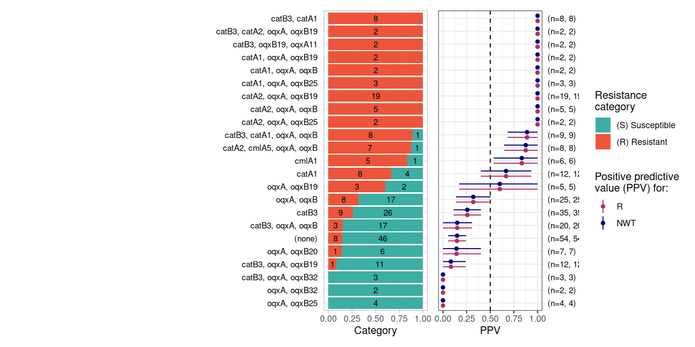
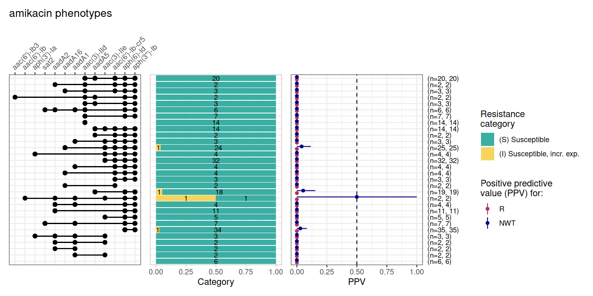
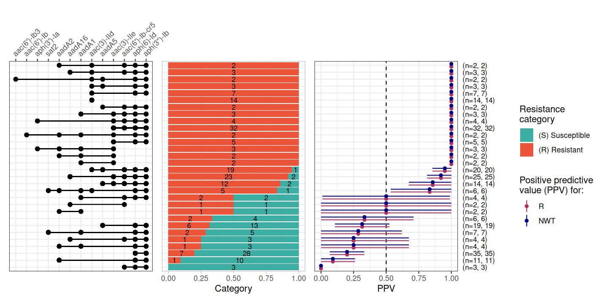
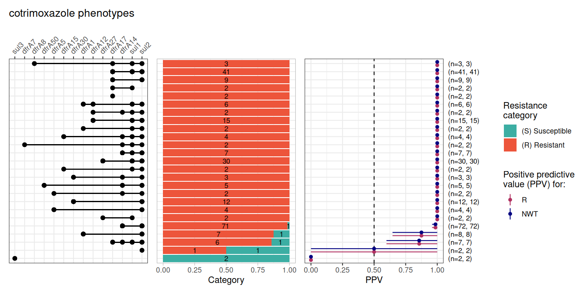
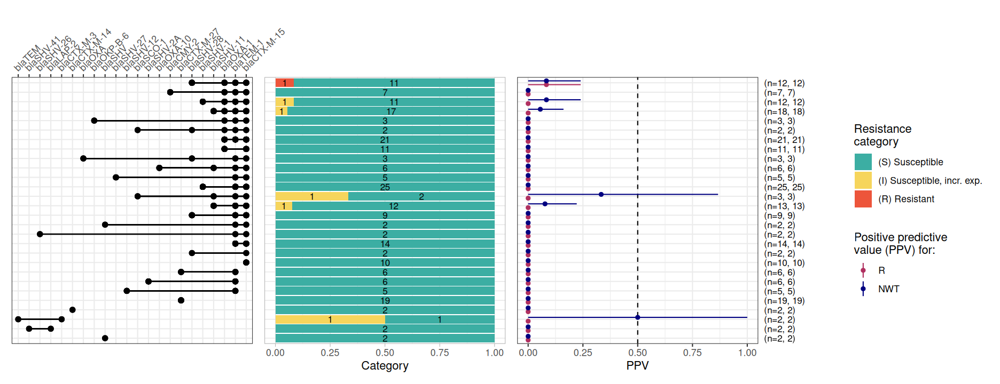
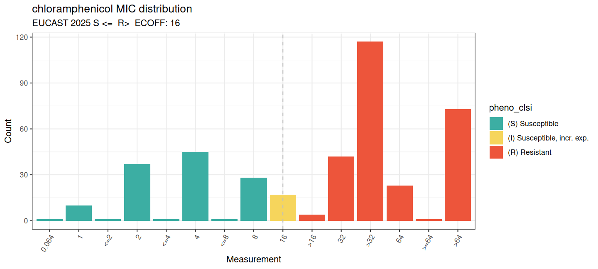
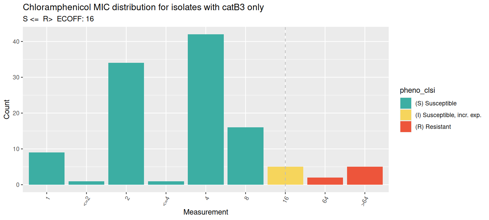
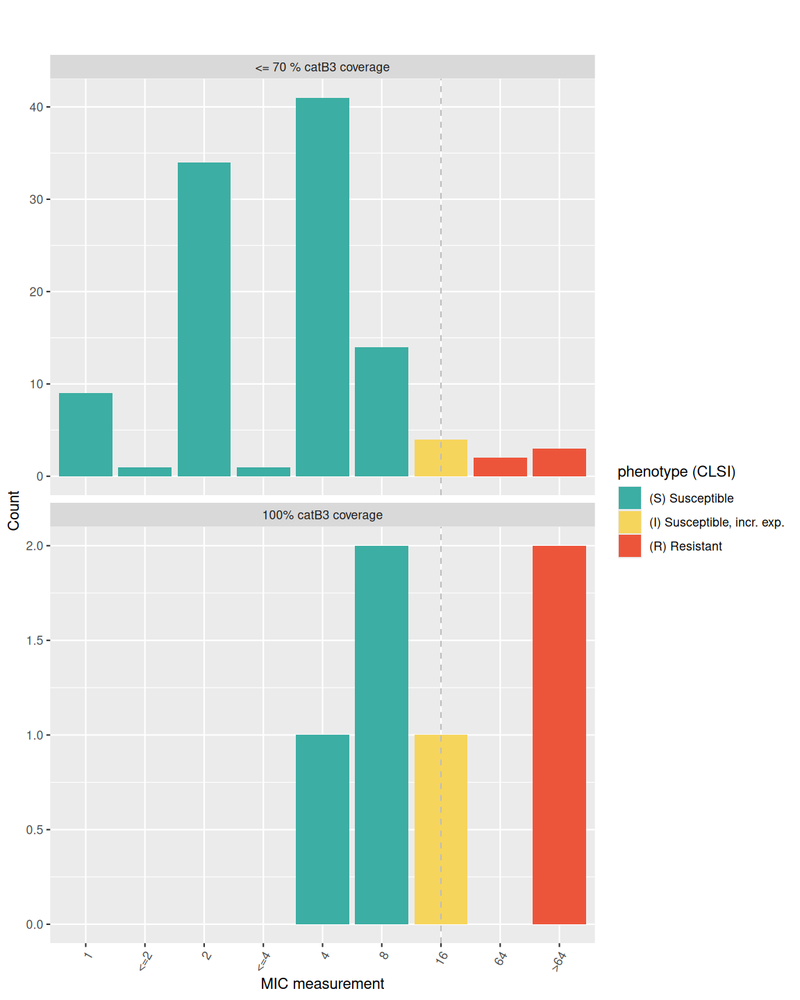
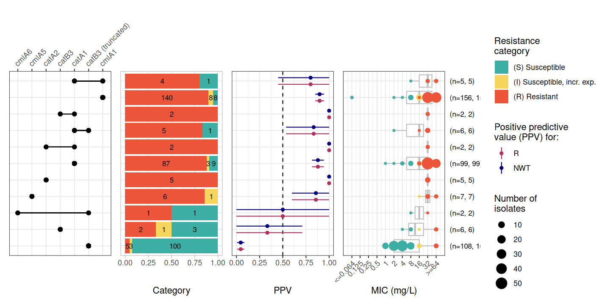

# Analysing the impact of deletion variants on susceptibility

## Exploring catB3 deletion variants and impact on chloramphenicol susceptibility in *Escherichia coli*

## 1. Introduction

Infections caused by extended-spectrum beta-lactamase (ESBL)-producing
Enterobacterales (ESBL-E) are a critical global health threat, often
leaving clinicians with few treatment options beyond last-resort
carbapenems.

In Malawi, first-line treatment for sepsis shifted from chloramphenicol
(CHL) to ceftriaxone (CRO) in 2004, this was followed by a notable
re-emergence of CHL susceptibility as its clinical use declined
([Musicha et al., 2017](https://doi.org/10.1016/S1473-3099(17)30394-8)).

A recent study ([Graf et al.,
2024](https://doi.org/10.1038/s41467-024-53391-2)) revealed that this
“resensitisation” is frequently driven by the stable degradation of
resistance genes rather than their total loss from the population.
Specifically, insertion sequences like IS*26* and IS*5* have been
identified as key drivers; IS*26* causes truncations in *catB3*
(creating the non-functional variant *catB4*), while IS*5* can integrate
into the promoter of *catA1*, effectively silencing its transcription.

Here we analyse a matched phenotype/genotype dataset used in the ([Graf
et al., 2024](https://doi.org/10.1038/s41467-024-53391-2)) study and
publicly available datasets from NCBI to investigate these
genotype-phenotype mismatches with the AMRgen package.

### 1.1 Sourcing data from the DASSIM study

One of the datasets used to highlight genotype-phenotype mismatches in
the [Graf et al., 2024](https://doi.org/10.1038/s41467-024-53391-2)
paper was the “Developing an antimicrobial strategy for sepsis in
Malawi” (DASSIM) dataset ([Lewis et
al. 2022](https://doi.org/10.1038/s41564-022-01216-7)).

The DASSIM study was an observational study of patients with sepsis
admitted to Queen Elizabeth Central Hospital, Blantyre, Malawi. The aim
was to understand the drivers of acquisition and long term carriage of
ESBL-E in sepsis survivors. The DASSIM dataset contains faecal samples
from community patients, inpatients and sepsis patients.

All genomic data was short-read sequenced on Illumina platforms at the
Wellcome Sanger Institute.

Antimicrobial sensitivity testing (AST) was carried out on a subset of
isolates using the disc-diffusion method using British Society for
Antimicrobial Chemotherapy (BSAC) guidelines (<https://bsac.org.uk/>).
AST was carried out for meropenem, amikacin, chloramphenicol,
ciprofloxacin, co-trimoxazole and gentamicin.

However this dataset only contains the interpreted phenotype data
(S/I/R) which is what we work with in this example.

### 1.1a DASSIM Genotype data

We downloaded genome data from the following papers:

> [Colonization dynamics of extended-spectrum beta-lactamase-producing
> Enterobacterales in the gut of Malawian
> adults](https://doi.org/10.1038/s41564-022-01216-7) Nat. Microbiol. 7,
> 1593–1604 (2022). Joseph M Lewis, Madalitso Mphasa, Rachel Banda,
> Matthew Beale, Eva Heinz, Jane Mallewa, Christopher Jewell, Nicholas R
> Thomson, Nicholas A Feasey

> [Genomic analysis of extended-spectrum beta-lactamase (ESBL) producing
> Escherichia coli colonising adults in Blantyre, Malawi reveals
> previously undescribed
> diversity](https://doi.org/10.1099/mgen.0.001035) Microb. Genom. 9,
> mgen001035 (2023). Joseph M Lewis, Madalitso Mphasa, Rachel Banda,
> Matthew Beale, Jane Mallewa, Catherine Anscombe, Allan Zuza, Adam P
> Roberts, Eva Heinz, Nicholas Thomson, Nicholas A Feasey

> [Genomic and antigenic diversity of colonising Klebsiella pneumoniae
> isolates mirrors that of invasive isolates in Blantyre,
> Malawi](https://doi.org/10.1099/mgen.0.000778) Microb. Genom. 8,
> 000778 (2022). Joseph M Lewis, Madalitso Mphasa, Rachel Banda, Matthew
> Beale, Jane Mallewa, Eva Heinz, Nicholas Thomson, Nicholas A Feasey

The genomes are deposited in the European Nucleotide Archive (ENA) under
the project IDs
[PRJEB26677](https://www.ebi.ac.uk/ena/browser/view/PRJEB26677) and
[PRJEB36486](https://www.ebi.ac.uk/ena/browser/view/PRJEB36486).

The fastq files were downloaded, processed with cutadapt, filtered to
\>Q20 with FASTQC, and assembled with SPAdes v3.11.1 as described in
[Graf et al., 2024](https://doi.org/10.1038/s41467-024-53391-2).

Antimicrobial resistance genes (ARGs) were called with AMRFinderPlus
v4.0.23 to produce the data frame (DASSIM_geno), which is included in
the AMRgen package as a data object `DASSIM_geno`.

#### 1.1b DASSIM Phenotype data

We downloaded the AST data from the [blantyreESBL
Github](https://joelewis101.github.io/blantyreESBL/) from Dr. Joe Lewis
at
<https://github.com/joelewis101/blantyreESBL/raw/refs/heads/main/data/btESBL_pheno.rda>.

This is included in the AMRgen package as a data object: `btESBL_pheno`.

Additional metadata relating to the isolates can be found in
[Supplementary Data
1](https://static-content.springer.com/esm/art%3A10.1038%2Fs41467-024-53391-2/MediaObjects/41467_2024_53391_MOESM4_ESM.xls)
of the following paper:

> [Molecular mechanisms of re-emerging chloramphenicol susceptibility in
> extended-spectrum beta-lactamase-producing
> Enterobacterales](https://doi.org/10.1038/s41467-024-53391-2). Nat
> Commun 15, 9019 (2024). Fabrice E Graf, Richard N Goodman, Sarah
> Gallichan, Sally Forrest, Esther Picton-Barlow, Alice J Fraser,
> Minh-Duy Phan, Madalitso Mphasa, Alasdair T M Hubbard, Patrick
> Musicha, Mark A Schembri, Adam P Roberts, Thomas Edwards, Joseph M
> Lewis, Nicholas A Feasey.

This data is included in the AMRgen package as data object:
`DASSIM_pheno_raw`.

## 2. Analysis of the DASSIM dataset

### 2.1 Setting up R

First we set up R and load our libraries.

``` r
library(AMRgen)
library(dplyr)
library(tidyr)
library(ggplot2)
```

### 2.2 Format the phenotype data

The phenotype data in `btESBL_pheno` needs to be reformatted to long
format, and sequence identifiers imported from `DASSIM_pheno_raw` so we
can match the phenotype data to the genotypes.

``` r
# Convert the S/I/R phenotype data to long format for easy use with AMRgen functions
DASSIM_pheno <- btESBL_pheno %>%
  pivot_longer(
    names_to = "drug",
    values_to = "pheno",
    cols = "amikacin":"meropenem"
  ) %>%
  mutate( # Standardise the terms to S, I, and R
    pheno = case_when(
      tolower(pheno) %in% c("sensitive", "susceptible", "s") ~ "S",
      tolower(pheno) %in% c("intermediate", "i") ~ "I",
      tolower(pheno) %in% c("resistant", "r") ~ "R",
      TRUE ~ NA_character_ # Any other unrecognised values become NA
    )
  ) %>%
  mutate(pheno = AMR::as.sir(pheno))

# add the sequence identifier from DASSIM_pheno_raw so we can match to genotype data
DASSIM_pheno <- DASSIM_pheno %>%
  left_join(DASSIM_pheno_raw %>% select(Strain_ID, seq, ST), join_by("supplier_name" == "Strain_ID")) %>%
  rename(id = seq) %>%
  relocate(id) %>%
  mutate(mic = NA)

head(DASSIM_pheno)
#> # A tibble: 6 × 7
#>   id         supplier_name organism drug            pheno    ST mic  
#>   <chr>      <chr>         <chr>    <chr>           <sir> <dbl> <lgl>
#> 1 ERR3426052 CAB10K        E. coli  amikacin          S     656 NA   
#> 2 ERR3426052 CAB10K        E. coli  chloramphenicol   S     656 NA   
#> 3 ERR3426052 CAB10K        E. coli  ciprofloxacin     S     656 NA   
#> 4 ERR3426052 CAB10K        E. coli  cotrimoxazole     R     656 NA   
#> 5 ERR3426052 CAB10K        E. coli  gentamicin        S     656 NA   
#> 6 ERR3426052 CAB10K        E. coli  meropenem         S     656 NA
```

### 2.3 Check the genotype data

``` r
head(DASSIM_geno)
#> # A tibble: 6 × 32
#>   id          marker      gene  mutation drug drug_class  `variation type` node 
#>   <chr>       <chr>       <chr> <chr>    <ab> <chr>       <chr>            <chr>
#> 1 26141_1_134 aadA5       aadA5 NA       STR1 Aminoglyco… Gene presence d… aadA5
#> 2 26141_1_134 dfrA17      dfrA… NA       NA   Trimethopr… Gene presence d… dfrA…
#> 3 26141_1_134 arr         arr   NA       RFM  Rifamycins  Inactivating mu… arr  
#> 4 26141_1_134 catB3       catB3 NA       CHL  Phenicols   Gene presence d… catB3
#> 5 26141_1_134 blaOXA-1    blaO… NA       NA   Cephalospo… Gene presence d… blaO…
#> 6 26141_1_134 aac(6')-Ib… aac(… NA       AMK  Aminoglyco… Gene presence d… aac(…
#> # ℹ 24 more variables: marker.label <chr>, `Protein id` <lgl>,
#> #   `Contig id` <chr>, Start <dbl>, Stop <dbl>, Strand <chr>,
#> #   `Gene symbol` <chr>, `Element name` <chr>, Scope <chr>, Type <chr>,
#> #   Subtype <chr>, Class <chr>, Subclass <chr>, Method <chr>,
#> #   `Target length` <dbl>, `Reference sequence length` <dbl>,
#> #   `% Coverage of reference` <dbl>, `% Identity to reference` <dbl>,
#> #   `Alignment length` <dbl>, `Closest reference accession` <chr>, …
```

### 2.4 PPV Analysis of DASSIM dataset

The function [`amr_ppv()`](https://amrgen.org/reference/amr_ppv.md)
predicts positive predictive value of genetic markers
(i.e. genes/mutations) for resistance among strains that carry these
markers.

We will look at the markers associated with the antibiotics used in the
AST assays for the DASSIM study.

- chloramphenicol
- amikacin
- gentamicin
- cotrimoxazole
- meropenem

For each of these first we create a binary matrix using
[`get_binary_matrix()`](https://amrgen.org/reference/get_binary_matrix.md)
which takes our genotype (AMRfinderplus etc.) and phenotype (AST
profile) datasets.

We can then plot the PPV graphs using
[`amr_ppv()`](https://amrgen.org/reference/amr_ppv.md).

``` r
# Get binary matrix
DASSIM_CHL_bin_mat <- get_binary_matrix(DASSIM_geno, DASSIM_pheno, pheno_drug = "chloramphenicol", sir_col = "pheno")
# Plot ppv
DASSIM_CHL_PPV <- amr_ppv(DASSIM_CHL_bin_mat, pheno_drug = "Chloramphenicol", sir_col = "pheno", upset_grid = FALSE)
```



This result clearly shows how the detection of *catB3* is not a good
predictor of resistance, whereas the detection of *catA2* is.

Now let’s check how well aminoglycoside markers predict resistance to
amikacin and gentamicin.

``` r
DASSIM_AMK_bin_mat <- get_binary_matrix(DASSIM_geno, DASSIM_pheno, pheno_drug = "amikacin", sir_col = "pheno")
DASSIM_AMK_PPV <- amr_ppv(DASSIM_AMK_bin_mat, pheno_drug = "amikacin", sir_col = "pheno", upset_grid = TRUE)
```



``` r

DASSIM_GEN_bin_mat <- get_binary_matrix(DASSIM_geno, DASSIM_pheno, pheno_drug = "gentamicin", sir_col = "pheno")
DASSIM_GEN_PPV <- amr_ppv(DASSIM_GEN_bin_mat, pheno_drug = "gentamicin", sir_col = "pheno", upset_grid = TRUE)
```



Here we see many of the aminoglycoside-associated resistance genes
detected in these genomes are predictive of resistance to gentamicin,
but none are associated with amikacin resistance. This is because
amikacin is a semi-synthetic drug with an addition of a specific side
chain, called the L-hydroxyaminobutyryl amide (HABA) group. This HABA
side chain blocks the Aminoglycoside-Modifying Enzymes (AMEs) from
reaching the sites on the molecule where they would normally attach
their deactivating tags.

Now let’s check how well markers associated with trimethoprims or
sulfonamides predict resistance to co-trimoxazole.

``` r
DASSIM_SXT_bin_mat <- get_binary_matrix(DASSIM_geno, DASSIM_pheno, pheno_drug = "cotrimoxazole", sir_col = "pheno")
DASSIM_SXT_PPV <- amr_ppv(DASSIM_SXT_bin_mat, pheno_drug = "cotrimoxazole", sir_col = "pheno", upset_grid = TRUE)
```



Co-trimoxazole is a combination drug made of sulfamethoxazole and
trimethoprim. It is prescribed prophylactically in Malawi for
HIV-positive individuals ([Everett et
al. 2011](https://doi.org/10.1371/journal.pone.0017765)). Since it is a
combination drug it requires both Sulfamethoxazole resistance genes
(e.g., *sul*) and Trimethoprim resistance genes (e.g., *dfrA*).

Meropenem is a last resort carbapenem antibiotic.
[`amr_ppv()`](https://amrgen.org/reference/amr_ppv.md) by default
returns all markers associated with beta-lactam resistance, for
comparison with meropenem phenotypes. However while many beta-lactamases
were detected, none are known carbapenemases (e.g., *bla_(NDM)*,
*bla_(KPC)*, *bla_(VIM)*, *bla_(IMP)*, *bla_(OXA-48-like)*). Consistent
with this only a single isolate, carrying multiple beta-lactamases, was
phenotyped as resistant to meropenem.

``` r
DASSIM_MEM_bin_mat <- get_binary_matrix(DASSIM_geno, DASSIM_pheno, pheno_drug = "meropenem", sir_col = "pheno")
DASSIM_MEM_PPV <- amr_ppv(DASSIM_MEM_bin_mat, pheno_drug = "meropenem", sir_col = "pheno", upset_grid = TRUE)
```



This analysis highlights how AMRgen can be used to explore
genotype/phenotype associations for specific genetic markers related to
a variety of antibiotics.

Next we’ll explore the chloramphenicol susceptibility associated with
the *catB3* gene with more functions of the AMRgen package. For this we
need raw phenotype data (e.g., MIC or disc diffusion), so we will go to
NCBI to download public datasets.

## 3. Analysis of publicly available phenotype and genotype data for chloramphenicol

### 3.1 Importing public data from NCBI

The National Center for Biotechnology Information (NCBI) provides tools
for analysing antimicrobial resistance (AMR).

**Phenotypes: NCBI AST**

The Antibiotic Susceptibility Test (AST) Browser serves as a centralised
resource for viewing and filtering phenotypic susceptibility data,
allowing researchers to correlate specific bacterial isolates with their
phenotypic resistance profiles.

AST data can be retrieved directly from NCBI using the AMRgen functions
[`download_ncbi_pheno()`](https://amrgen.org/reference/download_ncbi_pheno.md)
(slow but does not require authorisation) or
[`query_ncbi_bq_pheno()`](https://amrgen.org/reference/query_ncbi_bq_pheno.md)
(very fast, requires a Google Cloud account), or via the NCBI AST
Browser. For more details see the [Analysing Geno-Pheno
Data](https://amrgen.org/articles/AnalysingGenoPhenoData.html) vignette.

``` r
# Download E. coli phenotype data from NCBI, filtering for chloramphenicol, and re-interpret with CLSI breakpoints
ecoli_pheno_ncbi_via_biosample <- download_ncbi_pheno(
  species = "E. coli",
  pheno_drug = "chloramphenicol",
  reformat = TRUE,
  interpret_clsi = TRUE
)
```

``` r
# Download E. coli AST data from NCBI via Google Cloud, filtering for chloramphenicol, and re-interpret with CLSI breakpoints

install.packages("bigrquery")
library(bigrquery)
bigrquery::bq_auth()

# replace xxx with your project id
ecoli_pheno_ncbi_via_cloud <- query_ncbi_bq_pheno(
  taxgroup = "E.coli and Shigella",
  pheno_drug = "chloramphenicol",
  project_id = "xxx"
)

ecoli_pheno_ncbi_via_cloud_interpreted <- import_ncbi_pheno(ecoli_pheno_ncbi_via_cloud,
  interpret_clsi = TRUE
)
```

Alternatively, we can navigate to the [*NCBI Antibiotic Susceptibility
Test (AST) Browser*](https://www.ncbi.nlm.nih.gov/pathogens/ast) in a
web browser and search for

> `chloramphenicol AND Escherichia`

> <https://www.ncbi.nlm.nih.gov/pathogens/ast#chloramphenicol%20AND%20Escherichia>

Save this as a `tsv` file: `CHL_Ecoli_asts.tsv`, and import it using the
AMRgen function `import_pheno`.

``` r
# import phenotype data
NCBI_Ecoli_pheno_chl <- import_pheno("data-raw/CHL_Ecoli_asts.tsv", format = "ncbi")
```

A copy of this imported data (downloaded March 2026) is included in
AMRgen as data frame `NCBI_Ecoli_pheno_chl`.

``` r
head(NCBI_Ecoli_pheno_chl)
#> # A tibble: 6 × 25
#>   id    drug    mic  disk guideline method  platform pheno_provided spp_pheno   
#>   <chr> <ab>  <mic> <dsk> <chr>     <chr>   <chr>    <chr>          <mo>        
#> 1 SAMN… CHL  <=0.03    NA EUCAST    broth … NA       not defined    B_ESCHR_COLI
#> 2 SAMN… CHL    4.00    NA EUCAST    broth … NA       not defined    B_ESCHR_COLI
#> 3 SAMN… CHL    2.00    NA EUCAST    broth … NA       not defined    B_ESCHR_COLI
#> 4 SAMN… CHL  <=0.03    NA EUCAST    broth … NA       not defined    B_ESCHR_COLI
#> 5 SAMN… CHL    2.00    NA EUCAST    broth … NA       not defined    B_ESCHR_COLI
#> 6 SAMN… CHL    1.00    NA EUCAST    broth … NA       not defined    B_ESCHR_COLI
#> # ℹ 16 more variables: `Organism group` <chr>, `Scientific name` <chr>,
#> #   `Isolation type` <chr>, Location <chr>, `Isolation source` <chr>,
#> #   Isolate <chr>, Antibiotic <chr>, `Resistance phenotype` <chr>,
#> #   `Measurement sign` <chr>, `MIC (mg/L)` <dbl>, `Disk diffusion (mm)` <dbl>,
#> #   `Laboratory typing platform` <chr>, Vendor <chr>,
#> #   `Laboratory typing method version or reagent` <chr>,
#> #   `Testing standard` <chr>, `Create date` <dttm>
```

**Genotypes: MicroBIGG-E**

The Microbial Browser for Identification of Genetic and Genomic Elements
(MicroBIGG-E) is a specialised portal within the NCBI Pathogen Detection
system that enables users to query a database of over 46,000 isolates to
identify specific AMR genes and point mutations.

Navigate to the [*NCBI Pathogen Detection Microbial Browser for
Identification of Genetic and Genomic Elements
(MicroBIGG-E)*](https://www.ncbi.nlm.nih.gov/pathogens/microbigge) in a
web browser and search for:

> `chloramphenicol AND Escherichia`

> <https://www.ncbi.nlm.nih.gov/pathogens/microbigge/#chloramphenicol%20AND%20Escherichia>

Save this as a `tsv` file: `CHL-R_Ecoli_microbigge.tsv`, and import it
using the AMRgen function `import_gheno`.

``` r
# import phenotype data
MICROBIGGE_Ecoli_CHLR <- import_geno("data-raw/CHL-R_Ecoli_microbigge.tsv", format = "amrfp", sample_col = "BioSample")
```

A copy of this imported data (downloaded March 2026) is included in
AMRgen as data frame `MICROBIGGE_Ecoli_CHLR`.

``` r
head(MICROBIGGE_Ecoli_CHLR)
#> # A tibble: 6 × 27
#>   id          marker gene  mutation drug_agent drug_class `variation type` node 
#>   <chr>       <chr>  <chr> <chr>    <ab>       <chr>      <chr>            <chr>
#> 1 SAMN008293… catA1  catA1 NA       CHL        Phenicols  Gene presence d… catA1
#> 2 SAMN018857… catA1  catA1 NA       CHL        Phenicols  Gene presence d… catA1
#> 3 SAMN026875… catA1  catA1 NA       CHL        Phenicols  Gene presence d… catA1
#> 4 SAMN028020… catA1  catA1 NA       CHL        Phenicols  Gene presence d… catA1
#> 5 SAMN028018… catB3  catB3 NA       CHL        Phenicols  Inactivating mu… catB3
#> 6 SAMN031982… catA1  catA1 NA       CHL        Phenicols  Gene presence d… catA1
#> # ℹ 19 more variables: marker.label <chr>, `Scientific name` <chr>,
#> #   Protein <chr>, Isolate <chr>, Contig <chr>, Start <dbl>, Stop <dbl>,
#> #   Strand <chr>, `Element symbol` <chr>, `Element name` <chr>, Type <chr>,
#> #   Scope <chr>, Subtype <chr>, Class <chr>, Subclass <chr>, Method <chr>,
#> #   `% Coverage of reference` <dbl>, `% Identity to reference` <dbl>,
#> #   subclass_to_parse <chr>
```

### 3.2 Filter data to samples with chloramphenicol phenotype data, and chloramphenicol genotypic markers detected

``` r
# filter AST data, re-interpret using CLSI breakpoints
AST_pheno <- NCBI_Ecoli_pheno_chl %>%
  filter(id %in% MICROBIGGE_Ecoli_CHLR$id) %>%
  interpret_pheno(interpret_clsi = TRUE)
#> Warning: There was 1 warning in `mutate()`.
#> ℹ In argument: `across(...)`.
#> Caused by warning:
#> ! Some MICs were converted to the nearest higher log2 level, following the CLSI
#> interpretation guideline.
MB_CHLR_geno <- MICROBIGGE_Ecoli_CHLR %>% filter(id %in% NCBI_Ecoli_pheno_chl$id)

# check how many samples we have
length(unique(AST_pheno$id))
#> [1] 410

# check the genes
MB_CHLR_geno %>% count(gene)
#> # A tibble: 6 × 2
#>   gene      n
#>   <chr> <int>
#> 1 catA1   213
#> 2 catA2    16
#> 3 catB3   278
#> 4 cmlA1   350
#> 5 cmlA5    12
#> 6 cmlA6     6

# filter to find samples with catB3
MB_CATB3_geno <- MB_CHLR_geno %>% filter(gene == "catB3")
MB_nonCATB3_geno <- MB_CHLR_geno %>% filter(gene != "catB3")

# filter AST data to samples with catB3 and no other chloramphenicol markers
AST_CATB3_pheno <- AST_pheno %>%
  filter(id %in% MB_CATB3_geno$id) %>%
  filter(!(id %in% MB_nonCATB3_geno$id))

# check how many samples we have with catB3
length(unique(AST_CATB3_pheno$id))
#> [1] 116
```

### 3.3 Exploring chloramphenicol phenotype distributions with `assay_by_var()`

Now we can explore phenotype distributions based on MIC data using the
[`assay_by_var()`](https://amrgen.org/reference/assay_by_var.md)
function.

We visualise the MIC distribution with
[`assay_by_var()`](https://amrgen.org/reference/assay_by_var.md) on all
chloramphenicol AST data.

``` r
AST_pheno <- AST_pheno %>%
  mutate(across(all_of("mic"), ~ AMR::as.mic(.x, round_to_next_log2 = TRUE)))

assay_by_var(
  pheno_table = AST_pheno,
  pheno_drug = "chloramphenicol",
  measure = "mic",
  colour_by = "pheno_clsi",
  species = "Escherichia coli"
)
```



Next we can visualise the MIC distribution with
[`assay_by_var()`](https://amrgen.org/reference/assay_by_var.md) on the
AST data of isolates containing the *catB3* gene only

``` r
# CATB3 specific

assay_by_var(
  pheno_table = AST_CATB3_pheno,
  pheno_drug = "CHL",
  measure = "mic",
  colour_by = "pheno_clsi",
  species = "Escherichia coli"
) +
  labs(title = "Chloramphenicol MIC distribution for isolates with catB3 only")
```



The distribution shifts to the right and towards sensitive for isolates
with the *catB3* gene only, when compared to those with any
chloramphenicol-associated gene.

We can then split the plot based on whether the the *catB3* gene is
truncated or not. This is calculated as a percentage of coverage, with
100% aligning across the entire length of the gene and \<100% showing a
truncation or deletion (see [Graf et al.,
2024](https://doi.org/10.1038/s41467-024-53391-2) for more about the
IS*26* mediated truncation of *catB3*).

``` r
# add genotype data to the phenotype table for isolates with catB3 alone
AST_CATB3_pheno_2 <- MB_CATB3_geno %>%
  select(id, gene, `% Coverage of reference`) %>%
  distinct(id, .keep_all = TRUE) %>%
  right_join(AST_CATB3_pheno, by = "id")

# check coverage, all values are either 100% or 66.7-70%
AST_CATB3_pheno_2 %>% count(`% Coverage of reference`)
#> # A tibble: 4 × 2
#>   `% Coverage of reference`     n
#>                       <dbl> <int>
#> 1                      66.7     1
#> 2                      69.5    25
#> 3                      70      84
#> 4                     100       6

# define a grouping variable 'truncation' indicating samples with full coverage vs <=70%
AST_CATB3_pheno_3 <- AST_CATB3_pheno_2 %>%
  mutate(truncation = ifelse(`% Coverage of reference` > 70, "100% catB3 coverage", "<= 70 % catB3 coverage"))

# plot the MIC distribution for these 2 groups
MIC_dist_by_cov <- assay_by_var(
  pheno_table = AST_CATB3_pheno_3,
  pheno_drug = "Chloramphenicol",
  measure = "mic",
  colour_by = "pheno_clsi",
  facet_by = "truncation",
  measure_axis_label = "MIC (mg/L)",
  colour_legend_label = "Phenotype (CLSI)"
)

MIC_dist_by_cov
```



``` r

# check counts and median MIC per group
AST_CATB3_pheno_3 %>%
  group_by(truncation) %>%
  summarise(median = median(mic, na.rm = T), n = n(), R = sum(pheno_clsi == "S"))
#> # A tibble: 2 × 4
#>   truncation             median     n     R
#>   <chr>                   <dbl> <int> <int>
#> 1 100% catB3 coverage        12     6     3
#> 2 <= 70 % catB3 coverage      4   110   100
```

As we can see, isolates with truncated *catB3* genes (n=110) have median
MIC of 4 mg/L, and most (n=100) were classed as susceptible (MIC \<16
mg/L). In contrast, those with full-length *catB3* genes (n=6) had
higher values, and only 3 were classed as susceptible.

### 3.4 Analysing genotype and phenotype data with `amr_ppv()`

Now let’s look at the geno-pheno associations across all the isolates
with matched data. We first build a binary matrix using the genotype and
phenotype tables as input with
[`get_binary_matrix()`](https://amrgen.org/reference/get_binary_matrix.md)

Then we can view it as an upset grid, with a upset plot, SIR stacked
barplot and positive predictive value (ppv) using the
[`amr_ppv()`](https://amrgen.org/reference/amr_ppv.md) function.

``` r
MB_CHLR_geno <- MB_CHLR_geno %>%
  mutate(marker = ifelse(marker == "catB3" & `% Coverage of reference` < 100, "catB3 (truncated)", marker))

CHL_bin_mat <- get_binary_matrix(MB_CHLR_geno,
  AST_pheno,
  pheno_drug = "CHL",
  geno_class = c("Phenicols"),
  sir_col = "pheno_clsi",
  keep_assay_values = TRUE
)

CHL_PPV <- amr_ppv(CHL_bin_mat,
  pheno_drug = "Chloramphenicol",
  geno_class = c("Phenicols"),
  sir_col = "pheno_clsi",
  upset_grid = TRUE,
  assay = "mic",
  plot_assay = TRUE,
  order = "value"
)
```


### 3.5 Logistic regression

We can plot a coefficient plot using the
[`amr_logistic()`](https://amrgen.org/reference/amr_logistic.md)
function to show the statistical relationship between chloramphenicol
resistance genes and phenotypic resistance to chloramphenicol.

We just need the binary matrix as input (from
[`get_binary_matrix()`](https://amrgen.org/reference/get_binary_matrix.md))
and we can define the antibiotic, the column containing the ecoff and a
threshold for the number of samples a marker is present in.

``` r
CHL_logist <- amr_logistic(
  binary_matrix = CHL_bin_mat,
  pheno_drug = "chloramphenicol",
  ecoff_col = "ecoff",
  maf = 10,
  single_plot = TRUE
)
```



``` r

# model coefficients
CHL_logist$modelR
#> # A tibble: 5 × 5
#>   marker               est ci.lower ci.upper         pval
#>   <chr>              <dbl>    <dbl>    <dbl>        <dbl>
#> 1 (Intercept)        0.295   -0.555    1.14  0.496       
#> 2 cmlA1              1.84     0.866    2.81  0.000211    
#> 3 catA1              2.00     1.10     2.91  0.0000134   
#> 4 catB3             -0.611   -2.08     0.857 0.415       
#> 5 catB3 (truncated) -2.47    -3.38    -1.56  0.0000000980
```

This plot shows that both *catA1* and *cmlA1* have a strong positive
association with phenotypic resistance whereas truncated *catB3* has a
strong negative association with resistance (i.e. a stronger association
with susceptibility to chloramphenicol).

Experimental evolution analysis by [Graf et al.,
2024](https://doi.org/10.1038/s41467-024-53391-2) suggested that these
*catB3* silencing events are highly stable under antibiotic pressure,
reinforcing the potential for chloramphenicol to be reintroduced as a
targeted reserve agent for ESBL-E infections in low-resource settings.
