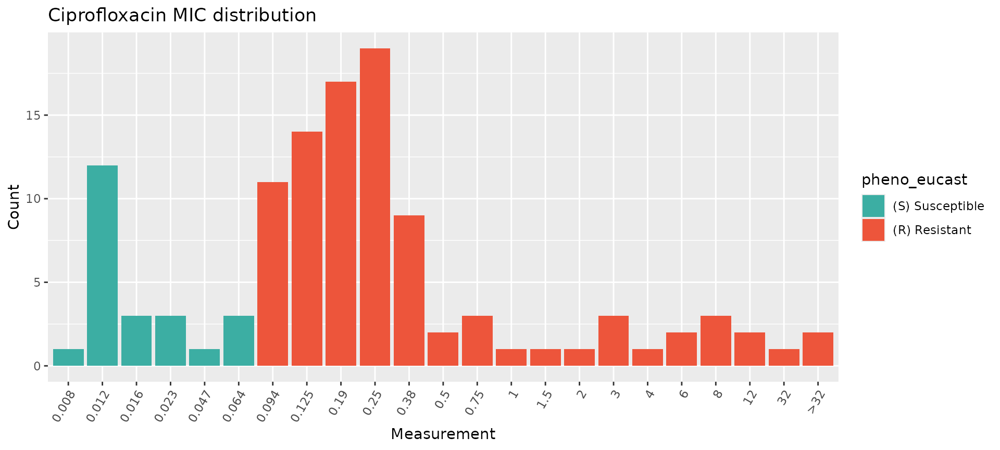
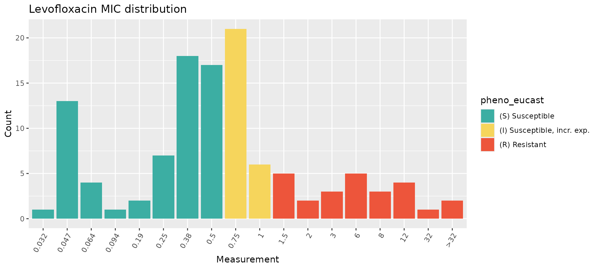
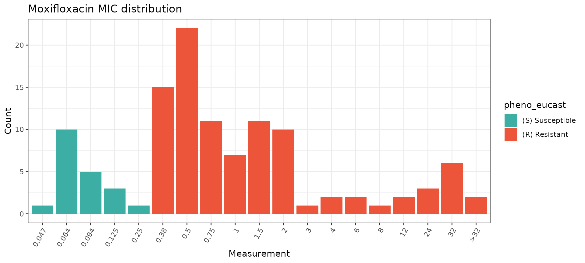
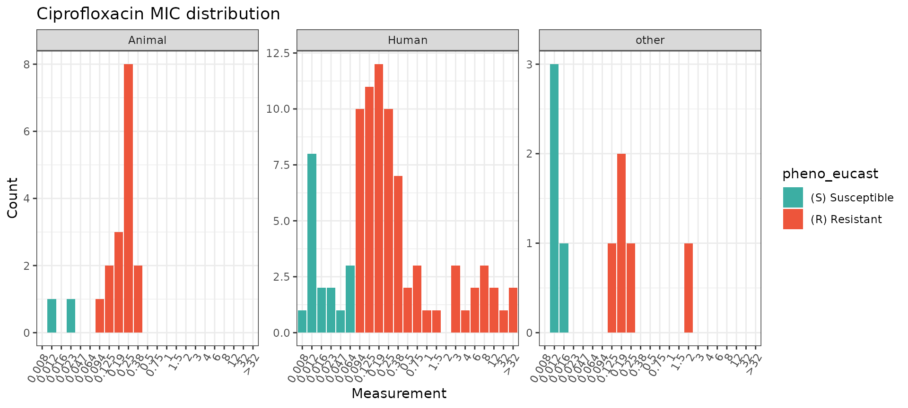
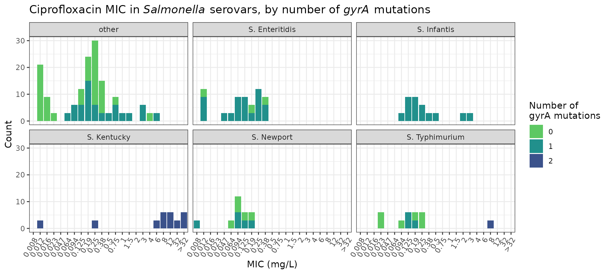
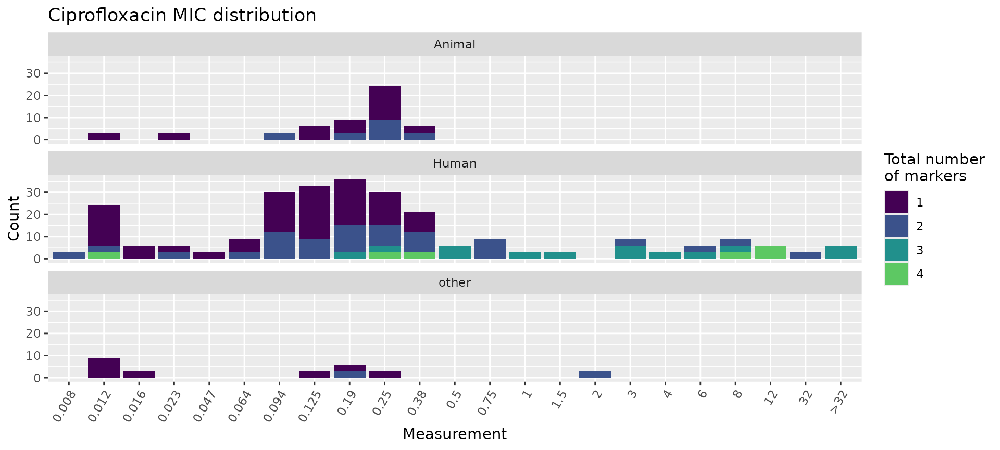
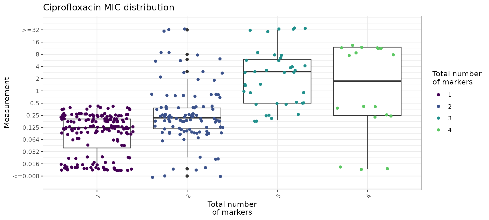
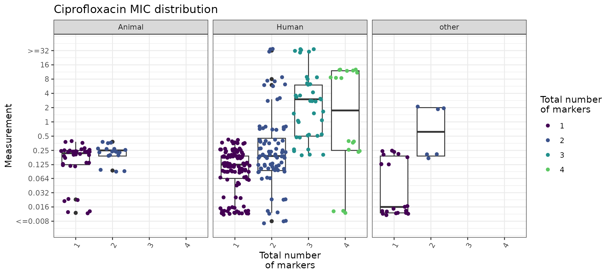
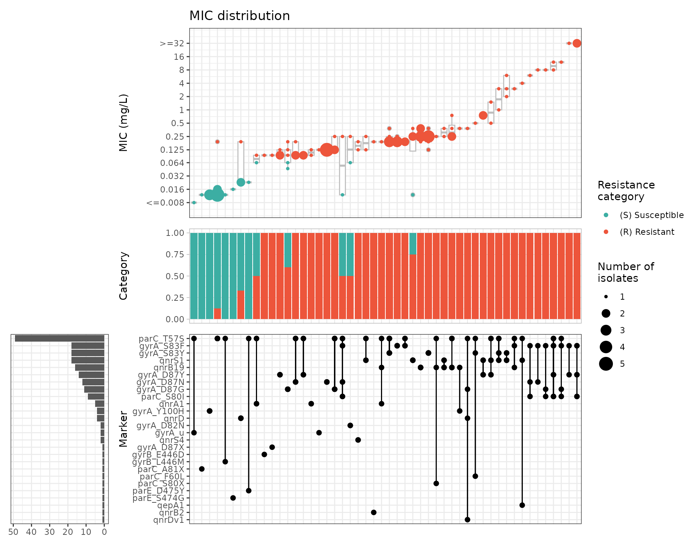
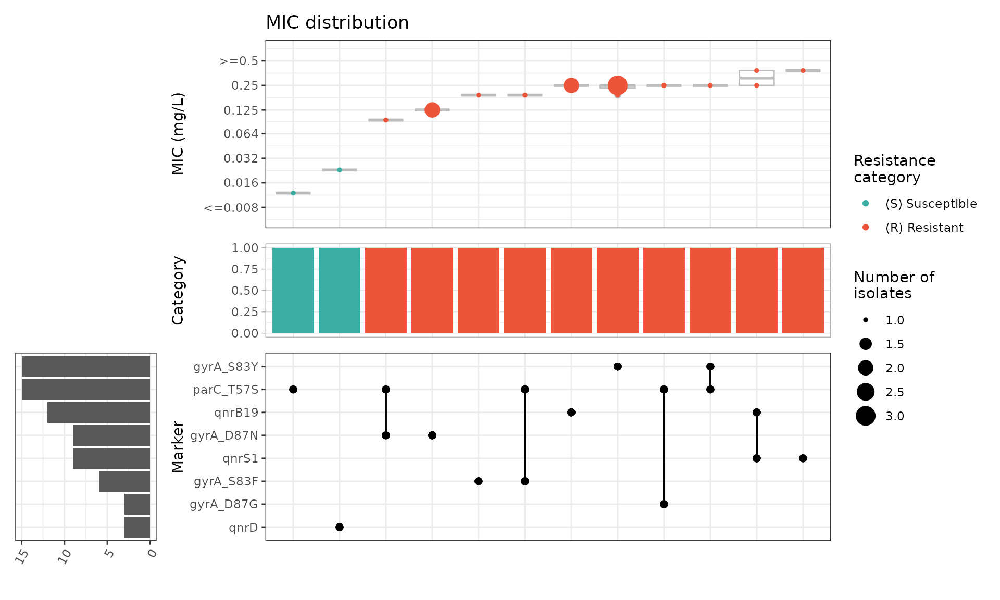

# Example with custom stratification by isolate source

## Analysing a small user-generated geno-pheno dataset of *Salmonella enterica*

### Introduction

This vignette shows how `AMRgen` can be used to explore a small
user-generated dataset with genotypic and phenotypic data for
non-typhoidal, non-invasive *Salmonella enterica* isolates. Phenotypic
data consists of MIC E-test results for ciprofloxacin, levofloxacin, and
moxifloxacin. Genotypic data includes AMRFinderPlus results for
quinolone resistance markers.

Start by loading the package:

``` r
library(AMRgen)
library(dplyr)
library(ggplot2)
library(tidyr)
```

### Import data

In this example, the data table was exported from the user’s laboratory
information management system as a single `.csv` file that includes both
genotypic and phenotypic results for 115 *S. enterica* isolates, with
one line per isolate. There are columns for two categorical variables of
interest: isolate source (human, animal, or other) and isolate serovar.
Genotype data is stored in a single column, and where multiple quinolone
resistance markers were identified, these are listed in a string with
semicolon delimiters. Phenotype data is stored in separate columns for
each antimicrobial agent that was tested (ciprofloxacin, levofloxacin,
moxifloxacin).

Data in this format can be read into R using `read_csv()` and then
formatted for use with `AMRgen`. Here, the object `salm_raw` is already
pre-loaded with the package so there is no need to read in the `.csv`
file.

``` r
# Importing raw data from .csv file (not needed to run vignette)
salm_raw <- read_csv("Salmonella_pheno_geno_data.csv")
```

``` r
head(salm_raw)
#> # A tibble: 6 × 7
#>   Sample Source Serovar     CpL_Genotype Ciprofloxacin Levofloxacin Moxifloxacin
#>   <chr>  <chr>  <chr>       <chr>        <chr>         <chr>        <chr>       
#> 1 SAL001 Animal other       gyrA_S83F;p… 0.19          0.5          0.5         
#> 2 SAL002 Human  S. Enterit… gyrA_S83Y    0.38          1.5          1.5         
#> 3 SAL003 Human  other       gyrA_S83F;p… 3             12           24          
#> 4 SAL004 other  S. Infantis gyrA_D87G    0.125         0.5          0.5         
#> 5 SAL005 Human  other       gyrA_D87Y    0.094         0.25         0.38        
#> 6 SAL006 Human  S. Kentucky gyrA_S83F;g… 8             8            32
```

The `AMRgen` package requires separate phenotypic and genotypic tables
with specific column headers, so the next step is to separate and
wrangle these data into the required formats.

### Genotype table

#### Format raw genotype data for AMRgen

To use downstream `AMRgen` functions, a genotype table must have at a
minimum the following columns: `Name` (unique sample name for each
isolate), `marker` (name of the resistance marker detected), and
`drug_class` (antibiotic class associated with this marker). It also
needs to be in long form, with a row for each isolate/marker
combination. In our dataset, the genotype information is found in a
single column alongside the metadata and phenotypic information, and we
can have multiple markers per row (up to four). Here, we carry out the
following steps to generate a genotype table that is compatible with
`AMRgen` functions:

- Select only the genotype column (called `CpL_Genotype` in this
  dataset) and the column specifying the individual isolate names
  (called `Sample` in this dataset)
- Rename the column `Sample` to `Name`, which is the default column
  heading used by `AMRgen` for identifying individual isolates
- Separate the genotype column `CpL_Genotype` into individual columns
  for each marker (up to four per isolate in these data), specifying the
  delimiter `;`
- Convert this wide-form data (one row per isolate) to a long-form table
  (one row per isolate/marker combination) using `pivot_longer`
- Add a column specifying that all these markers are associated with
  resistance to quinolones

``` r
# Extract geno data, separate by delimiter, pivot longer, and add drug_class column
salm_geno <- salm_raw %>%
  select(Sample, CpL_Genotype) %>%
  rename(Name = Sample) %>%
  separate_wider_delim(CpL_Genotype,
    delim = ";", names = c("Marker_1", "Marker_2", "Marker_3", "Marker_4"),
    too_few = "align_start", cols_remove = TRUE
  ) %>%
  pivot_longer(
    cols = c(Marker_1, Marker_2, Marker_3, Marker_4),
    names_to = "marker_no",
    values_to = "marker",
    values_drop_na = TRUE
  ) %>%
  select(-marker_no) %>%
  mutate(
    drug_class = "Quinolones",
    drug = NA_character_
  ) ## the variable drug appears essential for get_binary_matrix function to work...

# Check the format of the processed genotype table
head(salm_geno)
#> # A tibble: 6 × 4
#>   Name   marker    drug_class drug 
#>   <chr>  <chr>     <chr>      <chr>
#> 1 SAL001 gyrA_S83F Quinolones NA   
#> 2 SAL001 parC_T57S Quinolones NA   
#> 3 SAL002 gyrA_S83Y Quinolones NA   
#> 4 SAL003 gyrA_S83F Quinolones NA   
#> 5 SAL003 parC_T57S Quinolones NA   
#> 6 SAL003 qnrB19    Quinolones NA
```

#### Summarise genotype data

The [`summarise_geno()`](https://amrgen.org/reference/summarise_geno.md)
function can provide various summaries of the genotype table, including
the total number of unique markers and a table showing each marker’s
prevalence in the dataset.

``` r
# Create geno_summary object
salm_geno_summary <- summarise_geno(salm_geno)

# Total number of markers, drugs, and drug classes
salm_geno_summary$uniques
#> # A tibble: 3 × 2
#>   column     n_unique
#>   <chr>         <int>
#> 1 marker           26
#> 2 drug              1
#> 3 drug_class        1

# Prevalence of each detected marker, in decreasing abundance
salm_geno_summary$markers %>% arrange(-n)
#> # A tibble: 26 × 4
#>    marker    drug  drug_class     n
#>    <chr>     <chr> <chr>      <int>
#>  1 parC_T57S NA    Quinolones    49
#>  2 gyrA_S83F NA    Quinolones    18
#>  3 gyrA_S83Y NA    Quinolones    18
#>  4 qnrS1     NA    Quinolones    18
#>  5 qnrB19    NA    Quinolones    16
#>  6 gyrA_D87Y NA    Quinolones    14
#>  7 gyrA_D87N NA    Quinolones    12
#>  8 gyrA_D87G NA    Quinolones    11
#>  9 parC_S80I NA    Quinolones     9
#> 10 qnrA1     NA    Quinolones     5
#> # ℹ 16 more rows
```

These summaries show that there are 26 distinct genotypic markers for
quinolone resistance in this dataset. The most common one is parC_T57S,
found in 49 of 115 isolates, followed by gyrA_S83F, gyrA_S83Y, and
qnrS1, each found in 18 of 115 isolates. Eleven markers are found only
once across all isolates.

### Phenotype table

#### Format raw phenotype data for AMRgen

To use downstream `AMRgen` functions, a phenotype table must be in long
form with a single column for all antimicrobial agents that were tested,
rather than separate columns for each agent. It also needs to have at a
minimum the following columns: `id` (unique sample name for each
isolate), `spp_pheno` (species name formatted as per the AMR package
`mo` class), `drug` (antimicrobial agent name formatted as per the AMR
package `ab` class), a S/I/R phenotype column (e.g. one or more of
`pheno_eucast`, `pheno_clsi`, `pheno_provided`, `ecoff`). If raw assay
data is to be included, it needs to be in a column called `mic` and/or
`disk`.

To convert out dataset to this format, we begin by extracting the
columns with the unique isolate names (`Sample`) and those with the MIC
results for the three antimicrobial agents that we tested
(`Ciprofloxacin`, `Levofloxacin`, `Moxifloxacin`). We also keep the
columns with additional metadata (`Source`, `Serovar`), as these are not
in the genotype table. The antimicrobial columns need to be forced to
character vectors to avoid issues caused by occasional presence of
non-numeric prefixes (`>` or `<`). We then pivot the table to long form.

``` r
# Pheno table: select columns with sample ID, metadata, and antimicrobials tested,
# then pivot to long form
salm_pheno <- salm_raw %>%
  select(Sample, Source, Serovar, Ciprofloxacin, Levofloxacin, Moxifloxacin) %>%
  mutate(across(c(Ciprofloxacin, Levofloxacin, Moxifloxacin), as.character)) %>%
  pivot_longer(
    cols = c(Ciprofloxacin, Levofloxacin, Moxifloxacin),
    names_to = "drug",
    values_to = "MIC.values",
    values_drop_na = TRUE
  )
```

Our phenotype data is not yet in a standard AMR/AMRgen format so we use
the helpful `format_pheno` function to add the species name, to format
the antimicrobial and MIC columns correctly, and to generate the S/I/R
phenotype column `pheno_eucast` by interpreting our Salmonella MIC data
against EUCAST breakpoints. We apply these breakpoints across our
human/animal/other isolates, as our interest is in resistance phenotypes
that are potentially problematic in human infections, including zoonotic
ones.

``` r
salm_ast <- format_pheno(
  input = salm_pheno,
  sample_col = "Sample",
  species = "Salmonella enterica",
  ab_col = "drug",
  mic_col = "MIC.values",
  interpret_eucast = TRUE
)

# Check the format of the processed phenotype table
head(salm_ast)
#> # A tibble: 6 × 7
#>   id     drug   mic pheno_eucast spp_pheno    Source Serovar       
#>   <chr>  <ab> <mic> <sir>        <mo>         <chr>  <chr>         
#> 1 SAL001 CIP   0.19   R          B_SLMNL_ENTR Animal other         
#> 2 SAL001 LVX   0.50   S          B_SLMNL_ENTR Animal other         
#> 3 SAL001 MFX   0.50   R          B_SLMNL_ENTR Animal other         
#> 4 SAL002 CIP   0.38   R          B_SLMNL_ENTR Human  S. Enteritidis
#> 5 SAL002 LVX   1.50   R          B_SLMNL_ENTR Human  S. Enteritidis
#> 6 SAL002 MFX   1.50   R          B_SLMNL_ENTR Human  S. Enteritidis
```

#### Summarise phenotype data

The `summarise_pheno` function can be used to generate various summaries
of the phenotype table, including the total number of samples, drugs,
and species, and table of S/I/R counts for each drug in the dataset. Our
dataset is limited to a single species with data from only one method
(E-test MIC), and we are looking only at the EUCAST breakpoints, but the
vignette “Analysing Geno-Pheno Data” shows how the `summarise_pheno`
function can be used for datasets with multiple species, methods, drug
classes, and interpretation guidelines.

``` r
salm_pheno_summary <- summarise_pheno(salm_ast, pheno_cols = c("pheno_eucast"))
#> No disk data colummn provided

# Number of samples, drugs, species, and methods included in phenotype table
salm_pheno_summary$uniques
#> # A tibble: 3 × 2
#>   column    n_unique
#>   <chr>        <int>
#> 1 id             115
#> 2 drug             3
#> 3 spp_pheno        1

# SIR summary table for each drug in the phenotype table
salm_pheno_summary$pheno_counts_list
#> $pheno_eucast
#> # A tibble: 3 × 6
#>   drug drug_name     spp_pheno               S     R     I
#>   <ab> <chr>         <chr>               <int> <int> <int>
#> 1 CIP  Ciprofloxacin Salmonella enterica    23    92    NA
#> 2 LVX  Levofloxacin  Salmonella enterica    63    25    27
#> 3 MFX  Moxifloxacin  Salmonella enterica    20    95    NA
```

These summaries show that there are 115 isolates of one species in this
dataset, with results for three drugs. Similar proportions were
resistant to ciprofloxacin and moxifloxacin, whereas a lower proportion
was resistant to levofloxacin (using the EUCAST breakpoints).

Now that we have formatted our data into a genotype table (`salm_geno`)
and a phenotype table (`salm_ast`) that are compatible with `AMRgen`, we
can use its downstream functions for plotting distributions, combining
geno/pheno data, modeling binary drug phenotype, assessing positive
predictive values of genetic markers, and comparing how combinations of
markers influence resistance phenotype. Other vignettes outline these
workflows in more detail, so here we show only a basic workflow,
focusing on how additional metadata can be included.

### Plot phenotype data distributions

#### Overall phenotype distributions

We begin by looking at the distribution of the MIC values in our dataset
for the three antimicrobials that we tested. If desired, these plots
could then be combined into a multipanel figure using packages like
`patchwork` or `ggpubr`.

``` r
# Plot MIC distributions coloured by S/I/R call
assay_by_var(pheno_table = salm_ast, pheno_drug = "Ciprofloxacin", measure = "mic", colour_by = "pheno_eucast")
```



``` r

assay_by_var(pheno_table = salm_ast, pheno_drug = "Levofloxacin", measure = "mic", colour_by = "pheno_eucast")
```



``` r

assay_by_var(pheno_table = salm_ast, pheno_drug = "Moxifloxacin", measure = "mic", colour_by = "pheno_eucast")
```



While these plots show the MIC distributions of all isolates in our
dataset, we can break this down further by isolation source (human,
animal, other) and by *S. enterica* serovar. This can be done in a few
different ways, notably by faceting and/or by modifying the colour
variable.

#### Phenotype distributions by categorical variable

The `assay_by_var` function can separate plots by an additional
categorical variable by specifying `facet_var` within the function. For
example, we can split the ciprofloxacin plot by isolation source like
this:

``` r
assay_by_var(pheno_table = salm_ast, pheno_drug = "Ciprofloxacin", measure = "mic", colour_by = "pheno_eucast", facet_var = "Source")
```



Alternatively, because `assay_by_var` is a `ggplot2` function, it can be
extended by adding `ggplot2` layers, including
[`facet_wrap()`](https://ggplot2.tidyverse.org/reference/facet_wrap.html)
for a single faceting variable (to allow more control over how the
facets are displayed) or
[`facet_grid()`](https://ggplot2.tidyverse.org/reference/facet_grid.html)
to facet on two variables.

``` r
assay_by_var(pheno_table = salm_ast, pheno_drug = "Ciprofloxacin", measure = "mic", colour_by = "pheno_eucast") +
  facet_grid(Source ~ Serovar)
```


Another option for displaying categorical metadata is to change the
colour variable `colour_by` but still show the breakpoints as vertical
lines using the `guideline` and `species` calls within `assay_by_var`.
If desired, you can also modify other aspects of the plot using standard
ggplot2 extensions (e.g. using `viridis` to change the colour palette).

``` r
# Specify species and guideline to show breakpoints, but colour bars by isolation source
assay_by_var(pheno_table = salm_ast, pheno_drug = "Ciprofloxacin", measure = "mic", colour_by = "Source", species = "Salmonella enterica", guideline = "EUCAST 2025") +
  scale_fill_viridis_d(end = 0.8)
#>   MIC breakpoints determined using AMR package: S <= 0.064 and R > 0.064
```


### Combine ciprofloxacin genotype and phenotype data

Analysis of combined genotype-phenotype data must be carried out
separately for each antimicrobial agent. The first step is to generate a
combined dataframe for the specified agent from the genotype and
phenotype tables, using the
[`get_binary_matrix()`](https://amrgen.org/reference/get_binary_matrix.md)
function. As an example, we will do this for ciprofloxacin with our
small *S. enterica* dataset, but this could also be done for
levofloxacin and moxifloxacin.

``` r
### get_binary_matrix throws an error unless the variable drug_class is in salm_geno, even if it's empty
cip_bin <- get_binary_matrix(
  salm_geno,
  salm_ast,
  pheno_drug = "Ciprofloxacin",
  geno_class = "Quinolones",
  sir_col = "pheno_eucast",
  keep_assay_values = TRUE,
  keep_assay_values_from = "mic"
)
#>  Defining NWT in binary matrix as I/R vs S, as no ECOFF column defined

# check format
head(cip_bin)
#> # A tibble: 6 × 31
#>   id     pheno   mic     R   NWT gyrA_S83F parC_T57S gyrA_S83Y qnrB19 gyrA_D87G
#>   <chr>  <sir> <mic> <dbl> <dbl>     <dbl>     <dbl>     <dbl>  <dbl>     <dbl>
#> 1 SAL001   R   0.190     1     1         1         1         0      0         0
#> 2 SAL002   R   0.380     1     1         0         0         1      0         0
#> 3 SAL003   R   3.000     1     1         1         1         0      1         0
#> 4 SAL004   R   0.125     1     1         0         0         0      0         1
#> 5 SAL005   R   0.094     1     1         0         0         0      0         0
#> 6 SAL006   R   8.000     1     1         1         0         0      0         0
#> # ℹ 21 more variables: gyrA_D87Y <dbl>, gyrA_D87N <dbl>, qnrS1 <dbl>,
#> #   qnrA1 <dbl>, gyrA_D87X <dbl>, qepA1 <dbl>, parC_S80I <dbl>, gyrA_u <dbl>,
#> #   gyrA_D82N <dbl>, qnrB2 <dbl>, qnrD <dbl>, gyrB_E446D <dbl>, qnrDv1 <dbl>,
#> #   parE_S474G <dbl>, gyrA_Y100H <dbl>, parC_S80X <dbl>, parC_F60L <dbl>,
#> #   parE_D475Y <dbl>, qnrS4 <dbl>, gyrB_L446M <dbl>, parC_A81X <dbl>

# list colnames (alphabetically) to see full list of quinolone markers in data
# (will include additional columns id, pheno, mic, NWT, R, Source, and Serovar)
sort(colnames(cip_bin))
#>  [1] "gyrA_D82N"  "gyrA_D87G"  "gyrA_D87N"  "gyrA_D87X"  "gyrA_D87Y" 
#>  [6] "gyrA_S83F"  "gyrA_S83Y"  "gyrA_u"     "gyrA_Y100H" "gyrB_E446D"
#> [11] "gyrB_L446M" "id"         "mic"        "NWT"        "parC_A81X" 
#> [16] "parC_F60L"  "parC_S80I"  "parC_S80X"  "parC_T57S"  "parE_D475Y"
#> [21] "parE_S474G" "pheno"      "qepA1"      "qnrA1"      "qnrB19"    
#> [26] "qnrB2"      "qnrD"       "qnrDv1"     "qnrS1"      "qnrS4"     
#> [31] "R"
```

This binary matrix can be used for numerous downstream analyses, as
described in other vignettes. Here, we show how some can be modified
with additional metadata variables.

The
[`get_binary_matrix()`](https://amrgen.org/reference/get_binary_matrix.md)
output (`cip_bin`) did not retain our additional metadata variables
`Source` and `Serovar`. To use these variables in downstream analyses,
we first extract them from `salm_pheno` and then join to `cip_bin` to
create `cip_bin_meta`, which can be used in plotting functions (warning:
statistical model functions may not work correctly with these additional
metadata so `cip_bin` should be used in those instead of
`cip_bin_meta`).

``` r
salm_metadata <- salm_pheno %>%
  select(Sample, Source, Serovar) %>%
  rename(id = Sample)

cip_bin_meta <- left_join(cip_bin, salm_metadata)
#> Joining with `by = join_by(id)`
```

#### Plot ciprofloxacin phenotype by number of mutations and Serovar/Source

Joining the metadata to `cip_bin` allows us to colour the MIC
distribution plot by the number of mutations in *gyrA* and facet by
`Serovar`, highlighting that all S. Infantis isolates had one *gyrA*
mutation and all S. Kentucky isolates had two *gyrA* mutations, whereas
other serovars had variable numbers of mutations.

``` r
# count the number of gyrA mutations per genome
gyrA_mut <- cip_bin_meta %>%
  dplyr::mutate(gyrA_mut = rowSums(across(contains("gyrA_") & where(is.numeric)), na.rm = T)) %>%
  select(mic, gyrA_mut, Source, Serovar)

# plot the MIC distribution, coloured by count of gyrA mutations
mic_by_gyrA_count <- assay_by_var(gyrA_mut, measure = "mic", colour_by = "gyrA_mut", colour_legend_label = "Number of\ngyrA mutations", measure_axis_label = "MIC (mg/L)", pheno_drug = "Ciprofloxacin", colours = viridisLite::viridis(5)[c(4, 3, 2)]) + facet_wrap(~Serovar)

# add title with italicised species and drug names
mic_by_gyrA_count + ggtitle(expression(paste(
  "Ciprofloxacin MIC in ",
  italic("Salmonella"),
  " serovars, by number of ",
  italic("gyrA"),
  " mutations"
)))
```



Similarly, we can plot the total number of markers per isolate and facet
by `Source`.

``` r
# count the number of genetic determinants per genome
marker_count <- cip_bin_meta %>%
  mutate(marker_count = rowSums(across(where(is.numeric) & !any_of(c("R", "NWT"))), na.rm = T)) %>%
  select(mic, marker_count, Source, Serovar)

# plot the MIC distribution, coloured by count of associated genetic markers
mic_by_marker_count <- assay_by_var(marker_count, measure = "mic", colour_by = "marker_count", colour_legend_label = "Total number\nof markers", pheno_drug = "Ciprofloxacin", colours = viridisLite::viridis(max(marker_count$marker_count) + 1)) +
  facet_wrap(~Source, ncol = 1)

mic_by_marker_count
```



We can also use the `boxplot=TRUE` option in
[`assay_by_var()`](https://amrgen.org/reference/assay_by_var.md) to see
the MIC distribution as boxplots, stratified by number of markers. This
also summarises the median and interquartile range of MIC values, per
marker count so we can quantify as well as visualise the impact of
number of mutations on MIC.

``` r
# plot the MIC distributions as boxplots, stratified by number of markers
mic_boxplot_by_marker_count <- assay_by_var(marker_count, measure = "mic", colour_by = "marker_count", colour_legend_label = "Total number\nof markers", pheno_drug = "Ciprofloxacin", colours = viridisLite::viridis(max(marker_count$marker_count) + 1), boxplot = T)

mic_boxplot_by_marker_count$plot
```



``` r

mic_boxplot_by_marker_count$stats
#> # A tibble: 4 × 6
#>   marker_count     n median geom_mean   q25    q75
#>          <dbl> <int>  <dbl>     <dbl> <dbl>  <dbl>
#> 1            1   180  0.125    0.0884 0.041  0.205
#> 2            2   108  0.22     0.266  0.117  0.38 
#> 3            3    39  3        2.22   0.5    6    
#> 4            4    18  4.19     1.05   0.25  12
```

We can also use the `boxplot=TRUE` option in
[`assay_by_var()`](https://amrgen.org/reference/assay_by_var.md) to see
the MIC distribution as boxplots, stratified by number of markers. This
also summarises the median and interquartile range of MIC values, per
marker count so we can quantify as well as visualise the impact of
number of mutations on MIC.

``` r
# plot the MIC distributions as boxplots, stratified by number of markers
mic_boxplot_by_marker_count_source <- assay_by_var(marker_count, measure = "mic", colour_by = "marker_count", colour_legend_label = "Total number\nof markers", pheno_drug = "Ciprofloxacin", colours = viridisLite::viridis(max(marker_count$marker_count) + 1), facet_var = "Source", boxplot = T)

mic_boxplot_by_marker_count_source$plot
```



#### Plot ciprofloxacin phenotype by combinations of markers

We can look at how combinations of markers are associated with
phenotypic ciprofloxacin MIC by generating an UpSet plot with the
`amr_upset` function. This function does not accept extra metadata
columns so we use `cip_bin` instead of `cip_bin_meta` here. As our
dataset is quite small, we keep all the combinations, including those
with a single isolate (`min_set_size = 1`).

``` r
# Compare ciprofloxacin MIC data with quinolone marker combinations,
#    using the binary matrix we constructed earlier via get_binary_matrix()
cipro_mic_upset <- amr_upset(
  cip_bin,
  min_set_size = 1,
  assay = "mic",
  order = "value"
)
#> Ordering markers by frequency
```



We can generate UpSet plots of a subset of isolates by filtering on one
of our additional metadata variables and then running
[`amr_upset()`](https://amrgen.org/reference/amr_upset.md). For example,
we can focus on the animal isolates only:

``` r
cip_bin_animal <- cip_bin_meta %>%
  filter(Source == "Animal") %>%
  select(-Source, -Serovar)

cipro_mic_upset_animal <- amr_upset(
  cip_bin_animal,
  min_set_size = 1,
  assay = "mic",
  order = "value"
)
#> Ordering markers by frequency
```


